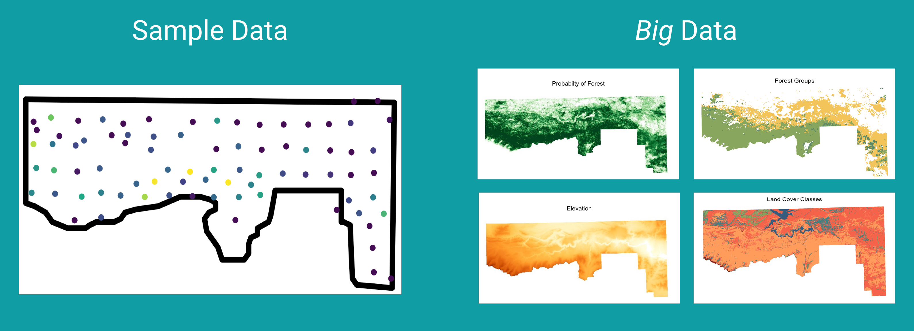

```{r setup, include=FALSE}
knitr::opts_chunk$set(echo = TRUE, warning = FALSE, message = FALSE, fig.retina = 3)
```

```{r xaringan-themer, include=FALSE, warning=FALSE}
library(xaringanthemer)
pal <- c(
  dark_purple = "#1F2041",
  purple = "#4B3F72",
  yellow = "#FFC857",
  aqua = "#119DA4",
  base_blue = "#19647E",
  whitish = "#FFFFFF",
  mustard = "#EDAE49",
  mauve = "#D1495B",
  orange = "#E4844A",
  grass_green = "#7AB317"
)


style_mono_accent(base_color = "#19647E",
                  white_color = "#FFFFFF",
                  black_color = "#1F2041",
                  link_color = "#119DA4",
                  text_bold_color = "#E4844A",
                  text_slide_number_color = "#EDAE49",
                  code_highlight_color = "#FFC857",
                  code_inline_color = "#D1495B",
                  inverse_link_color = "#FFC857",
                  link_decoration = "underline",
                  header_font_google = google_font("Roboto Slab"), #google_font("Roboto", "400"),
                  text_font_google   = google_font("Lato", "400"),
                  code_font_google   = google_font("Fira Mono"),
                  colors = pal#,
 #                 blockquote_left_border_color = "#119DA4"
                  )
# style_duo_accent(primary_color = "#21033A", secondary_color = "#7AB317",
#   header_font_google = google_font("Josefin Sans"),
#   text_font_google   = google_font("Montserrat", "300", "300i"),
#   code_font_google   = google_font("Fira Mono"),
#   white_color = "#FFFCFB",
#   black_color = "#000000",
# )
```


background-image: url("img/DAW.png")
background-position: left
background-size: 50%
class: middle, center, inverse


.pull-right[

## .whitish[Stat 100 Instructor Introduction]


<br>

<br>


### .whitish[Kelly McConville]

#### .yellow[ Stat 100 | Week 0 | Spring 2022] 

]

<!-- --- -->

<!-- class: center, middle, inverse -->


<!-- ## Previous Institutions -->


<!-- ```{r, echo = FALSE, dev.args = list(bg = 'transparent'), fig.asp = .6, out.width = '80%'} -->
<!-- library(tidyverse) -->
<!-- MainStates <- map_data("state") -->
<!-- ggplot() +  -->
<!--   geom_polygon( data=MainStates, aes(x=long, y=lat, group=group), -->
<!--                 color="white", fill = "#1F2041",  size = 1.25) + -->
<!--   theme_void()  -->
<!-- ``` -->

<!-- --- -->

<!-- class: center, middle, inverse -->


<!-- ## Previous Institutions -->

<!-- ```{r, echo = FALSE, dev.args = list(bg = 'transparent'), fig.asp = .6, out.width = '80%'} -->
<!-- library(tidyverse) -->
<!-- library(shadowtext) -->
<!-- library(ggimage) -->
<!-- library(ggrepel) -->
<!-- #devtools::install_github("yjunechoe/penngradlings") -->
<!-- #library(penngradlings) -->
<!-- MainStates <- map_data("state") -->
<!-- ggplot() + -->
<!--   geom_polygon( data=MainStates, aes(x=long, y=lat, group=group), -->
<!--                 color="white", fill = "#1F2041",  size = 1.25) + -->
<!--   theme_void() + -->
<!-- #  geom_point(aes(x = -118.343018, y = 46.064583), color = "white", size = 3) + -->
<!--   # geom_text_repel(aes(x = -118.343018, y = 46.064583, label = "Whitman College"), -->
<!--   #                 color = "white", size = 5, bg.color = "#1F2041", -->
<!--   #                 direction = "x", seed = 11) -->
<!--   geom_shadowtext(aes(x = -118.343018 + 2, y = 46.064583 + 0.5, -->
<!--                       label = "Whitman College"), -->
<!--                   color = "white", size = 5, bg.color = "#1F2041") -->
<!-- ``` -->


<!-- --- -->

<!-- class: center, middle, inverse -->


<!-- ## Previous Institutions -->

<!-- ```{r, echo = FALSE, dev.args = list(bg = 'transparent'), fig.asp = .6, out.width = '80%'} -->
<!-- library(tidyverse) -->
<!-- library(ggimage) -->
<!-- library(ggrepel) -->
<!-- #devtools::install_github("yjunechoe/penngradlings") -->
<!-- #library(penngradlings) -->
<!-- MainStates <- map_data("state") -->
<!-- ggplot() + -->
<!--   geom_polygon( data=MainStates, aes(x=long, y=lat, group=group), -->
<!--                 color="white", fill = "#1F2041",  size = 1.25) + -->
<!--   theme_void() + -->
<!--   geom_shadowtext(aes(x = -118.343018 + 2, y = 46.064583 + 0.5, -->
<!--                       label = "Whitman College"), -->
<!--                   color = "white", size = 5, bg.color = "#1F2041") + -->
<!--   geom_shadowtext(aes(x = -75.34991, y = 39.90206 + 0.2, -->
<!--                       label = "Swarthmore College"), -->
<!--                   color = "white", size = 5, bg.color = "#1F2041") -->

<!-- ``` -->


---

class: center, middle, inverse


## Previous Institutions

```{r, echo = FALSE, dev.args = list(bg = 'transparent'), fig.asp = .6, out.width = '80%'}
library(tidyverse)
library(shadowtext)

MainStates <- map_data("state")
ggplot() +
  geom_polygon( data=MainStates, aes(x=long, y=lat, group=group),
                color="white", fill = "#1F2041",  size = 1.25) +
  theme_void() +
  geom_shadowtext(aes(x = -118.343018 + 2, y = 46.064583 + 0.5,
                      label = "Whitman College"),
                  color = "white", size = 5, bg.color = "#1F2041") +
  geom_shadowtext(aes(x = -75.34991, y = 39.90206 + 0.2,
                      label = "Swarthmore College"),
                  color = "white", size = 5, bg.color = "#1F2041") +
    geom_shadowtext(aes(y = 45.523064 - 0.5, x = -122.676483 + 1,
                        label = "Reed College"),
                  color = "white", size = 5, bg.color = "#1F2041") +
    geom_shadowtext(aes(y = 42.374443, x = -71.116943,
                        label = "Harvard University"),
                  color = "white", size = 5, bg.color = "#1F2041")  

```


---

class: center, inverse
background-color: #119DA4

## Research Interests


### Survey statistics and collaborate with


```{r, echo = FALSE, out.width= "50%"}
knitr::include_graphics("img/logos.jpeg")
```


```{r, echo = FALSE, out.width= "30%", eval = FALSE}
library(magick)

fs <- image_read("~/stat100s22/slides/img/FS.png")
fs <- image_shadow(fs, bg = "#1F2041", color = "white")
fs_border <- image_border(fs, "#1F2041", "40x40")
image_write(fs_border, "~/stat100s22/slides/img/fs_border.png")
bls <- image_read("~/stat100s22/slides/img/bls2.png")
bls <- image_shadow(bls, bg = "#1F2041", color = "white")
bls_border <- image_border(bls, "#1F2041", "40x40")
image_write(bls_border, "~/stat100s22/slides/img/bls_border.png")

knitr::include_graphics(c("img/fs_border.png", "img/bls_border.png"))

# 
# knitr::include_graphics("img/bls2.png")

```


---

class: center, inverse
background-color: #119DA4

## Research Interests


### Where survey statistics meets data science

--

```{r, echo = FALSE}

```

---

class: center, inverse
background-color: #119DA4

## Advising Undergraduate Research -- Forestry Data Science

```{r, echo = FALSE, fig.align='center', out.width='45%'}
knitr::include_graphics("img/fds_crew.jpg")
```


---

class: inverse, middle, center
background-color: #7AB317


## Themes of My Teaching Style


---

class: center

## Teaching the *Entire* Data Analysis Process


```{r, echo = FALSE, fig.align='center', out.width='45%'}
knitr::include_graphics('img/DAW.png')
```


---

class: center

## Computation as an Integral Component


.left-column[

<br>


```{r, echo = FALSE, fig.align='center', out.width='100%'}
knitr::include_graphics('img/Rlogo.png')
```

]

--

.right-column[

.pull-left[
```{r, echo = FALSE, fig.align='center', out.width='60%'}
knitr::include_graphics('img/RStudio.png')
```

]

.pull-right[


]

]


---

class: center

## Computation as an Integral Component


.left-column[

<br>


```{r, echo = FALSE, fig.align='center', out.width='100%'}
knitr::include_graphics('img/Rlogo.png')
```

]


.right-column[

.pull-left[
```{r, echo = FALSE, fig.align='center', out.width='60%'}
knitr::include_graphics('img/RStudio.png')
```

]

.pull-right[
```{r, echo = FALSE, fig.align='center', out.width='60%'}
knitr::include_graphics('img/rmarkdown.png')
```

]

]


---

class: center

## Learning with Real-World and Relevant Examples


--

.pull-left[

```{r, echo = FALSE, fig.align='center', out.width='110%'}
knitr::include_graphics('img/nytimes_access.png')
```

]

--

.pull-right[


```{r, echo = FALSE, fig.align='center', out.width='70%'}

```

]

---

class: center


## Creating a Supportive Classroom

#### Implementing a code of conduct

> We expect all members of Stat 100 to make participation a harassment-free experience for everyone, regardless of age, body size, visible or invisible disability, ethnicity, sex characteristics, gender identity and expression, level of experience, education, socio-economic status, nationality, personal appearance, race, religion, or sexual identity and orientation.

> We expect everyone to act and interact in ways that contribute to an open, welcoming diverse, inclusive, and healthy community of learners. Examples of unacceptable behavior include: using sexualized language or imagery, making insulting or derogatory comments, harrassing someone publicly or privately, or other unprofessional conduct.

> Instead you can contribute to a positive learning environment by demonstrating empathy and kindness, being respectful of differing viewpoints and experiences, and giving and gracefully accepting constructive feedback.


---

class: center


## Creating a Supportive Classroom

```{r, echo = FALSE, fig.align='left', out.width='25%'}
knitr::include_graphics("img/Slack_RGB.png")
```


```{r, echo = FALSE, fig.align='center', out.width='40%'}

```

---

background-image: url("img/seedlings.jpg")
background-position: left
background-size: contain

.pull-right[

 ## Encouraging a Growth Mindset 

* Learning stats and coding is hard.

]


--

.pull-right[

* But with the **right scaffolding**, **good strategies**, and **sustained effort**, you can excel at both!  

]

--

.pull-right[

* And mistakes are part of the learning process.  They don't imply that you are bad at stats.


]


---

class: inverse, middle, center


## Looking Forward to Teaching You!


<!-- --- -->

<!-- Common elements of my teaching: -->


<!-- Here's my [website](mcconville.rbind.io) -->

<!-- (Since you don't have any Q Scores yet on my classes) -->
<!-- (Pull from teaching.Rmd) -->

<!-- * Foster an engaging and supportive classroom environment -->
<!--     + Slack -->
<!--     + Code of Conduct -->
<!--     + Lots of low stakes ways to participate -->
<!-- * Use variety of real-world and relevant examples -->
<!--     + pdxTrees, movies, JEDI -->
<!-- * Incorporate computing into the process -->
<!--     + R, RStudio, Rmarkdown -->
<!-- * Teach entire data analysis process in Stat 100 (If you only take 1 stats class, then I want to help prepare you to head back to your lab or major or passion and be able to answer data related questions)   -->
<!--     + But I may try to convince you to take more stats. -->
<!-- * Growth mindset -->
<!--     + Anyone can get good at coding/stats/math.  I will meet you where you are and give you the scaffolding to improve. -->
<!--     + But, you do have to be prepared to work hard! -->
