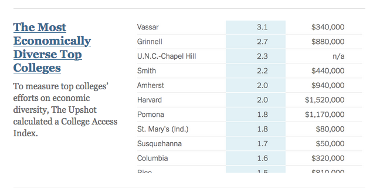

```{r setup, include=FALSE}
knitr::opts_chunk$set(echo = TRUE, warning = FALSE, message = FALSE, 
                      fig.retina = 3, fig.align = 'center')
```


background-image: url("img/DAW.png")
background-position: left
background-size: 50%
class: middle, center, inverse


.pull-right[


## .whitish[Stat 100:]
### .whitish[Introduction to Statistics and Data Science]

<br>

<br>

### .whitish[Kelly McConville]

#### .yellow[ Stat 100 | Week 0 | Spring 2022] 

]

---

class: center, inverse, middle


## Overarching Goal:

--

### Learn how to .yellow[extract knowledge] from data.


---


background-image: url("img/DAW.png")
background-position: left
background-size: 50%
class: middle


.pull-right[

###  Course Learning Objectives

]


--

.pull-right[

 * Learn how to **analyze** data. 

]

--

.pull-right[

* Acquire good data **habits**.

]

--

.pull-right[

* Develop **statistical thinking** and **problem-solving** skills.

]

---

background-image: url("img/packages.001.jpeg")
background-position: contain
background-size: 70%

## Computation


---

background-image: url("img/packages.002.jpeg")
background-position: contain
background-size: 70%

## Computation

---

background-image: url("img/packages.003.jpeg")
background-position: contain
background-size: 70%

## Computation


---
name: viz
background-image: url("img/exploration_visualization.jpeg")
background-position: left
background-size: 15%


.pull-rightish[

## Data Visualization


]


---

template: viz

.pull-rightish[


.pull-left[


* Learn key **design principles** of effective data visualizations.

* Practice drawing **sound conclusions** from graphs.

```{r, out.width="80%", echo=FALSE}

```


]
]


---

template: viz

.pull-rightish[


.pull-left[

* Learn key **design principles** of effective data visualizations.

* Practice drawing **sound conclusions** from graphs.

```{r, out.width="80%", echo=FALSE}

```

]


.pull-right[

* Master **creating** graphs with `ggplot2`.


```{r, out.width="55%", echo = FALSE, fig.align='center'}

knitr::include_graphics("img/ggplot2.png")

```

```{r, out.width="95%", echo=FALSE, eval = FALSE}
library(tidyverse)
# Load data and omit the four schools with missing data for our two key variables
collegeaccess <-  read_csv("data/collegeaccess.csv") %>%
  drop_na(college.access.index, endowment.per.student)

library(ggrepel)
ggplot(data = collegeaccess, mapping =  aes(x = endowment.per.student,
                                            y = college.access.index)) + 
  geom_point(alpha = 0.4, color = "#19647E") + 
  geom_text_repel(aes(label=College), size = 4.5) +
  theme_bw() +
  scale_x_continuous(labels=scales::dollar_format()) +
  labs(x = "Endowment per student", y = "NY Times College Access Index", caption = "Data from NY Times", title = "How does college access and endowment relate?") 
  
  
```

]


]


---
name: wrangle
background-image: url("img/data_wrangling.jpeg")
background-position: left
background-size: 15%


.pull-rightish[

## Data Wrangling/Cleaning/Transforming

.pull-left[

* Apply basis data wrangling operations with `dplyr`.


```{r, out.width="55%", echo = FALSE, fig.align='center'}

knitr::include_graphics("img/dplyr.png")

```

]


]


---
name: wrangle
background-image: url("img/data_wrangling.jpeg")
background-position: left
background-size: 15%


.pull-rightish[

## Data Wrangling/Cleaning/Transforming

.pull-left[

* Apply basis data wrangling operations with `dplyr`.


```{r, out.width="55%", echo = FALSE, fig.align='center'}

knitr::include_graphics("img/dplyr.png")

```

]

.pull-right[

* Explore datasets to determine what wrangling and summarization may be required.

```{r, out.width="85%", echo = FALSE, fig.align='center'}


```

]

]

---
name: formulating
background-image: url("img/question_formulation.jpeg")
background-position: left
background-size: 15%


.pull-rightish[

### Question Formulation

* Translate a research problem into a set of relevant questions that can be answered with data. 

* Formulate data questions as **measurable statements** about parameters in a model.


]


---
name: formulating
background-image: url("img/question_formulation.jpeg")
background-position: left
background-size: 15%


.pull-rightish[

### Question Formulation

* Translate a research problem into a set of relevant questions that can be answered with data. 

* Formulate data questions as **measurable statements** about parameters in a model.


.pull-left[


> "Mistaking the type of question being considered is the most common error in data analysis." -- Jeff Leek and Roger Peng


]

.pull-right[


```{r, out.width="85%", echo = FALSE, fig.align='center'}


```


]


]

---
background-image: url("img/question_formulation.jpeg")
background-position: left
background-size: 15%


.pull-rightish[

### Question Formulation

* Translate a research problem into a set of relevant questions that can be answered with data. 

* Formulate data questions as **measurable statements** about parameters in a model.

.pull-left[


> "Consider context. The bottom line for numbers is that they cannot speak for themselves."

> "Lacking this context for orientation, strangers in the data set run the risk of getting things entirely wrong or actually doing harm by filling in the missing information with their own biases and assumptions." -- Catherine D’Ignazio and Lauren F. Klein


]

.pull-right[


```{r, out.width="85%", echo = FALSE, fig.align='center'}


```


]


]


---
name: acquisition
background-image: url("img/data_acquisition.jpeg")
background-position: left
background-size: 15%


.pull-rightish[

## Data Acquisition


]

---
name: acquisition
background-image: url("img/data_acquisition.jpeg")
background-position: left
background-size: 15%


.pull-rightish[

## Data Acquisition


* Determine the necessary data to conduct analyses.
* Reflect on how **design structures** impact potential conclusions.
* Identify potential ethical concerns surrounding data collection and data privacy.


]

---
name: acquisition
background-image: url("img/data_acquisition.jpeg")
background-position: left
background-size: 15%


.pull-rightish[

## Data Acquisition


* Determine the necessary data to conduct analyses.
* Reflect on how **design structures** impact potential conclusions.
* Identify potential ethical concerns surrounding data collection and data privacy.

```{r, out.width="85%", echo = FALSE, fig.align='center'}


```


]


---
name: inference
background-image: url("img/modeling_inference.jpeg")
background-position: left
background-size: 15%


.pull-rightish[

## Modeling and Inference

.pull-left[


```{r, echo = FALSE, out.width='80%'}

```

]

]

---
background-image: url("img/modeling_inference.jpeg")
background-position: left
background-size: 15%
class: middle


.pull-rightish[

## Modeling and Inference

<br>


.pull-left[


```{r, echo = FALSE, out.width='90%'}

```

<br>


]

.pull-right[

* Understand and be able to explain key **probabilistic** and **inferential** concepts.
* Determine the **correct model** for a given problem and set of data.
* Appropriately apply and draw inferences from a statistical model, including **quantifying and interpreting the uncertainty** in model estimates.
* Consider the **ethical implications** of various modeling practices. 

]

]


---

background-image: url("img/communicating_findings.jpeg")
background-position: left
background-size: 15%


.pull-rightish[

## Communicating Findings


]


---

background-image: url("img/communicating_findings.jpeg")
background-position: left
background-size: 15%


.pull-rightish[

## Communicating Findings

.pull-left[

* Develop a **reproducible** workflow using `R` Markdown documents.

]

.pull-right[


```{r, out.width="45%", echo = FALSE, fig.align='center'}

knitr::include_graphics("img/rmarkdown.png")

```

]

]


---

background-image: url("img/communicating_findings.jpeg")
background-position: left
background-size: 15%


.pull-rightish[

## Communicating Findings

.pull-left[

* Develop a **reproducible** workflow using `R` Markdown documents.
* **Interpret** and **communicate** results of statistical analyses effectively for both a statistical and a non-statistical audience.

]

.pull-right[


```{r, out.width="45%", echo = FALSE, fig.align='center'}

knitr::include_graphics("img/rmarkdown.png")

```

]

]


---

background-image: url("img/communicating_findings.jpeg")
background-position: left
background-size: 15%


.pull-rightish[

## Communicating Findings

.pull-left[

* Develop a **reproducible** workflow using `R` Markdown documents.
* **Interpret** and **communicate** results of statistical analyses effectively for both a statistical and a non-statistical audience.
* Be able to reflect on the data involved in an analysis and show a **curiosity** for other ways of examining and thinking about the data.  

]

.pull-right[


```{r, out.width="45%", echo = FALSE, fig.align='center'}

knitr::include_graphics("img/rmarkdown.png")

```

]

]

---


background-image: url("img/workflows.004.jpeg")
background-position: contain
background-size: 65%

## Data Analysis Workflow


---


background-image: url("img/workflows.003.jpeg")
background-position: contain
background-size: 65%


## Data Analysis Workflow

---


background-image: url("img/workflows.002.jpeg")
background-position: contain
background-size: 65%

## Data Analysis Workflow


---


background-image: url("img/workflows.001.jpeg")
background-position: contain
background-size: 65%


## Data Analysis Workflow


---


background-image: url("img/DAW.png")
background-position: left
background-size: 50%
class: middle


.pull-right[

###  Data Analysis Workflow

]


.pull-right[

* Not a strict set of guidelines.

* General structure for **extracting knowledge from data**.


]

--

.pull-right[

* Consider **iteration** throughout.

]

--

.pull-right[

* Consider **reproducibility** throughout.

]

--

.pull-right[

* Consider **ethics** throughout.

]


---

## Course Structure


.pull-left[

```{r, echo = FALSE, out.width='95%'}

```


]


--

.pull-right[

* You are **expected** to attend lectures and sections.
    + But I recognize that with COVID and other excused reasons, there will be absences.  Just make sure to **communicate** with your TF and me.


* We will use [Gradescope](https://www.gradescope.com/courses/343471) for submitting work.
    + More on that in your first section meeting.


* I will introduce you to our Rstudio Server during a Week 1 lecture.


* The primary textbook, [Modern Dive](https://moderndive.com/), and the supplemental textbook, [Introduction to Modern Statistics](https://www.openintro.org/book/ims/), are both free online.

]

---

## Forms of Assessment

* **Weekly problem sets:**
    + Practice concepts
    + Time during section will be devoted to starting the next week's assignment.
    + Can drop one problem set grade.

--

* **Exams:** 
    + Format: Takehome Exam followed by Oral Exam
    + Mid-term and Final


--

* **Group project:**
    + Practice apply data analysis process to a research question

--

* **Participation/Engagement:**
    + In class and section
    + Office hours: Must attend **at least one** office hours during the first five weeks of the semester
    + On Slack: **At least two** posts before Spring Break

---


background-image: url("img/slack.001.jpeg")
background-position: left
background-size: 18%
class: middle, left, inverse


.pull-rightish[
    
### What Slack posts count?

]

--

.pull-rightish[

+ Asking a question about course content

]

--

.pull-rightish[

+ Answering someone else's question

]

--

.pull-rightish[

+ Posting a useful resource and why you found it helpful

]

--

.pull-rightish[

+ Creating an example that illustrates a recent concept

]

--

.pull-rightish[

If you have never used Slack before, don't worry.  We will practice together at the start of the semester.


    
]    
    

---

class: center, middle
background-image: url(img/jessica-knowlden--AvRbJOVUKA-unsplash.jpg)
background-size: cover


---

## Engagement

.pull-left[ 


]

.pull-right[

* Being **actively present** is key.
{{content}}

]

--

* During class and lab, remove distractions.
    + Close email, social media, news, etc.
    + Hide your phone.
{{content}}

--

* What you get out of Stat 100 will depend on what you put into it.
{{content}}

--

* I have high expectations but know that all of you (regardless of your stats or computing background) have the ability to meet them.
{{content}}


---

## Identity and the Classroom

* Acknowledge that my perspectives and experiences have shaped how I teach this course

--

* Some of my identities place me in dominant groups while others in marginalized groups


--


* Strive to bring examples and scholarly contributions that value knowledge from folks with a wide variety of identities


--

* Strive to be a open listener and recognize your thoughts as a generous offer and a vote of confidence in my ability to hear and be transformed by you

--

* Ask that you reflect on your own identities, privileges, and power and how they impact your engagement with Stat 100

---

## Code of Conduct

I expect all members of STAT 100 to make participation a harassment-free experience for everyone, regardless of age, body size, visible or invisible disability, ethnicity, sex characteristics, gender identity and expression, level of experience, education, socio-economic status, nationality, personal appearance, race, religion, or sexual identity and orientation.  

I expect everyone to act and interact in ways that contribute to an open, welcoming diverse, inclusive, and healthy community of learners.  You can contribute to a positive learning environment by demonstrating empathy and kindness, being respectful of differing viewpoints and experiences, and giving and gracefully accepting constructive feedback.


This Code of Conduct is adapted from the [Contributor Covenant](https://www.contributor-covenant.org/version/2/0/code_of_conduct.html), version 2.0.


---

## Ways to Get Support


* **Attend, attend, attend** when you don't feel ill

--

* **Participate** in the Stat 100 Slack Workspace

--

* **Come** to Office Hours

--

* **Create** study groups with your classmates
    + Natural groups: project group members, folks in your same section


<!-- --- -->

<!-- ## [Canvas Site](https://canvas.harvard.edu/courses/102162) -->


<!-- * Syllabus -->

<!-- -- -->


<!-- * Schedule with Readings -->
<!--     + Which will be always two weeks ahead of where we are in class -->

<!-- -- -->

<!-- * Reminders of important due dates -->

<!-- -- -->

<!-- * Office hours -->


---


## Data in Stat 100


Will use a wide-range of **real** and **relevant** data examples

.pull-left[

```{r, echo = FALSE, fig.align='center', out.width='110%'}

```

]

--

.pull-right[

```{r, echo = FALSE, fig.align='center', out.width='50%'}

```

]

---


## Data in Stat 100

.pull-left[

```{r, echo = FALSE, fig.align='center', out.width='100%'}

```


]

--

.pull-right[


```{r, echo = FALSE, fig.align='center', out.width='100%'}

```

]


--

* I understand that some of these topics have likely had profound impacts on your lives.

--

* We will focus class time on the key course objectives but will use these current topics to empower ourselves and to see how we can productively participate with data. 


---

class: inverse, middle, center


## Looking Forward to Teaching You!


