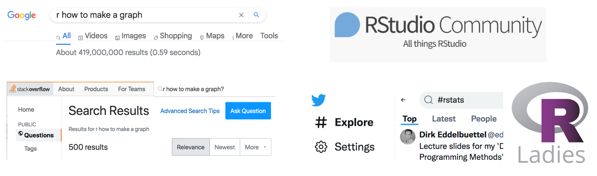
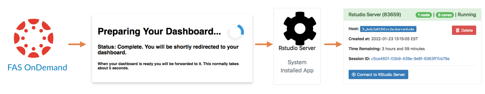
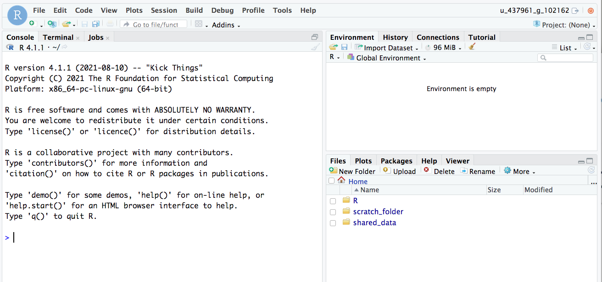

```{r setup, include=FALSE}
knitr::opts_chunk$set(echo = TRUE, warning = FALSE, message = FALSE, 
                      fig.retina = 3, fig.align = 'center')
library(knitr)
library(tidyverse)
```


background-image: url("img/DAW.png")
background-position: left
background-size: 50%
class: middle, center, inverse


.pull-right[


## .whitish[Computing in Stat 100]

<br>

<br>

### .whitish[Kelly McConville]

#### .yellow[ Stat 100 | Week 1 | Spring 2022] 

]

---


#
# Announcements

* You have now been assigned to a section.
    + If you'd like to move sections, fill out [this form](https://forms.gle/UMtTy2QisNtSVkoSA) by Thurs, Jan 27th. 
* No sections this week.
* I have extra office hours on Thursday 10am - noon. If you are having trouble getting started in `R`, come by!

****************************

--

## Goals for Today

* Stat 100 assessments
* Getting up and running in `RStudio`
* Working with `RMarkdown` documents


---

## Forms of Assessment

* **Weekly problem sets:**
    + Practice concepts
    + Time during section will be devoted to starting the next week's assignment.
    + Can drop one problem set grade.

--

* **Exams:** 
    + Format: Takehome Exam followed by Oral Exam
    + Mid-term and Final


--

* **Group project:**
    + Practice apply data analysis process to a research question

--

* **Participation/Engagement:**
    + In class and section
    + Office hours: Must attend **at least one** office hours during the first five weeks of the semester
    + On Slack: **At least two** posts before Spring Break


---

background-image: url("img/packages.001.jpeg")
background-position: contain
background-size: 70%

## Computation


---

background-image: url("img/packages.002.jpeg")
background-position: contain
background-size: 70%

## Computation

---

background-image: url("img/packages.003.jpeg")
background-position: contain
background-size: 70%

## Computation

---

### Getting Help with `R`

--

```{r  out.width = "80%", echo=FALSE, fig.align='center'}

```


--

#### .center[Novices asking the internet for `R` help = `r emo::ji("cold_sweat")`]

--

.pull-left[

* **Get help from the Stat 100 teaching staff or classmates!**
    + Will start p-sets in section each week.
    + Use the Slack `#q-and-a` channel.

]

--

.pull-left[

* Get help **early** before `r emo::ji("rage")` sets in!
    + Be prepared for missing commas and quotes, capitalization issues, etc...

]

--

.pull-left[

* Later in the semester, will learn tricks for effectively getting `R` help online.

]

---

## Language: `R`-This, `R`-That, `R`-...

Three `R` Things:

--

```{r, echo = FALSE, out.width= "15%", out.extra='style="float:left; padding:10px"'}
knitr::include_graphics("img/Rlogo.png")
```

<br>

`R` is the name of the programming language.


--

```{r, echo = FALSE, out.width= "15%", out.extra='style="float:left; padding:10px"'}
knitr::include_graphics("img/RStudio.png")
```

<br>

 `RStudio` is the pretty interface.

<br>

--

```{r, echo = FALSE, out.width= "15%", out.extra='style="float:left; padding:10px"'}
knitr::include_graphics("img/rmarkdown.png")
```

<br>

`RMarkdown` is the type of file where we will record all of our work (code, output, narrative).

<br>

---

class: inverse, center, middle

## Let's Get Started with `R`!

## First step: Navigate to the class Canvas site.


---

## Accessing the RStudio Server


```{r  out.width = "95%", echo=FALSE, fig.align='center'}

```

* First time may take a while.

---

## Main Components of RStudio Lay-Out 


```{r  out.width = "85%", echo=FALSE, fig.align='center'}

```

---

### Main Components of RStudio Lay-Out 


.pull-left[.fullish-width[.content-box-yellow[

**Console**

* Sideways carrot called **prompt**.

* Where you run code.

* Let's try it:

```{r}
6 * 2/ 3
```

]]]

--


.pull-left[.fullish-width[.content-box-yellow[

**Environment**

* Lists items stored in your session.

* Will add some items soon!

]]]

--


.pull-left[.fullish-width[.content-box-yellow[

**Files et. al.**

* **Files**: Accesses files in your own directory and the shared directory `shared_data`.

* **Plots**: Contains graphs we create.

* **Packages**: Installs and loads packages.

* **Help**: Displays help files.

]]]


---

##Accessing Course Materials 

* All `R` related course materials will be stored in the `shared_data` folder in the **Files** tab.

* You can access shared files but **you must move the files to your home directory** before you edit and save them.

* Let's practice that now with `introRMarkdown.Rmd` which can be found in `shared_data/stat100/handouts`.

* Steps:
    + Step 1: Click on the `shared_data`, then `stat100`, then `handouts`.
    + Step 2: Click on "introRMarkdown".  It should open in the upper lefthand window.
    + Step 5: Go to the top left of the window and click on File > Save as...
    + Step 6: Click on "Home".
    + Step 7: (Only do this once) Click on **New Folder** and call it "handouts". Hit "Ok".
    + Step 8: Then hit Save.  Now the file is saved in your directory and you are ready to work on it.

---

class: inverse, middle, center

## Questions so far?

--


## Let's go through the Intro to `RMarkdown` Handout.


---

class: inverse, middle, center

## Practice: How do we access P-Set 1?

--

### .mustard[It is okay if all things R haven't sunk in yet.  It will take the first few weeks for that to happen.]

---

## Reminders

* No sections this week.
* I have extra office hours on Thursday 10am - noon. If you are having trouble getting started in `R`, come by!
* See you in **Science Center Hall A** on Monday!
    + Note the room change!

