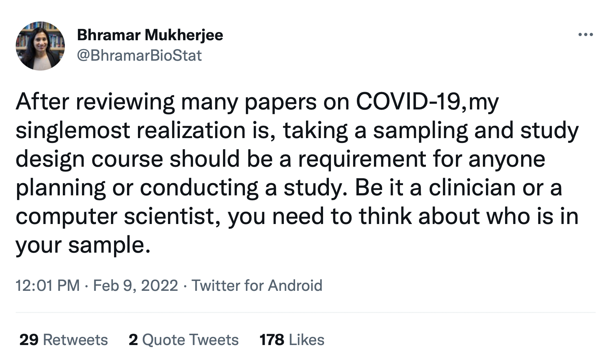
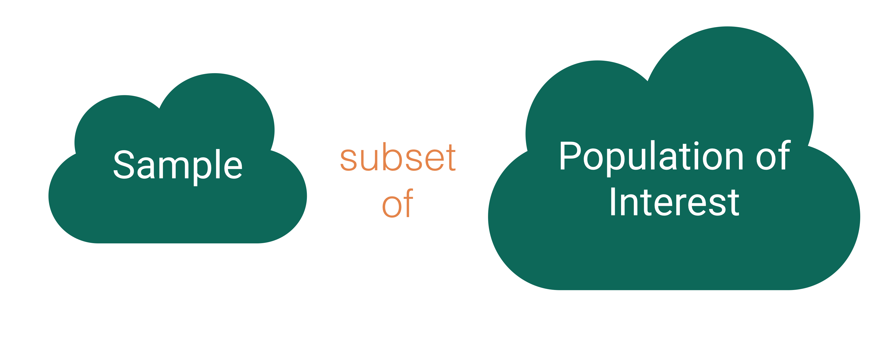
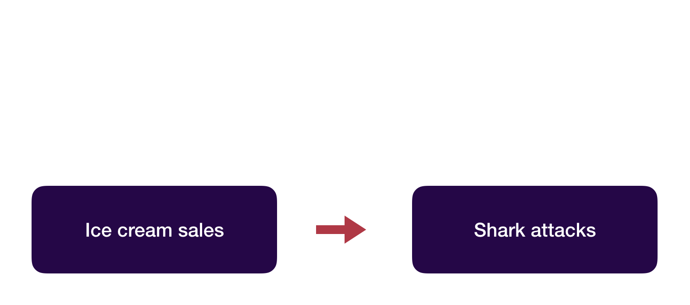
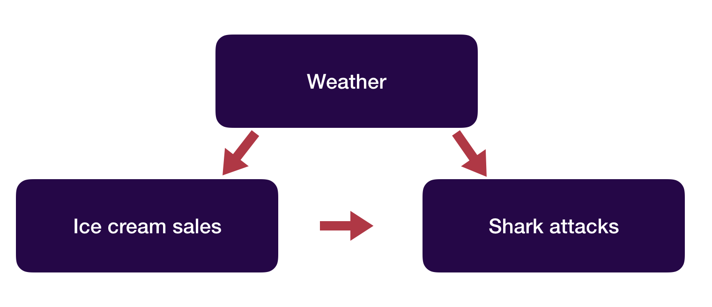

```{r setup, include=FALSE}
knitr::opts_chunk$set(echo = TRUE, warning = FALSE, message = FALSE, 
                      fig.retina = 3, fig.align = 'center',
                      fig.asp = 0.75, fig.width = 8,
                      cache = TRUE)
library(knitr)
library(tidyverse)
theme_update(text = element_text(size = 20))
```

```{r xaringan-scribble, echo=FALSE}
xaringanExtra::use_scribble()
```


background-image: url("img/DAW.png")
background-position: left
background-size: 50%
class: middle, center, inverse


.pull-right[


## .whitish[Data Collection]

<br>

<br>

### .whitish[Kelly McConville]

#### .yellow[ Stat 100 | Week 4 | Spring 2022] 

]


---

## Announcements


****************************

--

## Goals for Today

.pull-left[

* Go through data joins.

] 

--

.pull-right[


* Discuss data collection/acquisition
    + Have out your data dictionaries that you created with your section mates. 

]


---

## Data Joins

* Often in the data analysis workflow, we have more than one data source, which means more than one dataframe, and we want to combine these dataframes.

--

* Need principled way to combine.
    + Need a **key** that links two dataframes together.

--

* These multiple dataframes are called **relational data**.

<!-- --- -->

<!-- ## Data Joins: Language -->

<!-- Three families of verbs for working with relational data: -->

<!-- -- -->

<!-- * **Mutating joins**: Add variables to one data frame but matching observations in another. -->

<!-- -- -->

<!-- * **Filtering joins**: Filter observations from one data frame based on whether or not they match an observation in the other table. -->

<!-- -- -->

<!-- * **Set operations**: treat observations as if they were set elements. -->

    
---

## Example: BLS Consumer Expenditure Data

* Household survey but data are also collected on individuals
    + fmli: household data
    + memi: household member-level data

```{r}
#Read in data with readr package
library(tidyverse)
fmli <- read_csv("~/shared_data/stat100/data/fmli.csv", 
                 na = c("NA", "."))
memi <- read_csv("~/shared_data/stat100/data/memi.csv", 
                 na = c("NA", "."))

```

* Want variables on principal earner to be added to the household data

---

## CE Data

* Key variable(s)?

```{r}
library(dplyr)
glimpse(fmli)
```

---


## CE Data

* Key variables?

```{r}
glimpse(memi)
```

---

## CE Data

* Key variables?
    + Problem with class?

```{r}
glimpse(select(fmli, 1,2))
glimpse(select(memi, 1:2))
```

---

## CE Data

* Key variables?
    + Problem with class?

```{r}
fmli <- mutate(fmli, PRINEARN = as.integer(PRINEARN))
glimpse(select(fmli, 1, 2))
glimpse(select(memi, 1, 2))
```

---

## CE Data

* Want to add columns of `memi` to `fmli` that correspond to the principal earner's memi data
    + What type of join is that?

---

## The World of Joins

* Mutating joins: Add new variables to one dataset from matching observations in another.
    + `left_join()` (and `right_join()`)
    + `inner_join()`
    + `full_join()`

* There are also *filtering* joins but we won't cover those today.    

---

## Example Dataframes

```{r}
d1 <- tibble(V = 1:5, X = c(1, 2, 2, 3, 1), Y = c(14, 3, 6, 1, 4))
d2 <- tibble(X = c(2, 4, 1), S = c(4, 13, 8))
d1
d2
```

---

## `left_join()`

```{r, message=TRUE, warning=TRUE}
d1_new <- left_join(d1, d2)
d1_new
```

---

## `left_join()`

```{r}
d1_new <- left_join(d1, d2, by = c("X" = "X"))
d1_new
```

---

## `left_join()`

```{r}
d1_new <- left_join(d1, d2, by = c("V" = "X"))
d1_new
```

---

## `inner_join()`

```{r}
d1_d2 <- inner_join(d1, d2, by = c("X" = "X"))
d1_d2
```

---

## `inner_join()`

```{r}
d1_d2 <- inner_join(d1, d2, by = c("V" = "X"))
d1_d2
```

---

## `full_join()`

```{r}
d1_d2 <- full_join(d1, d2, by = c("X" = "X"))
d1_d2
```

---

## `full_join()`

```{r}
d1_d2 <- full_join(d1, d2, by = c("V" = "X"))
d1_d2
```

---

## Back to our Example

* What kind of join do we want for the Consumer Expenditure data?
    + Want to add columns of `memi` to `fmli` that correspond to the principal earner's memi data

---

## Look at the Possible Joins

```{r, message=TRUE, warning=TRUE}
left_join(fmli, memi) %>% 
  arrange(NEWID)
```

---

## Look at the Possible Joins

* Be careful.  This erroneous example made my R crash!

```{r, eval = FALSE}
left_join(fmli, memi, by = c("PRINEARN" = "MEMBNO")) %>% 
  arrange(MEMBNO)
```

---

## Look at the Possible Joins

```{r}
left_join(fmli, memi, by = c("NEWID" = "NEWID",
                             "PRINEARN" = "MEMBNO")) %>% 
  arrange(NEWID)
```

---

## Look at the Possible Joins

```{r}
inner_join(fmli, memi, by = c("NEWID" = "NEWID",
                              "PRINEARN" = "MEMBNO")) %>% 
  arrange(NEWID)
```

* Why does this give us the same answer as `left_join` for this situation?

---

## Look at the Possible Joins

```{r}
full_join(fmli, memi, by = c("NEWID" = "NEWID",
                             "PRINEARN" = "MEMBNO")) %>% 
  arrange(NEWID)
```

---

## Joining Tips

```{r}
fmli <- left_join(fmli, memi, by = c("NEWID" = "NEWID",
                                     "PRINEARN" = "MEMBNO")) %>% 
  arrange(NEWID)
```

* FIRST: conceptualize for yourself what you think you want the final dataset to look like!
* Check initial dimensions and final dimensions.
* Use variable names when joining even if they are the same.  


---

class: middle, center

## Quick Survey Time

### Once you have received the survey, provide your responses here:

# [https://bit.ly/stat100-survey](https://bit.ly/stat100-survey)

---

class: inverse, middle, center


## Data Collection


```{r, echo = FALSE, out.width='50%'}

```


---

##  Who are the data supposed to represent?

```{r, echo = FALSE, out.width='80%'}
knitr::include_graphics("img/week4.002.jpeg")
```

--

**Key questions:**

+ What evidence is there that the data are **representative**?
+ Who is present?  Who is absent?
+ Who is overrepresented?  Who is underrepresented?

---

##  Who are the data supposed to represent?

```{r, echo = FALSE, out.width='80%'}
knitr::include_graphics("img/week4.003.jpeg")
```

--

**Census**: We have data on the whole population!

---

##  Who are the data supposed to represent?

```{r, echo = FALSE, out.width='80%'}

```

---

##  Who are the data supposed to represent?

```{r, echo = FALSE, out.width='80%'}
knitr::include_graphics("img/week4.005.jpeg")
```


**Key questions:**

+ What evidence is there that the data are **representative**?
+ Who is present?  Who is absent?
+ Who is overrepresented?  Who is underrepresented?

---

###  Who are the data supposed to represent?

```{r, echo = FALSE, out.width='80%'}
knitr::include_graphics("img/week4.006.jpeg")
```


**Key questions:**

+ What evidence is there that the data are **representative**?
+ Who is present?  Who is absent?
+ Who is overrepresented?  Who is underrepresented?

---

Pick of just samp and pop

Sampling: Say several techniques

list them

Why doesn't everyone just use SRS?

Perils of ignoring the fact that the data aren't SRS

---

class: middle, center, inverse

## Data Ethics

---

### Data Ethics

> "Good statistical practice is fundamentally based on transparent assumptions, reproducible results, and valid interpretations." -- Committee on Professional Ethics of the American Statistical Association (ASA)

--

The ASA have created ["Ethical Guidelines for Statistical Practice"](https://www.amstat.org/ASA/Your-Career/Ethical-Guidelines-for-Statistical-Practice.aspx)

--

&rarr; These guidelines are for EVERYONE doing statistical work. 

--

&rarr; There are ethical decisions at all steps of the Data Analysis Process.

--

&rarr; We will periodically refer to specific guidelines throughout this class.

--

> "Above all, professionalism in statistical practice presumes the goal of advancing knowledge while avoiding harm; using statistics in pursuit of unethical ends is inherently unethical."

---

class: inverse, center, middle

##  Responsibilities to Research Subjects


> "The ethical statistician protects and respects the rights and interests of human and animal subjects at all stages of their involvement in a project. This includes respondents to the census or to surveys, those whose data are contained in administrative records, and subjects of physically or psychologically invasive research."

---

##  Responsibilities to Research Subjects


> "Protects the privacy and confidentiality of research subjects and data concerning them, whether obtained from the subjects directly, other persons, or existing records."

### NHANES

```{r, echo = FALSE}
library(tidyverse)
library(NHANES)
ggplot(data = NHANES, mapping = aes(x = Age, y = Height)) +
  geom_point(alpha = 0.01) +
  stat_smooth() 
```


---

class: middle, center, inverse

## Back to Data Collection

---

Representativeness Issues

Sampling bias

non-response bias

bigger is better? -- XL's work -- Big Data Paradox


---

Causation


---

Add image from IMS end of Ch 2


<!-- --- -->

<!-- ## Who are the data supposed to represent? -->

<!-- **Population**: Group we want to better understand -->

<!-- -- -->

<!-- **Sample**: Subset of the population that we have data on -->

<!-- -- -->

<!-- &rarr; Is the sample representative of the population? -->


<!-- -- -->

<!-- * EX: How many children (including yourself) are in your immediate family? -->


<!-- -- -->

<!-- * We are a sample of households in the US.  Is our average number of children a representative estimate for households in the US? -->

<!-- --- -->

<!-- ## Bias -->

<!-- **Sampling bias**:  When the sampled cases are **systematically** different from the non-sampled cases. -->

<!-- -- -->

<!-- &rarr; Use random sampling (a random mechanism for selecting cases from the population) to minimize sampling bias. -->

<!-- -- -->

<!-- **Nonresponse bias**: The responses are **systematically** different from the non-responses. -->


<!-- -- -->

<!-- &rarr; Use multiple modes and multiple attempts for reaching sampled cases. -->

<!-- -- -->

<!-- &rarr; Explore key demographic variables to see how respondents and non-respondents vary. -->


<!-- --- -->

<!-- ## How were the data collected? -->

<!-- The answer to the question greatly impacts the conclusions we can draw about the population. -->


<!-- &rarr; EX: If we don't use random sampling, the sample might not be representative of the population and therefore we might only be able to draw conclusions about the sample itself. -->

<!-- -- -->

<!-- ### Types of random sampling -->

<!-- * Simple random sampling -->

<!-- * Stratified random sampling -->

<!-- * Cluster sampling -->

<!-- Why aren't all samples generated using simple random sampling? -->

<!-- --- -->

<!-- ## National Health and Nutrition Examination Survey (NHANES) -->

<!-- Why are these data collected? -->

<!-- -- -->

<!-- &rarr; To assess the health of people in the US. -->

<!-- -- -->

<!-- How are these data collected? -->

<!-- -- -->

<!-- &rarr; Stage 1: US is stratified by geography and distribution of minority populations.  Counties are randomly selected within each stratum. -->

<!-- -- -->

<!-- &rarr; Stage 2: From the sampled counties, city blocks are randomly selected. (City blocks are clusters.) -->

<!-- -- -->

<!-- &rarr; Stage 3: From sampled city blocks, households are randomly selected. (Household are clusters.) -->

<!-- -- -->

<!-- &rarr; Stage 4: From sampled households, people are randomly selected.  For the sampled households, a mobile health vehicle goes to the house and medical professionals take the necessary measurements. -->

<!-- -- -->

<!-- **Why not use simple random sampling?** -->

<!-- --- -->

<!-- ## How were the data collected? -->

<!-- The answer to the question greatly impacts the conclusions we can draw about the population. -->

<!-- ### Other key random mechanism: -->

<!-- **Random assignment**: Cases are randomly assigned to categories of the **explanatory variable** -->

<!-- * **Response variable**: Variable I want to better understand -->

<!-- * **Explanatory variables**: Variables I think might explain the response variable -->

<!-- -- -->

<!-- &rarr; If the data were collected using random assignment, then I can determine if the explanatory variable **causes** changes in the response variable. -->


<!-- --- -->

<!-- ## Causal Inference -->

<!-- Often want to conclude that an explanatory variable causes changes in a response variable but you did not randomly assign the explanatory variable. -->

<!-- -- -->

<!-- **Confounding variable**: When the explanatory variable and response variable vary, so does the confounder. -->

<!-- &rarr; Unclear if the explanatory variable or the confounder (or some other variable) is causing changes in the response. -->


<!-- ```{r  out.width = "70%", echo=FALSE, fig.align='center'} -->
<!--   -->
<!-- ``` -->

<!-- --- -->

<!-- ## Causal Inference -->

<!-- Often want to conclude that an explanatory variable causes changes in a response variable but you did not randomly assign the explanatory variable. -->


<!-- **Confounding variable**: When the explanatory variable and response variable vary, so does the confounder. -->

<!-- &rarr; Unclear if the explanatory variable or the confounder (or some other variable) is causing changes in the response. -->


<!-- ```{r  out.width = "70%", echo=FALSE, fig.align='center'} -->
<!--   -->
<!-- ``` -->

<!-- --- -->

<!-- ## Causal Inference -->

<!-- * **Spurious relationship**: Two variables are associated but not causally related -->
<!--     + In the age of big data, lots of good examples [out there](https://tylervigen.com/spurious-correlations). -->

<!-- -- -->

<!-- > "Correlation does not imply causation." -->

<!-- -- -->

<!-- >  "Correlation does not imply not causation." -->

<!-- -- -->

<!-- * **Causal inference**: Methods for finding causal relationships even when the data were collected without random sampling -->


<!-- --- -->

<!-- ## Types of Studies -->

<!-- * **Observational Study:** Collect data in a way that doesn't interfere -->

<!-- -- -->

<!-- * **Experiment:** Interested in causal relationships so utilize random assignment.  Other key features include: -->
<!--     + Blinding -->
<!--     + Control group -->
<!--     + Placebo -->


<!-- --- -->

<!-- ## Thoughts on Data Collection -->

<!-- * Two key forms of **randomness** in data collection: -->
<!--     + Random Sampling -->
<!--     + Random Assignment -->

<!-- -- -->

<!-- * Most studies have one or neither of these forms of randomness.  -->
<!--     + But still want to draw conclusions about the population.   -->

<!-- --- -->

<!-- ## Types of Studies -->

<!-- * **Observational Study:** Collect data in a way that doesn't interfere -->

<!-- -- -->

<!-- * **Experiment:** Interested in causal relationships so utilize random assignment.  Other key features include: -->
<!--     + Blinding -->
<!--     + Control group -->
<!--     + Placebo -->


<!-- --- -->

<!-- ## Thoughts on Data Collection -->

<!-- #### Random Sampling -->


<!-- *  Random sampling is important to ensure the sample is representative of the population. -->

<!-- -- -->

<!-- * Representativeness isn't about size. -->
<!--     + Small random samples will tend to be more representative than large non-random samples.   -->

<!-- -- -->

<!-- * How do we draw conclusions about the population from non-random samples? -->

<!-- -- -->

<!-- &rarr; Investigate how your sampled cases (and respondents) are systematically different from the non-sampled cases (and non-respondents). -->

<!-- --- -->

<!-- ## Thoughts on Data Collection -->

<!-- #### Random Assignment -->

<!-- * Random assignment allows you to explore **causal** relationships between your explanatory variables and the predictor variables. -->

<!-- -- -->

<!-- * How do we draw causal conclusions from studies without random assignment? -->

<!-- -- -->

<!-- &rarr; With extreme care!  Try to control for all possible confounding variables. -->

<!-- -- -->

<!-- &rarr; Discuss the associations/correlations you found.  Use domain knowledge to address potentially causal links. -->

<!-- -- -->

<!-- &rarr; Take more stats to learn more about causal inference. -->


<!-- -- -->

<!-- **Bottom Line:** We often have to use imperfect data to make decisions.  -->


---

### Data Collection Practice

XXX


---

### Reminders


* **Participation/Engagement:**
    + In class and section
    + Office hours: Must attend **at least one** office hours during the first five weeks of the semester
    + On Slack: **At least two** posts before Spring Break

* Will practice applying data collection ideas in Section this week!

