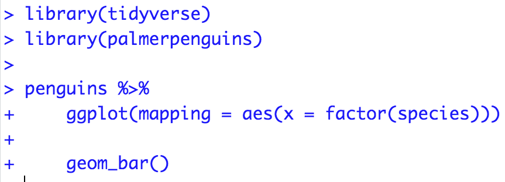

```{r setup, include=FALSE}
knitr::opts_chunk$set(echo = TRUE, warning = FALSE, message = FALSE, 
                      fig.retina = 3, fig.align = 'center',
                      fig.asp = 0.75, fig.width = 8)
library(knitr)
library(tidyverse)
theme_update(text = element_text(size = 20))
```

```{r xaringan-scribble, echo=FALSE}
xaringanExtra::use_scribble()
```


background-image: url("img/DAW.png")
background-position: left
background-size: 50%
class: middle, center, inverse


.pull-right[


## .whitish[Asking Coding Questions]

<br>

<br>


#### .yellow[ Stat 100 | Week 4 | Spring 2022] 

]


---

```{r, echo = FALSE, out.width= "15%", out.extra='style="float:left; padding:10px"'}
knitr::include_graphics("img/ggplot2.png")
``` 

## Creating `repr`oducible `ex`amples with `reprex`


<br>

<br>

<br>

#### Why do I need to learn to create reproducible technical examples?

--

So that you can ask and answer questions in our class Slack Workspace or Stack Overflow or other `R` help sites!


---

## What is wrong with this coding question?


I am trying to create a plot and I can't get the bars to do what I want them to.  Help?!


---

## What is wrong with this coding question?

I want to do the following but it isn't working:

thing <- read.csv("long/file/path/thing.csv")

ggplot(thing, aes(x = factor(that))) + geom_bar()


Help?!


---

## What is wrong with this coding question?

I want to reorder the bars of my plot but can't get it working.  Help!

```{r, fig.show = 'hold'}
library(tidyverse)
library(palmerpenguins)

penguins <- penguins %>%
  group_by(species) %>%
  mutate(mean_flipper = mean(flipper_length_mm)) %>%
  ungroup() %>%
  mutate(long = case_when(flipper_length_mm < mean(flipper_length_mm) ~ "no",
                           flipper_length_mm >= mean(flipper_length_mm) ~ "yes"))  

penguins %>%
  ggplot(mapping = aes(x = factor(species))) +
  geom_bar()

penguins %>%
  count(species)
```

---

## What is wrong with this coding question?

I want to reorder the bars of my plot but can't get it working.  Help!

```{r, eval = FALSE}
rm(list = ls())

library(tidyverse)
library(palmerpenguins)

penguins %>%
  ggplot(mapping = aes(x = factor(species))) +
  geom_bar()

```


---

## [What makes a good coding question?](https://stackoverflow.com/questions/5963269/how-to-make-a-great-r-reproducible-example)


--

* It uses a **minimal** dataset to reproduce the issue.

* It includes the **shortest** amount of  **runnable** code necessary to reproduce the issue.

* It doesn't wreak havoc on other people's computers.

* It includes code **and output** so that others don't have to run it!

* It includes any necessary information on the used packages, R version, system, etc.
    + Should not be a concern for our class Slack since we are all on the same RStudio Server.
    + Can use `packageVersion("tidyverse")` or `sessionInfo()` to find this information.
    


---

## Minimal Dataset


Create a toy data frame.

```{r}
dat <- data.frame(animal = c("cat", "dog", "mouse"), 
                  weight = c(5, 10, 0.5))
dat
```

    
Use a built-in dataset or a dataset from a particular package.

```{r}
library(palmerpenguins)
penguins
```


---

## Minimal Code

Include the **necessary** libraries.

Test run the code in a restarted R session to make sure it is runnable!

```{r, fig.width = 5}
library(tidyverse)
library(palmerpenguins)

penguins %>%
  ggplot(mapping = aes(x = factor(species))) +
  geom_bar()
```


---

## Make sure your code is copy-and-paste-able!

Don't copy from the console.

```{r, eval = FALSE}
> library(tidyverse)
> library(palmerpenguins)
> 
> penguins %>%
+     ggplot(mapping = aes(x = factor(species))) +
+     geom_bar()
```


---

## Make sure your code is copy-and-paste-able!





---

Now we have our reproducible example:

How can I reorder the bars in the ggplot to go from the most frequent to the least frequent category?

```{r, fig.width = 4}
library(tidyverse)
library(palmerpenguins)

penguins %>%
  ggplot(mapping = aes(x = factor(species))) +
  geom_bar()
```

--

**How can we easily share it?**

--

* Using the `reprex()` function in the `reprex` package.

---

## `reprex` Practice Time!


But first: **Q**: What is an R script file?

--

* A text file for entering R commands.

--

**Q**: How is an R script file different from an R Markdown document?

--

* You only put code in an `R` script.  
* If you add any text you must comment it out with `#`.
* Think of it as a single `R` chunk that you won't knit into an output document.
* Useful when writing a lot of code and want to compartmentalize.

---

#### `reprex` Practice Time!


(1) In **Session**, select "Clear Workspace" and then "Restart R".

(2) Open a script file and include in the top line:

```{r}
library(reprex)
```


(3) Put the code you want to use in the script file and make sure it runs.

```{r, eval = FALSE}
library(tidyverse)
library(palmerpenguins)

penguins %>%
  ggplot(mapping = aes(x = factor(species))) +
  geom_bar()
```


(4) Surround the code with `reprex({ ... }, venue = "slack")` and run it.

(5) An md file will pop up. Copy all the contents of that file.  

(6) Head over to your Section channel and paste in the contents.  A text box will pop-up and select "Apply". 

(7) Above your code, type your question.  Then hit "Send".


---

#### `reprex` Practice Time!

Let's now practice sharing our graphs from Problem 7 on P-Set 3 using `reprex`.

Notes:

1. Post the code and graph to our Section channel.
1. Don't forget to share the code to generate the data frame.
1. In your post, include an interesting observation about your selected actor's movies.


