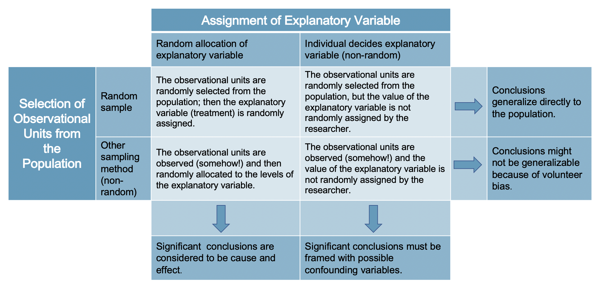

```{r setup, include=FALSE}
knitr::opts_chunk$set(echo = TRUE, warning = FALSE, message = FALSE, 
                      fig.retina = 3, fig.align = 'center',
                      fig.asp = 0.75, fig.width = 8,
                      cache = TRUE)
library(knitr)
library(tidyverse)
theme_update(text = element_text(size = 20))
```

```{r xaringan-scribble, echo=FALSE}
xaringanExtra::use_scribble()
```


background-image: url("img/DAW.png")
background-position: left
background-size: 50%
class: middle, center, inverse


.pull-right[


## .whitish[Simple Linear Regression]

<br>

<br>

### .whitish[Kelly McConville]

#### .yellow[ Stat 100 | Week 4 | Spring 2022] 

]


---

## Announcements


* P-Set 3 due Friday this week.
* Moving all project assignment due dates to Fridays at 5pm.


****************************

--

## Goals for Today

.pull-left[

 
* Introduce statistical modeling

* Simple linear regression model
    + Estimating the slope and intercept terms
    + Prediction
    + Consider one quantitative predictor
    + Consider one categorical predictor

 
] 


.pull-right[

* Measuring correlation

]


---

###  When to Get Help

> "I have no idea how to do this problem."

--

&rarr; Ask us to point you to an similar example from the lecture or handouts.

--

&rarr; Talk it through with one of us so we can verbalize the process of going from Q to A.

--

> "I am getting a weird error but really think my code is correct/on the right track/matches the examples from class."

--


&rarr; It is time for a second pair of eyes.  Don't stare that the error for over 10 minutes.

--

> And lots of other times too!

---

###  When to Get Help


Remember:

&rarr; Struggling is part of learning.

--

&rarr; But let us help you ensure it is a **productive** struggle.

--

&rarr; Struggling does NOT mean you are bad at stats!

---


## Thoughts on Data Collection

**Random Sampling**


Random sampling is important to ensure the sample is representative of the population.

--

Representativeness isn't about size.

+ Small random samples will tend to be more representative than large non-random samples.

--

How do we draw conclusions about the population from non-random samples?

--

&rarr; Investigate how your sampled cases (and respondents) are systematically different from the non-sampled cases (and non-respondents).

---

## Thoughts on Data Collection

**Random Assignment**

Random assignment allows you to explore **causal** relationships between your explanatory variables and the predictor variables.

--

How do we draw causal conclusions from studies without random assignment?

--

&rarr; With extreme care!  Try to control for all possible confounding variables.

--

&rarr; Discuss the associations/correlations you found.  Use domain knowledge to address potentially causal links.

--

&rarr; Take more stats to learn more about causal inference.


--

**Bottom Line:** We often have to use imperfect data to make decisions.


---

## Two Key Random Mechanisms


```{r, echo = FALSE, out.width='80%'}

```


---

.left-column[

## Recap

]

.right-column[

```{r, echo = FALSE, out.width = '70%'}
knitr::include_graphics("img/DAW.jpeg")
```


]

---

## Statistical Models

#### Two Main Motivations

--

You can often tell the modeling motivation from the research question.  We will look at studies that ask the following questions:


--

> "Can I use remotely sensed data to predict forest types in Alaska?"

--

&rarr; Motivation: Predict new observations


--

> "Do left-handed people live shorter lives than right-handed people?"

--

&rarr; Motivation: Describe relationships


--

We will focus mainly on **descriptive/explanatory modeling** in this course.  If you want to learn more about **predictive modeling**, take Stat 121A: Data Science 1 + Stat 121B: Data Science 2.

---

## Form of the Model

<br><br><br>

--

$$
y = f(x) + \epsilon
$$

<br><br><br> 

--

**Goal:**

&rarr; Determine a reasonable form for $f()$. (Ex: Line, curve, ...)

--

&rarr; Estimate $f()$ with $\hat{f}()$ using the data.

--

&rarr; Generate predicted values: $\hat{y} = \hat{f}(x)$.

---

### Simple Linear Regression Model

Consider this model when:

--

* Response variable $(y)$: quantitative

--

* Explanatory variable $(x)$: quantitative
    + Have only ONE explanatory variable.

--
    
* AND, $f()$ can be approximated by a line.

---

### Example: [The Ultimate Halloween Candy Power Ranking](https://fivethirtyeight.com/videos/the-ultimate-halloween-candy-power-ranking/)

> "The social contract of Halloween is simple: Provide adequate treats to costumed masses, or be prepared for late-night tricks from those dissatisfied with your offer. To help you avoid that type of vengeance, and to help you make good decisions at the supermarket this weekend, we wanted to figure out what Halloween candy people most prefer. So we devised an experiment: Pit dozens of fun-sized candy varietals against one another, and let the wisdom of the crowd decide which one was best." -- Walt Hickey

--

> "While we don’t know who exactly voted, we do know this: 8,371 different IP addresses voted on about 269,000 randomly generated matchups.2 So, not a scientific survey or anything, but a good sample of what candy people like. "


---

### Example: [The Ultimate Halloween Candy Power Ranking](https://fivethirtyeight.com/videos/the-ultimate-halloween-candy-power-ranking/)


```{r}
candy <- read_csv("https://raw.githubusercontent.com/fivethirtyeight/data/master/candy-power-ranking/candy-data.csv")

glimpse(candy)

```

---

### Example: [The Ultimate Halloween Candy Power Ranking](https://fivethirtyeight.com/videos/the-ultimate-halloween-candy-power-ranking/)

.pull-left[

```{r candy, fig.show = 'hide', echo = FALSE}
ggplot(data = candy, 
       mapping = aes(x = pricepercent,
                     y = winpercent)) +
  geom_point(alpha = 0.6, size = 4, 
             color = "chocolate4")
```

* Linear trend? 

* Direction of trend?

]

.pull-right[

```{r, echo = FALSE}
knitr::include_graphics(knitr::fig_chunk("candy", "png"))
```

]


---


### Example: [The Ultimate Halloween Candy Power Ranking](https://fivethirtyeight.com/videos/the-ultimate-halloween-candy-power-ranking/)

.pull-left[

```{r candy2, fig.show = 'hide', echo = FALSE}
ggplot(data = candy, 
       mapping = aes(x = pricepercent,
                     y = winpercent)) +
  geom_point(alpha = 0.6, size = 4, 
             color = "chocolate4") +
  stat_smooth(method = "lm", se = FALSE,
              color = "deeppink2")
```

**A simple linear regression model would be suitable for these data.**

* But first, let's describe more plots!

]

.pull-right[

```{r, echo = FALSE}
knitr::include_graphics(knitr::fig_chunk("candy2", "png"))
```

]


---

```{r, echo = FALSE, fig.height=6, fig.width=8, fig.align='center'}
set.seed(4119)
x <- runif(50, 0, 10)
y1 <- 3 + 1*x + rnorm(50, 0 , 3)
y2 <- runif(50, 0, 10)
y3 <- 1 - .5*x + rnorm(50, 0, 1)
y4 <- 3 + -40*x +  4*x^2 + rnorm(50, 0, 20)
dat <- data_frame(x, y1, y2, y3, y4)  

library(cowplot)
# Create scatterplots and place in a grid
p1 <- ggplot(dat, aes(x, y1)) + geom_point()
p2 <- ggplot(dat, aes(x, y2)) + geom_point()
p3 <- ggplot(dat, aes(x, y3)) + geom_point()
p4 <- ggplot(dat, aes(x, y4)) + geom_point()
plot_grid(p1, p2, p3, p4, ncol=2, labels = c("A", "B", "C", "D"))

```

--

#### Need a summary statistics that quantifies the strength and relationship of the linear trend!


---

## (Sample) Correlation Coefficient

* Measures the **strength** and **direction** of **linear** relationship between two quantitative variables

--

* Symbol: $r$

--

* Always between -1 and 1

--

* Sign indicates the direction of the relationship 

--

* Magnitude indicates the strength of the linear relationship

--

```{r}
candy %>%
  summarize(cor = cor(pricepercent, winpercent))
```


---

.pull-left[

```{r, echo = FALSE, fig.height=5, fig.width=7.5, fig.align='center'}

plot_grid(p1, p2, p3, p4, ncol=2, labels = c("A", "B", "C", "D"))

```

]

.pull-right[

Any guesses on the correlations for A, B, C, or D?

]

--

.pull-right[

```{r}
dat %>%
  summarize(A = cor(x, y1), B = cor(x, y2),
            C = cor(x, y3), D = cor(x, y4))
```

]

---

## New Example

```{r, echo = FALSE}
# Load new dataset
dat2 <- read_csv("~/shared_data/stat100/data/datasaurus.csv")
```


.pull-left[

```{r}
# Correlation coefficients
dat2 %>%
  group_by(dataset) %>%
  summarize(cor = cor(x, y))
```

]

--

.pull-right[

* Conclude that $x$ and $y$ have the same relationship across these different datasets because the correlation is the same?

]

---

###  Always graph the data when exploring relationships!

```{r, echo = FALSE, fig.height=6, fig.width=8, fig.align='center'}
# Scatterplots
ggplot(data = dat2, mapping = aes(x = x, y = y)) +
  geom_point() +
  facet_wrap(~ dataset, ncol = 3)
```


---

class: center, middle, inverse

# It's Time for Trend Stretches!

---

### Simple Linear Regression


.pull-left[

```{r, echo = FALSE}
knitr::include_graphics(knitr::fig_chunk("candy2", "png"))
```

]

.pull-right[

Let's return to the Candy Example.


* A line is a reasonable model form.


* Where should the line be?
    + Slope? Intercept?

]


---

###  Form of the SLR Model

$$ 
\begin{align}
y &= f(x) + \epsilon \\
y &= \beta_o + \beta_1 x + \epsilon
\end{align}
$$

**Need to determine the best estimates of $\beta_o$ and $\beta_1$.**

--

*****************************

#### Distinguishing between the population and the sample

--

* Parameters: 
    + Based on the population
    + Unknown then if don't have data on the whole population
    + EX: $\beta_o$ and $\beta_1$

--

* Statistics: 
    + Based on the sample data
    + Known
    + Usually estimate a population parameter
    + EX: $\hat{\beta}_o$ and $\hat{\beta}_1$ 

---


### Method of Least Squares

Need two key definitions:

--

* Fitted value: The *estimated* value of the $i$-th case

$$
\hat{y}_i = \hat{\beta}_o + \hat{\beta}_1 x_i
$$
--

* Residuals: The *observed* error term for the $i$-th case

$$
e_i = y_i - \hat{y}_i
$$


**Goal**: Pick values for $\hat{\beta}_o$ and $\hat{\beta}_1$  so that the residuals are small!

---

### Method of Least Squares


```{r, echo=FALSE, eval = TRUE}
ggplot(data = candy, 
       mapping = aes(x = pricepercent,
                     y = winpercent)) +
  geom_point(alpha = 0.6, size = 4, 
             color = "chocolate4") +
  stat_smooth(method = "lm", se = FALSE,
              color = "deeppink2") +
  annotate("segment", x = candy$pricepercent, 
           xend = candy$pricepercent, 
           y = candy$winpercent, yend = 42 + 17.8*candy$pricepercent, 
           color = "darkblue", arrow = arrow(length = unit(0.03, "npc"))) + 
  geom_point()
  
```

--

* Want residuals to be small.

--

* Minimize some function of the residuals.  

---

### Method of Least Squares

Minimize:

$$
\sum_{i = 1}^n e^2_i
$$

--

Get the following equations:

$$ 
\begin{align}
\hat{\beta}_1 &= \frac{ \sum_{i = 1}^n (x_i - \bar{x}) (y_i - \bar{y})}{ \sum_{i = 1}^n (x_i - \bar{x})^2} \\
\hat{\beta}_o &= \bar{y} - \hat{\beta}_1 \bar{x}
\end{align}
$$
where 

$$
\begin{align}
\bar{y} = \frac{1}{n} \sum_{i = 1}^n y_i \quad \mbox{and} \quad \bar{x} = \frac{1}{n} \sum_{i = 1}^n x_i
\end{align}
$$


---

## Method of Least Squares

Once we have the estimated intercept $(\hat{\beta}_o)$ and the estimated slope $(\hat{\beta}_1)$, we can estimate the whole function:

--

$$
\hat{y} = \hat{\beta}_o + \hat{\beta}_1 x
$$


Called the **least squares line** or the **line of best fit**.

---

### Method of Least Squares


.pull-left[

`ggplot2` will compute the line and add it to your plot using `geom_smooth(method = "lm")`

```{r candy3, fig.show = 'hide', echo = FALSE}
ggplot(data = candy, 
       mapping = aes(x = pricepercent,
                     y = winpercent)) +
  geom_point(alpha = 0.6, size = 4, 
             color = "chocolate4") +
  stat_smooth(method = "lm", se = FALSE,
              color = "deeppink2")
```


But what are the **exact** values of $\hat{\beta}_o$ and $\hat{\beta}_1$?


]

.pull-right[


```{r, echo = FALSE}
knitr::include_graphics(knitr::fig_chunk("candy3", "png"))
```

]

---

### Constructing the Simple Linear Regression Model in R

```{r}
mod <- lm(winpercent ~ pricepercent, data = candy)

library(moderndive)
get_regression_table(mod)
```


---

### Interpretation

Slope:


<br><br><br> <br> <br> <br>

Intercept:


---

### Prediction

```{r}
new_cases <- data.frame(pricepercent = c(0.25, 0.85, 1.5))
predict(mod, newdata = new_cases)
```

We didn't have any trees in our sample with a price percentage of 85%.  Can we still make this prediction?


--

&rarr;  Called **interpolation**

We didn't have any candies in our sample with a price percentage of 150%.  Can we still make this prediction?

--

&rarr;  Called **extrapolation**


---


### Cautions

.pull-left[

* Careful to only predict values within the range of $x$ values in the sample.


* Make sure to investigate **influential points**.


**Q:** What is an **outlier**?

]

.pull-right[

```{r, echo = FALSE}
set.seed(13681)
x <- c(runif(50, 0, 10), 20)
y1 <- c(3 + 1*x + rnorm(51, 0 , 3))
dat0 <- data_frame(x, y1)
x <- c(x, 20)
y1 <- c(y1, 10)
dat <- data_frame(x, y1) 
ggplot(dat, aes(x, y1)) + geom_point() + 
  stat_smooth(method = "lm", se = FALSE) +
  stat_smooth(method = "lm", se = FALSE, data = dat[-51,], color = "purple") +
  stat_smooth(method = "lm", se = FALSE, data = dat[-52,], color = "orange")  
```


]

---


### Linear Regression

Linear regression is a flexible class of models that allow for:

* Both quantitative and categorical explanatory variables.

--

* Multiple explanatory variables.

--

* Curved relationships between the response variable and the explanatory variable.

--

* BUT the **response variable is quantitative**.

********************

--

### What About A Categorical Explanatory Variable?

--

* Response variable $(y)$: quantitative

--

* Have 1 categorical explanatory variable $(x)$ with two categories.


---

### Example: The Smile-Leniency Effect

**Can a simple smile have an effect on punishment assigned following an infraction?** In a 1995 study, Hecht and LeFrance examined the effect of a smile on the leniency of disciplinary action for wrongdoers. Participants in the experiment took on the role of members of a college disciplinary panel judging students accused of cheating. For each suspect, along with a description of the offense, a picture was provided with either a smile or neutral facial expression. A leniency score was calculated based on the disciplinary decisions made by the participants.

**Response variable?**

**Explanatory variable?**


---

###  Model Form


$$ 
\begin{align}
y &= \beta_o + \beta_1 x + \epsilon
\end{align}
$$

--

First, need to convert the categories of $x$ to numbers.

--

Before building the model, let's explore and visualize the data!

```{r}
library(tidyverse)
library(Lock5Data)
# Load data
data(Smiles)
smiles <- Smiles
glimpse(smiles)
```

--

* What `dplyr` functions should I use to find the mean and sd of `Leniency` by the categories of `Group`?

--

* What graph should we use to visualize the `Leniency` scores by `Group`?

---

### Example: The Smile-Leniency Effect

```{r}
# Summarize
smiles %>%
  group_by(Group) %>%
  summarize(count = n(), mean_len = mean(Leniency), 
            sd_len = sd(Leniency))
```


---

### Example: The Smile-Leniency Effect


.pull-left[

```{r box, fig.show = 'hide'}
# Visualize
ggplot(smiles, aes(x = Group, 
                   y = Leniency)) +
  geom_boxplot() +
    stat_summary(fun = mean,
                 geom = "point",
                 color = "purple",
                 size = 4)
```

]

.pull-right[

```{r, echo = FALSE}
knitr::include_graphics(knitr::fig_chunk("box", "png"))
```

]


---

### Fit the Linear Regression Model


Model Form:

$$ 
\begin{align}
y &= \beta_o + \beta_1 x + \epsilon
\end{align}
$$

--

When $x = 0$:


<br>

<br>

When $x = 1$:

--


```{r}
mod <- lm(Leniency ~ Group, data = smiles)
library(moderndive)
get_regression_table(mod)
```

---

### Notes 

1. When the explanatory variable is categorical, $\beta_o$ and $\beta_1$ no longer represent the interceopt and slope.

--

2. Now $\beta_o$ represents the (population) mean of the response variable when $x = 0$.

--

3. And, $\beta_1$ represents the change in the (population) mean response going from $x = 0$ to $x = 1$.

--

4. Can also do prediction:

```{r}
new <- data.frame(Group = c("smile", "neutral"))
predict(mod, newdata = new)
```


