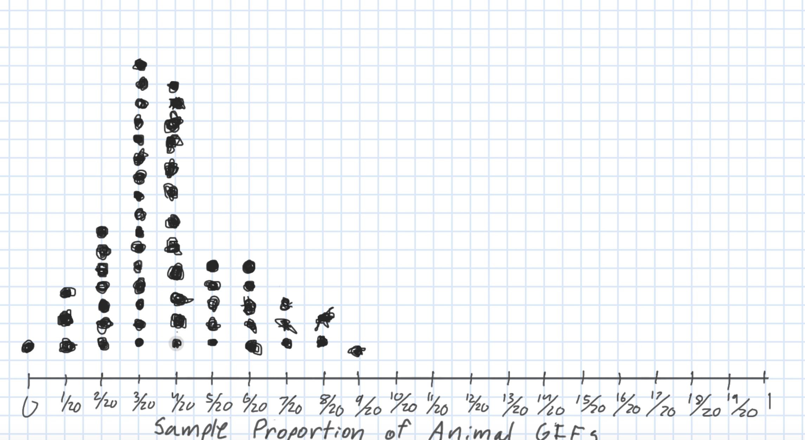
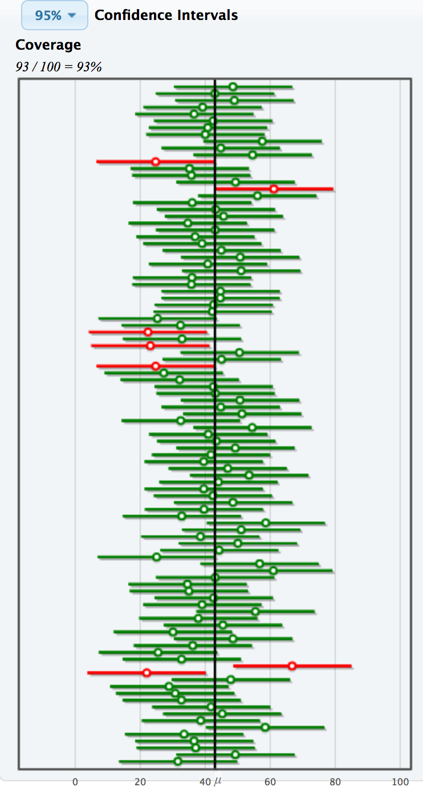

```{r setup, include=FALSE}
knitr::opts_chunk$set(echo = TRUE, warning = FALSE,
                      message = FALSE, 
                      fig.retina = 3, fig.align = 'center',
                      fig.asp = 0.75, fig.width = 8)
library(knitr)
library(tidyverse)
theme_update(text = element_text(size = 20))
```

```{r xaringan-scribble, echo=FALSE}
xaringanExtra::use_scribble()
```

class: inverse, middle, center


# Grab 30 notecards!


---

background-image: url("img/DAW.png")
background-position: left
background-size: 50%
class: middle, center, inverse


.pull-right[


## .whitish[Estimation]

<br>

<br>

### .whitish[Kelly McConville]

#### .yellow[ Stat 100 | Week 7 | Spring 2022] 

]


---

### Announcements

* P-Set 6 is post.  Due in two weeks (Wed, March 23rd 9:00am).
* Try again: Final Exam: May 10th - 13th
* Mid-Term Exam: Wednesday, March 9th - Friday, March 11th
    + Takehome released at noon today in shared folder on the server.
    + Only access the takehome when you are ready to start your 3 hour block!
    + Make sure to do the takehome BEFORE your oral exam time slot!

****************************

--

### Goals for Today

.pull-left[

* First steps of the takehome exam

* Key features of **Sampling Distributions**
] 


.pull-right[


* Estimation with **confidence intervals**

* Revisit parameters versus statistics

* Approximating a **sampling distribution** with a **bootstrap distribution**


]

---

## Takehome Exam

Starting at noon today, will be located in: `shared_data` > `stat100` > `exams`.


#### Let's go through the instructions page.

First three things the exam will ask you to do:

1. Save it to your home directory.
    + If you forget this step, R likely won't save your work!
2. Read over and acknowledge the Harvard College Honor Code.
3. Insert your start time.


---

## Sampling Distribution of a Statistic

.pull-left[


Steps to Construct an (Approximate) Sampling Distribution:

1. Decide on a sample size, $n$.
2. Randomly select a sample of size $n$ from the population.
3. Compute the sample statistic.
4.  Put the sample back in.
5. Repeat Steps 2 - 4 many (1000+) times.

]

.pull-right[

```{r  out.width = "95%", echo=FALSE, fig.align='center'}
 
```

]


---

## Key Features of a Sampling Distribution

What did we learn about sampling distributions?

--

&rarr; **Standard error** = standard deviation of the statistic


--

&rarr; Centered around the true population parameter.

--

&rarr; As the sample size increases, the **standard error** (SE) of the statistic decreases.

--

&rarr; As the sample size increases, the shape of the sampling distribution becomes more bell-shaped and symmetric.

--

**Question**: How do sampling distributions help us **quantify uncertainty**?

--

**Question**: If I am estimating a parameter in a real example, why won't I be able to construct the sampling distribution??

---

## Estimation

**Goal**: Estimate the value of a population parameter using data from the sample.


--

**Question**: How do I know which population parameter I am interesting in estimating?

--

&rarr; **Answer**: Likely depends on the research question and structure of your data!


--

**Point Estimate**: The corresponding statistic

*  Single best guess for the parameter

```{r}
library(tidyverse)
ce <- read_csv("~/shared_data/stat100/data/ce.csv")
summarize(ce, meanFINCBTAX = mean(FINCBTAX))
```    
    
---

### Potential Parameters and Point Estimates

---

## Confidence Intervals

.pull-left[

It is time to move **beyond** just point estimates to interval estimates that quantify our uncertainty.

]

.pull-right[

```{r}
summarize(ce, meanFINCBTAX = mean(FINCBTAX))
```

]

--

**Confidence Interval**: Interval of **plausible** values for a parameter

--

**Form**: $\mbox{statistic} \pm \mbox{Margin of Error}$

--

**Question**: How do we find the Margin of Error (ME)?

--

&rarr; **Answer**: If the sampling distribution of the statistic is approximately bell-shaped and symmetric, then a statistic will be within 2 SEs of the parameter for 95% of the samples.

--

**Form**: $\mbox{statistic} \pm 2\mbox{SE}$

--

Called a 95% confidence interval (CI).  (Will discuss the meaning of the word confidence soon)

---

## Confidence Intervals

**95% CI Form**: 

$$
\mbox{statistic} \pm 2\mbox{SE}
$$

Let's use the `ce` data to produce a CI for the average household income before taxes.

```{r}
summarize(ce, meanFINCBTAX = mean(FINCBTAX))
```

What else do we need to construct the CI?

--

**Problem**: To compute the SE, we need many samples from the population.  We have 1 sample.

--

**Solution**: Approximate the sampling distribution using **ONLY OUR ONE SAMPLE!**

---

### Bootstrap Distribution

How do we approximate the sampling distribution?

.pull-left[

Steps for Generating a **Bootstrap Distribution of a Sample Statistic**:

1. Take a sample of size $n$ with replacement from the sample.
    + Called a bootstrap sample.

2. Compute the statistic.


3. Repeat 1 and 2 many times.

]

---

### Let's Practice Generating Bootstrap Samples!


**Example:** In a recent study, 23 rats showed compassion that surprised scientists. Twenty-three of the 30 rats in the study freed another trapped rat in their cage, even when chocolate served as a distraction and even when the rats would then have to share the chocolate with their freed companion. (Rats, it turns out, love chocolate.) Rats did not open the cage when it was empty or when there was a stuffed animal inside, only when a fellow rat was trapped. We wish to use the sample to estimate the proportion of rats that show empathy in this way.

**Parameter**:

**Statistic**:

You have 30 cards.  How can you use these to take a bootstrap sample?

* For each sample, compute the bootstrap statistic and put it on the class dotplot.
    + Go to: [https://bit.ly/stat100-dists](https://bit.ly/stat100-dists).


(Will use these data on the first problem of P-Set 6.)

---

### Sampling Distribution Versus Bootstrap Distribution

* Data needed:

<br> <br> <br>

--

* Center:

<br> <br> <br>

--

* Spread:


---


### (Bootstrapped) Confidence Intervals


**95% CI Form**: 

$$
\mbox{statistic} \pm 2\mbox{SE}
$$

--

We approximate $\mbox{SE}$ with $\widehat{\mbox{SE}}$ = the standard deviation of the bootstrapped statistics.


Caveats:

* Assuming a random sample

--

* Even with random samples, sometimes we get non-representative samples.  Bootstrapping can't fix that.

--

* Assuming the bootstrap distribution is bell-shaped and symmetric


---

### Percentile Method Confidence Interval

If I want a P% confidence interval, I find the bounds of the middle P% of the bootstrap distribution.

---

class: inverse, center, middle

### Let's see how to calculate these confidence intervals in R with the confidenceIntervals.Rmd handout.


---

.pull-left[

### What do we mean by confidence?


CI: Interval of **plausible values** for the **parameter**


I am P% confident that the true parameter is in the computed interval.

]

.pull-right[

```{r,  out.width = "60%", echo=FALSE, fig.align='center', fig.cap = "", fig.pos="h"}
library(knitr)
 
```

]


---

## Reminders:

* Mid-Term Exam: Wednesday, March 9th - Friday, March 11th
    + Takehome released at noon today in shared folder on the server.
    + Only access the takehome when you are ready to start your 3 hour block!
    + Make sure to do the takehome BEFORE your oral exam time slot!

* P-Set 6 is post.  Due in two weeks (Wed, March 23rd 9:00am).
