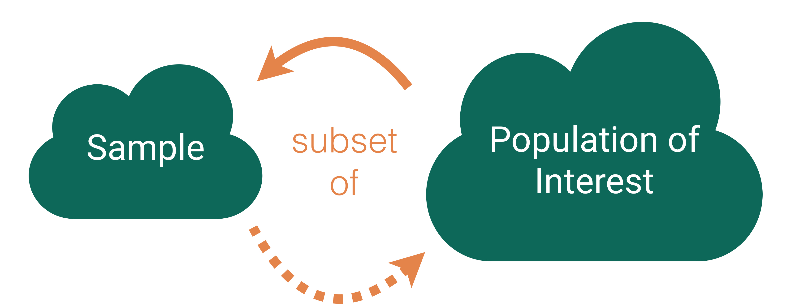

```{r setup, include=FALSE}
knitr::opts_chunk$set(echo = TRUE, warning = FALSE,
                      message = FALSE, 
                      fig.retina = 3, fig.align = 'center',
                      fig.asp = 0.75, fig.width = 8)
library(knitr)
library(tidyverse)
theme_update(text = element_text(size = 20))
```

```{r xaringan-scribble, echo=FALSE}
xaringanExtra::use_scribble()
```


background-image: url("img/DAW.png")
background-position: left
background-size: 50%
class: middle, center, inverse


.pull-right[


## .whitish[Finish Estimation]

## .whitish[Start Hypothesis Testing]

<br>

<br>

### .whitish[Kelly McConville]

#### .yellow[ Stat 100 | Week 8 | Spring 2022] 

]


---

### Announcements

* P-Set 6 is due at the usual time (Wed at 9:00am).
* PA 2 is due Friday at 5pm.
* `r emo::ji("tada")` We are now accepting Course Assistant/Teaching Fellow applications for Stat 100 for Fall 2022. To apply, fill out [this application](https://docs.google.com/forms/d/e/1FAIpQLScwKJaRfppRqXAzyxMMCeBUdwrzBudNONt0S9dc8lE2ZUlQwQ/viewform) by March 31st.
    + About 9-12 hours of work per week.  
    + Primary responsibilities: Lead a discussion section, hold office hours, grade assessments.

****************************

--

### Goals for Today

.pull-left[

* Estimation with **confidence intervals**

* Meaning of the word **confidence**


] 


.pull-right[


* Set-up the structure of **hypothesis testing**


]

---

class: inverse, middle, center


## `r emo::ji("thinking")` The second half of Stat 100 is more conceptually difficult. `r emo::ji("thinking")`

---

### Bootstrapped Confidence Intervals


**SE Method 95% CI**:

$$
\mbox{statistic} \pm 2\widehat{\mbox{SE}}
$$

We approximate $\mbox{SE}$ with $\widehat{\mbox{SE}}$ = the standard deviation of the bootstrapped statistics.


**Percentile Method CI:**

If I want a P% confidence interval, I find the bounds of the middle P% of the bootstrap distribution.


Assuming random sample and roughly bell-shaped and symmetric bootstrap distribution for both methods.


---

.pull-left[

### What do we mean by confidence?


CI: Interval of **plausible values** for the **parameter**


I am P% confident that the true parameter is in the computed interval.

]

.pull-right[

```{r,  out.width = "60%", echo=FALSE, fig.align='center', fig.cap = "", fig.pos="h"}
library(knitr)
include_graphics("img/cis.png") 
```

]

---

##  Notes on CIs

CI = interval of **plausible** values for the **parameter**


--

* Confidence level = success rate of the method under **repeated sampling**

--

* How do I know if my ONE CI successfully contains the true value of the parameter?

--

* As we increase the **confidence level**, what happens to the width of the interval?

--

* As we increase the **sample size**, what happens to the width of the interval?

--

* As we increase the **number of bootstrap samples** we take, what happens to the width of the interval?


---

class: inverse, center, middle

### Let's go through the second example from the confidenceIntervals.Rmd handout.


```{r, echo = FALSE, fig.align='center', out.width='20%'}
knitr::include_graphics("img/infer.png")
```

---

## Statistical Inference

.pull-left[

```{r, echo = FALSE, out.width='90%'}

```


]


.pull-right[

**Goal**: Draw conclusions about the population based on a sample.
{{content}}


]


--

**Main Flavors**:
{{content}}


--

&rarr; Estimating numerical quantities.
{{content}}

--

&rarr; Testing conjectures.
{{content}}


---

## Example: Does Extrasensory Perception (ESP) exist?

.pull-left[

```{r, echo = FALSE, out.width='80%', fig.cap = "Daryl Bem and Ben Honorton"}

```

]

--

.pull-right[

Bem and Honorton conducted extrasensory perception  studies:


* A "sender" randomly chooses an object out of 4 possible objects and sends that information to a "receiver".
* The "receiver" is then given a set of 4 possible objects and they must decide which one most resembles the object sent to them.

Out of 329 trials, the "receivers" correctly identified the object 106 times.

]

---

## ESP Example

Let's consider the following questions:

--

a. If ESP does not exist and the "receivers" are guessing, how often would we expect them to be correct?

--

&rarr; <span style="color: orange;">25% of the time</span>

--

b. For each sample (set of 329 trials), do we expect the proportion of correct guesses to be equal?  Why or why not?

--

&rarr; <span style="color: orange;">No because of sampling variability!</span>

--

c. Is it possible to randomly guess correctly 106 out of 329 times (i.e., 32% of the time)?

--

&rarr; <span style="color: orange;">Yes but plausible?</span>

--

d. How unusual is it to guess correctly 106 out of 329 times if ESP doesn't exist?

--

To help us answer d., we need a **sampling distribution** for the sample proportion where **we assume the "receivers" were purely guessing!**

---


## Sampling Distribution of a Statistic

.pull-left[

**Steps for (Approximate) Distribution:**

(1) Decide on a sample size, $n$.

(2) Randomly select a sample of size $n$ from the population.

(3) Compute the sample statistic.

(4)  Put the sample back in.

(5) Repeat Steps (2) - (4) many (1000+) times.

]

--

.pull-right[


<iframe src="https://giphy.com/embed/MCfhrrNN1goH6" width="280" height="240" frameBorder="0" class="giphy-embed" allowFullScreen></iframe>

<center><p> via GIPHY</a></p></center>

]


---


## Sampling Distribution of a Statistic

.pull-left[

**Steps for (Approximate) Distribution:**

(1) Decide on a sample size, $n$.

(2) Randomly select a sample of size $n$ from the population.

(3) Compute the sample statistic.

(4)  Put the sample back in.

(5) Repeat Steps (2) - (4) many (1000+) times.

]


.pull-right[

```{r  out.width = "95%", echo=FALSE, fig.align='center'}
include_graphics("img/samp_dist.png") 
```


]


---


## Sampling Distribution Under No ESP


**Steps for (Approximate) Distribution:**


--

(1) Decide on a sample size, $n$. 


--


&rarr; <span style="color: orange;">n = 329.</span> 


--

(2) Randomly select a sample of size $n$ from the population. 


--

&rarr; <span style="color: orange;"> 
We can generate one draw from this population by flipping an unfair coin where the probability of heads (i.e., a correct answer) is 0.25. </span>

--

&rarr; <span style="color: orange;"> For the sample, flip the coin 329 times. </span>

--

```{r}
library(mosaic)
rflip(n = 329, prob = 0.25)
```


---


## Sampling Distribution Under No ESP


(3) Compute the sample statistic.


--

&rarr; <span style="color: orange;"> Compute the proportion of heads (i.e., correct answers). </span>

--

```{r}
rflip(n = 329, prob = 0.25, summarize = TRUE)
```


--

(4)  Put the sample back in.


(5) Repeat Steps (2) - (4) many (1000+) times.

--


```{r}
guess_sampling_dist <- do(1000)*rflip(n = 329, prob = 0.25)
guess_sampling_dist
```


---

## Sampling Distribution Under No ESP

.pull-left[

```{r null, fig.show='hide'}
ggplot(data = guess_sampling_dist,
       mapping = aes(x = prop)) +
  geom_histogram(color = "white",
                 bins = 20)
```

* What value should our sampling distribution be centered around if the receivers are just guessing? 


]

.pull-right[

```{r, echo = FALSE}
knitr::include_graphics(knitr::fig_chunk("null", "png"))
```


]


---

## Sampling Distribution Under No ESP

.pull-left[

* How do the study results compare to the sampling distribution under no ESP?
    + How unusual is it to guess correctly 106 out of 329 times if ESP doesn't exist?


```{r phat, fig.show='hide'}
p_hat <- 106/329
ggplot(data = guess_sampling_dist,
       mapping = aes(x = prop)) +
  geom_histogram(color = "white",
                 bins = 20) +
  geom_vline(xintercept = p_hat,
             color = "orange",
             size = 2)
```

]

.pull-right[

```{r, echo = FALSE}
knitr::include_graphics(knitr::fig_chunk("phat", "png"))
```


]

--


* Do Bem and Honorton have evidence that ESP exists?

---

## Do Harvardians Have ESP?

--


.pull-left[

In pairs:

* Decide who is going to be the sender and who is going to be the receiver.

* **Sender:** Think of one of these images.

* **Receiver:** Guess which image the sender was thinking of.  

* Now switch roles and do it again!  

* Once you have both played each role, each person should add a tally mark on the chalkboard.

]


.pull-right[

```{r, echo = FALSE, fig.align='center', out.width='95%'}
knitr::include_graphics("img/four_images.png")
```
]

---

## Do Harvardians Have ESP?

What do we need to modify in the code to answer the question?

```{r, eval = FALSE}
guess_sampling_dist <- do(1000)*rflip(n = 329, prob = 0.25)
p_hat <- 106/329
ggplot(data = guess_sampling_dist, mapping = aes(x = prop)) +
  geom_histogram(color = "white", bins = 20) +
  geom_vline(xintercept = p_hat, color = "orange", size = 2)
```


---

## Reminders:

* P-Set 6 is due at the usual time (Wed at 9:00am).
* PA 2 is due Friday at 5pm.
* We are now accepting Course Assistant/Teaching Fellow applications for Stat 100 for Fall 2022. To apply, fill out [this application](https://docs.google.com/forms/d/e/1FAIpQLScwKJaRfppRqXAzyxMMCeBUdwrzBudNONt0S9dc8lE2ZUlQwQ/viewform) by March 31st.
    + About 9-12 hours of work per week.  
    + Primary responsibilities: Lead a discussion section, hold office hours, grade assessments.
