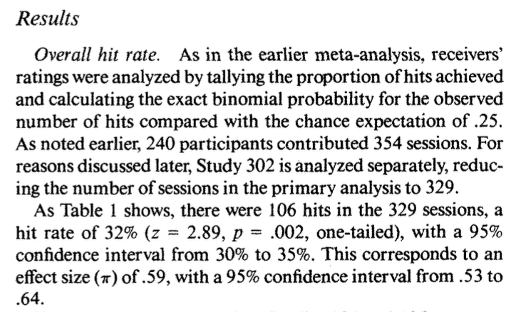

```{r setup, include=FALSE}
knitr::opts_chunk$set(echo = TRUE, warning = FALSE,
                      message = FALSE, 
                      fig.retina = 3, fig.align = 'center',
                      fig.asp = 0.75, fig.width = 8)
library(knitr)
library(tidyverse)
theme_update(text = element_text(size = 20))
```

```{r xaringan-scribble, echo=FALSE}
xaringanExtra::use_scribble()
```


background-image: url("img/DAW.png")
background-position: left
background-size: 50%
class: middle, center, inverse


.pull-right[


## .whitish[P-Value Pitfalls]

<br>

<br>

### .whitish[Kelly McConville]

#### .yellow[ Stat 100 | Week 9 | Spring 2022] 

]


---

### Announcements

XXX

****************************

--

### Goals for Today

.pull-left[


* Ethical Guidelines: "Integrity of Data and Methods"

* A hearty p-values discussion


] 


.pull-right[

* Inference zoom out

* Key probability concepts

]

---


---

### Ethics

* Let's return to the ASA's ["Ethical Guidelines for Statistical Practice"](https://www.amstat.org/ASA/Your-Career/Ethical-Guidelines-for-Statistical-Practice.aspx).


* Let's now look at "Integrity of Data and Methods".

---

class: inverse, center, middle

##  Integrity of Data and Methods


> "The ethical statistician is candid about any known or suspected limitations, defects, or biases in the data that may affect the integrity or reliability of the statistical analysis. Objective and valid interpretation of the results requires that the underlying analysis recognizes and acknowledges the degree of reliability and integrity of the data."

---

##  Integrity of Data and Methods

> "To aid peer review and replication, shares the data used in the analyses whenever possible/allowable and exercises due caution to protect proprietary and confidential data, including all data that might inappropriately reveal respondent identities."

--

#### Example: Reinhart and Rogoff (2009)

* Explores the effects of deficit spending.

--

* Used to justify budget-cutting policies.

--

* Misaligned columns in Excel so results didn't actually follow from their raw data.

--

* Herndon, Ash, Pollin (2014) found the error when they were trying to reproduce the original data analysis workflow.


---

### Hypothesis Testing: Decisions, Decisions


$\alpha$ = prob of Type I error **under repeated sampling** = prob reject $H_o$ when it is true


$\beta$ = prob of Type II error **under repeated sampling** = prob fail to reject $H_o$ when $H_a$ is true.

Set $\alpha$ beforehand.  Use as the cut-off for p-value.

**The smaller $\alpha$ is the larger $\beta$ will be.**


Choose a lower $\alpha$ (e.g., 0.01, 0.001) when the Type I error is worse and a higher $\alpha$ (e.g., 0.1) when the Type II error is worse.

---

### Let's Talk About P-values

--

* The original intention of the p-value was as an informal measure to judge whether or not a researcher should take a second look.

--

* But to create simple statistical manuals for practitioners, the rule quickly became "p-value < 0.05" = "statistically significant".

--

* **A consequence**: The p-value is often misinterpreted to be the probability the null hypothesis is true.  
    + A p-value of 0.003 does not mean there's a 0.3% chance that ESP doesn't exist!
    
--

* **A consequence**: Researchers often put too much weight on the p-value and not enough weight on their domain knowledge/the implausibility of their conjecture.


--

* **A consequence**: [P-hacking](https://projects.fivethirtyeight.com/p-hacking/): Cherry-picking promising findings

---

### Let's Talk About P-values


* **A consequence**: People conflate *statistical significance* with *practical significance*.

--

**Example**: A recent *Nature* study of 19,000+ people found that those who meet their spouses online...

--

&rarr; Are less likely to divorce (p-value < 0.002)

--

&rarr; Are more likely to have high marital satisfaction (p-value < 0.001)

--

BUT the *effect sizes* were tiny:

--

* Divorce rate of 7.67% for those who met online versus 5.96% for those who met in-person.

--

* On a 7 point scale, happiness value of 5.48 for those who met online versus 5.6 for those who met in-person.


---

### Let's Talk About P-Values

The American Statistical Association created a set of principles to address misconceptions and misuse of p-values:

--


(1) P-values can indicate how incompatible the data are with a specified statistical model.


(2) P-values do not measure the probability that the studied hypothesis is true, or the probability that the data were produced by random chance alone.


(3) Scientific conclusions and business or policy decisions should not be based only on whether or not a p-value passes a specific threshold (i.e. 0.05).


(4) Proper inference requires full reporting and transparency.


(5) A p-value, or statistical significance, does not measure the size of an effect or the importance of a result.


(6) By itself, a p-value does not provide a good measure of evidence regarding a model or hypothesis.


---

### Let's Talk About P-values

* Despite its issues, p-values are still quite popular and can still be a useful tool. 

--


* In 2014, George Cobb, Mount Holyoke College poised the following questions:

```{r  out.width = "60%", echo=FALSE, fig.align='center'}
 
```

--

* Understanding p-values and being able to interpret a p-value in context is a learning objective of Stat 100.
    + Ex: If ESP doesn't exist, the probability of guessing correctly on at least 106 out of 329 trials is 0.003.

--

* Understanding that a small p-value means evidence for $H_a$ is important.

--


* Understanding that what you mean by **small** should depend on your field and whether a Type I Error or Type II Error is worse for **your particular research question**.

--
    
* Your ability to tell if a # is less than 0.05 is not a learning objective.  

---

### Reporting Results in Journal Articles

```{r, echo = FALSE, out.width= "70%"}

```


---

background-image: url("img/ci_diagram_sim.png")
background-position: contain
background-size: 70%

### Statistical Inference Zoom Out -- Estimation


--

**Question**: How did folks do inference before computers?


---

background-image: url("img/hyp_testing_diagram_sim.png")
background-position: contain
background-size: 80%

### Statistical Inference Zoom Out -- Testing


--

**Question**: How did folks do inference before computers?


---

background-image: url("img/ci_diagram_sim.png")
background-position: contain
background-size: 70%

### Statistical Inference Zoom Out -- Estimation


**Question**: How did folks do inference before computers?


---

background-image: url("img/ci_diagram.png")
background-position: contain
background-size: 70%

### Statistical Inference Zoom Out -- Estimation


**Question**: How did folks do inference before computers?


---

background-image: url("img/hyp_testing_diagram_sim.png")
background-position: contain
background-size: 80%

### Statistical Inference Zoom Out -- Testing


**Question**: How did folks do inference before computers?


---

background-image: url("img/hyp_testing_diagram.png")
background-position: contain
background-size: 80%

### Statistical Inference Zoom Out -- Testing


**Question**: How did folks do inference before computers?


---

class: inverse, middle, center


## This means we need to learn about probability models!


---

### Probability Models

--

> "All models are wrong but some are useful."  -- George Box

--

.pull-left[

**Question**: How can we use theoretical models to approximate our distributions?

```{r, echo=FALSE, fig.width = 6}
library(tidyverse)
library(palmerpenguins)
library(infer)
penguins %>%
  drop_na(sex) %>%
  specify(flipper_length_mm ~ sex) %>%
  hypothesize(null = "independence") %>%
  generate(reps = 1000, type = "permute") %>%
  calculate(stat ="diff in means", order = c("female", "male")) %>%
  visualize()
```

]

--

.pull-right[

Before we can answer that question, we need to learn some probability concepts that will help us understand these models.

]

---

### Probability Concepts

**Random process**: outcomes is uncertain.

--

* EX: Roll 6 sided die.

--

The **probability** of an outcome is the "long-run proportion" of times the outcome occurs.

--

* EX: Want probability of rolling the #5
    + Let $p_n$ = proportion of rolls that are 5 in n rolls
    + Let $p$ = probability of rolling 5 = $P$(roll 5)

--

**Law of Large Numbers** (LLN) says that as $n$ increases, $p_n$ converges to $p$.

---

### Probability Concepts

.pull-left[

**Question**: Why is the LLN important to us?

]


--


.pull-left[

**Question**: How have we been computing p-values?

]

--


.pull-left[


$$
\mbox{p-value} = \frac{\mbox{# of extreme test stats}}{\mbox{# of replications}}
$$

LLN tells us the proportion of extreme test stats is roughly equal to the true probability of observing the test statistic or more extreme under $H_o$.

]

.pull-right[


```{r, echo = FALSE}
# Construct data frame of sample results
esp <- data.frame(guess = c(rep("correct", 106),
                            rep("incorrect", 329 - 106)))

# Compute observed test statistic
test_stat <- esp %>%
  specify(response = guess, success = "correct") %>%
  calculate(stat ="prop")


# Generate null distribution 
set.seed(411)
null_dist <- esp %>%
  specify(response = guess, success = "correct") %>%
  hypothesize(null = "point", p = 0.25) %>%
  generate(reps = 200, type = "simulate") %>%
  calculate(stat ="prop")

# Graph null distribution with test statistic
ggplot(null_dist, aes(x = stat)) +
  geom_dotplot() +
  geom_vline(xintercept = test_stat$stat, color = "deeppink", size = 2)
```

]


---

### Probabilities: $P(\mbox{event})$

* Probability of event = long-run proportion of event


#### Useful properties of probabilities:

(1)  $0 \leq P(\mbox{event}) \leq 1$

--

.pull-left[

(2) If two events are disjoints (have no outcomes in common), then 

$$
P(\mbox{event 1 or event 2}) = P(\mbox{event 1}) + P(\mbox{event 1}).
$$

]


.pull-right[

```{r, echo = FALSE}
ggplot(null_dist, aes(x = stat)) +
  geom_histogram() +
  geom_vline(xintercept = .3, color = "deeppink", size = 2) +
  geom_vline(xintercept = .2, color = "deeppink", size = 2)
```
We use this fact when we find a two-sided p-value.

]

---

### Probabilities: $P(\mbox{event})$

#### Useful properties of probabilities:

.pull-left[

(3) Complement Rule

$$
P(\mbox{event}) = 1 - P(\mbox{not that event}) = 1 - P(\mbox{event}^c)
$$

Sometimes it is "easier" to find the complement event's probability.

]

.pull-right[

```{r, echo = FALSE}
ggplot(null_dist, aes(x = stat)) +
  geom_histogram() +
  geom_vline(xintercept = .3, color = "deeppink", size = 2)
```


]


---

## Reminders:

XXX
