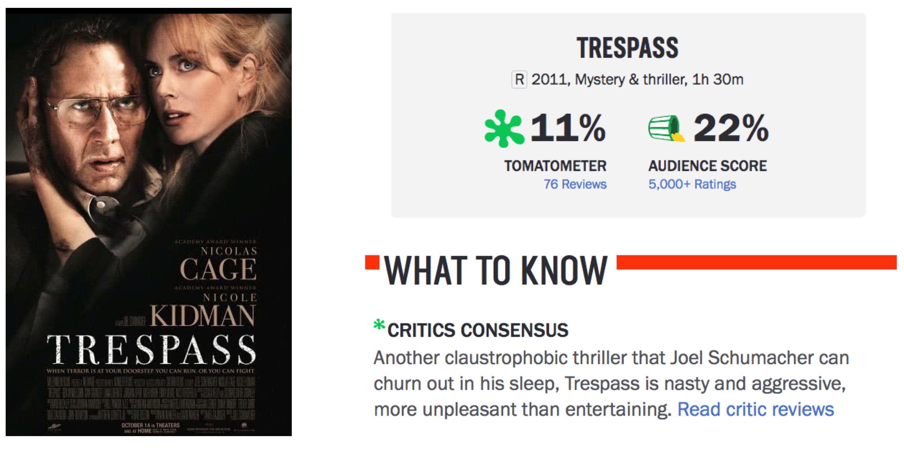

```{r setup, include=FALSE}
knitr::opts_chunk$set(echo = TRUE, warning = FALSE,
                      message = FALSE, 
                      fig.retina = 3, fig.align = 'center',
                      fig.asp = 0.75, fig.width = 8,
                      cache = TRUE)
library(knitr)
library(kableExtra)
library(tidyverse)
theme_update(text = element_text(size = 20),
             plot.title = element_text(hjust = 0.5))
```

```{r xaringan-scribble, echo=FALSE}
xaringanExtra::use_scribble()
```


background-image: url("img/DAW.png")
background-position: left
background-size: 50%
class: middle, center, inverse


.pull-right[


## .whitish[ANOVA Test]

## .whitish[Inference for]

## .whitish[Many Means]


<br>

### .whitish[Kelly McConville]

#### .yellow[ Stat 100 | Week 12 | Spring 2022] 

]


---

### Announcements

* Project Assignment 3 is due Friday, April 22nd at 5pm


****************************

--

### Goals for Today

.pull-left[

* Cover the **ANOVA** test.

* Learn about the F distribution.

] 


.pull-right[

* Compare **Simulation** methods versus **Probability Model** methods for inference.

* Start exploring inference for linear regression models.

]

---

### Inference for Many Means

Consider the situation where:

* Response variable: quantitative

* Explanatory variable: categorical

--

* Parameter of interest: $\mu_1 - \mu_2$

--

This parameter of interest only makes sense if the explanatory variable is restricted to two categories.

--

It is time to learn how to conduct inference for more than two means.

---

### Hypotheses

Consider the situation where:

* Response variable: quantitative

* Explanatory variable: categorical

--

$H_o$: $\mu_1 = \mu_2 = \cdots = \mu_K$  (Variables are independent/not related.)

$H_a$: At least one mean is not equal to the rest. (Variables are dependent/related)

---

### Example

Do Audience Ratings vary by movie genre?

```{r}
library(tidyverse)
# Load data
library(Lock5Data)
movies <- HollywoodMovies2011 %>%
  filter(!(Genre %in% c("Fantasy", "Adventure"))) %>%
  drop_na(Genre, AudienceScore)
```

* **Cases**:


* **Variables of interest (including type)**:


* **Hypotheses**:

---

### Example

.pull-left[

Does there appear to be a relationship?

```{r movies, fig.show = 'hide'}
ggplot(data = movies, 
       mapping = aes(x = Genre,
                     y = AudienceScore)) + 
  geom_boxplot() +     
  stat_summary(fun = mean, geom = "point", 
               color = "purple",
               shape = 8, size = 3)
```

]

.pull-right[

```{r, echo = FALSE}
knitr::include_graphics(knitr::fig_chunk("movies", "png"))
```

]

--

What movie did the audience hate so much??


---

### Example

.pull-left[

Does there appear to be a relationship?

```{r bad, fig.show = 'hide'}
bad <- filter(movies, 
        AudienceScore == min(AudienceScore))

ggplot(data = movies, 
       mapping = aes(x = Genre,
                     y = AudienceScore)) + 
  geom_boxplot() +     
  stat_summary(fun = mean, geom = "point", 
               color = "purple",
               shape = 8, size = 3) +
  geom_label(data = bad, 
             mapping = aes(label = Movie))
```

]

.pull-right[

```{r, echo = FALSE}
knitr::include_graphics(knitr::fig_chunk("bad", "png"))
```

]


What movie did the audience hate so much??

---

### Trespass

```{r, echo = FALSE}

```


---

### Test Statistic

Need a test statistic!

--

* Won't be a sample statistic.  

$$
\bar{x}_1 - \bar{x}_2 - \cdots - \bar{x}_K \mbox{ won't work!}
$$


--

* Needs to measure the discrepancy between the **observed** sample and the sample **we'd expect** to see if $H_o$ were true.

--

* Would be nice if its null distribution could be approximated by a known probability model.

******************************


Let's return to the **name** of the test.

--

* Called "Analysis of **VARIANCE**" test.

--

* Not called "Analysis of **MEANS**" test.

--

**Question**: Why analyze **variability** to test differences in means?

---

###  Why analyze **variability** to test differences in means?

Let's look at some simulated data for a moment.

```{r, echo = FALSE, fig.width=12, fig.asp = 0.5}
library(gridExtra)
#Fake Data 
set.seed(4341)
dat <- data.frame(response1 = rnorm(n=100*3, mean = (1:3)*1, sd = 3), 
                  response2 = rnorm(n=100*3, mean = (1:3)*4, sd = 1),
                  response3 = rnorm(n=100*3, mean = (1:3)*4, sd = 3),
                  expl = rep(c("a", "b", "c"), 100*3))

# Boxplots
p1 <- ggplot(data = dat, mapping = aes(x = expl, y = response1)) +
  geom_boxplot() + ylim(-10, 20) +
  geom_jitter(alpha = 0.05, width = .1, height = 0) +
  stat_summary(fun.y = mean, colour = "red", geom="point",
               shape = 8, size = 3) + 
  labs(title = "Scenario 1")

p2 <- ggplot(data = dat, mapping = aes(x = expl, y = response2)) +
  geom_boxplot() + ylim(-10, 20) +
  geom_jitter(alpha = 0.05, width = .1, height = 0) +
  stat_summary(fun.y = mean, colour = "red", geom="point",
               shape = 8, size = 3)  + 
  labs(title = "Scenario 2")

p3 <- ggplot(data = dat, mapping = aes(x = expl, y = response3)) +
  geom_boxplot() + ylim(-10, 20) +
  geom_jitter(alpha = 0.05, width = .1, height = 0) +
  stat_summary(fun.y = mean, colour = "red", geom="point",
               shape = 8, size = 3)  + 
  labs(title = "Scenario 3")

grid.arrange(p1, p2, p3, ncol = 3)
```

**Question**: For which scenario are you most convinced that the means are different?

---

### Key Idea: Partitioning the Variability

.pull-left[

```{r, echo = FALSE, fig.width=12, fig.asp = 0.5}
grid.arrange(p1, p2, p3, ncol = 3)
```

]

.pull-right[

\begin{align*}
\mbox{Total Variability} & = \\
& \mbox{Variability Between Groups} + \\
& \mbox{Variability Within Groups}
\end{align*}

]

--


.pull-left[

* Variability **Between** Groups: How much the group means vary
    + Compare the red dots.

]

--

.pull-right[

* Variability **Within** Groups: How much natural group variability there is
    + Within groups, compare the black dots to the red dot.
 
]

---

### Key Idea: Partitioning the Variability


\begin{align*}
\mbox{Total Variability} & = \mbox{Variability Between Groups} + \mbox{Variability Within Groups}
\end{align*}


* Variability **Between** Groups: How much the group means vary
    + Compare the red dots.

\begin{align*}
\mbox{Variability Between Groups} &= \sum n_i (\bar{x}_i - \bar{x})^2 \\
& = \mbox{Sum of Squares Group} \\
& = \mbox{SSG} 
\end{align*}

--

* Variability **Within** Groups: How much natural group variability there is
    + Within groups, compare the black dots to the red dot.
    

\begin{align*}
\mbox{Variability Within Groups} &= \sum  (x - \bar{x}_i)^2 \\
& = \mbox{Sum of Squares Error} \\
& = \mbox{SSE} 
\end{align*}

--

* Total Variability: How much points vary from the overall mean

\begin{align*}
\mbox{Total Variability} &= \sum  (x - \bar{x})^2 \\
& = \mbox{Sum of Squares Total} \\
& = \mbox{SSTotal} 
\end{align*}

---

### Mean Squares

Need to standardize the Sums of Squares to compare SSG to SSE.

--

\begin{align*}
\mbox{Mean Variability Between Groups} & = \frac{\mbox{SSG}}{K - 1} 
\end{align*}

\begin{align*}
\mbox{Mean Variability Within Groups} & = \frac{\mbox{SSE}}{n - K} 
\end{align*}

--

* Now on a comparable scale!  

* Now we can create a test statistic that compares these two measures of variability.

---

### Test Statistic

In some ways, MSG is the natural test statistic but as we saw for this example, MSG alone isn't enough.

```{r, echo = FALSE, fig.width=12, fig.asp = 0.4}
grid.arrange(p1, p2, p3, ncol = 3)
```

--

Scenarios 2 and 3 have roughly the same MSG but we are much more convinced that the means are different for 2 than 3.  

--

That is where MSE comes in!

---

### Test Statistic

$$
F = \frac{\mbox{MSG}}{\mbox{MSE}} = \frac{\mbox{variance between groups}}{\mbox{variance within groups}}
$$

If $H_o$ is true, then $F$ should be roughly equal to what?

--

If $H_a$ is true, then $F$ should be greater than 1 because there is more variation in the group means than we'd expect if the population means are all equal.

---

### Returning to the Movies Example

```{r}
library(infer)
#Compute F test stat
test_stat <- movies %>%
  specify(AudienceScore ~ Genre) %>%
  calculate(stat = "F") 
test_stat
```

--

* Is 3.88 a **large** test statistic?  Is a test statistic of 3.88 **unusual** under $H_o$?

---

### Generating the Null Distribution

.pull-left[

```{r, echo = FALSE}
movies %>%
  select(AudienceScore, Genre) %>%
  sample_n(20)
```

] 

--

.pull-right[

**Steps**:

1. Shuffle Genre.
2. Compute the $MSE$ and $MSG$.  
3. Compute the test statistic.
4. Repeat 1 - 3 many times.

]

---

### Generating the Null Distribution

.pull-left[

```{r null, fig.show = 'hide'}
# Construct null distribution
null_dist <- movies %>%
  specify(AudienceScore ~ Genre) %>%
  hypothesize(null = "independence") %>%
  generate(reps = 1000, type = "permute") %>%
  calculate(stat = "F") 


visualize(null_dist)
```

]

.pull-right[

```{r, echo = FALSE}
knitr::include_graphics(knitr::fig_chunk("null", "png"))
```

]

---

### The Null Distribution

.pull-left[


**Key Observations**:

* Smallest possible value?

<br>

* Shape?

]

.pull-right[

```{r, echo = FALSE}
visualize(null_dist)
```

]


---

### The Null Distribution


.pull-left[


**Key Observations**:

* Smallest possible value?

<br>

* Shape?

<br>

* Is our observed test statistic unusual?


]

.pull-right[

```{r, echo = FALSE}
visualize(null_dist) +
  geom_vline(mapping = aes(xintercept = test_stat$stat), 
             color = "deeppink")
```

]


---

### The P-value

```{r}
# Compute p-value
null_dist %>%
  get_pvalue(obs_stat = test_stat, direction = "greater")
```

---

### Approximating the Null Distribution

.pull-left[


If 

* There are at least 30 observations **in each group** or the response variable is normal
* The variability is similar for all groups 

then 

$$
\mbox{test statistic} \sim F(df1 = K - 1, df2 = n - K)
$$
]

.pull-right[

```{r, echo = FALSE}
visualize(null_dist, method = "both", 
          dens_color = "orange")
```

]

---

### The ANOVA Test

Check assumptions!

```{r}
movies %>%
  group_by(Genre) %>%
  summarize(n(), sd(AudienceScore))
```


---

### The ANOVA Test

Check assumptions!

```{r, fig.width=12, fig.asp = 0.4}
ggplot(data = movies, mapping = aes(x = AudienceScore)) + 
  geom_histogram(bins = 15) + 
  facet_wrap(~Genre)
```


---

### The ANOVA Test

```{r}
library(broom)
mod_anova <- aov(AudienceScore ~ Genre, data = movies)
tidy(mod_anova)
```

---

### Connection to Linear Regression

```{r}
library(moderndive)
mod_reg <- lm(AudienceScore ~ Genre, data = movies)
get_regression_table(mod_reg, print = TRUE)

```

---

### Connection to Linear Regression

```{r}
tidy(mod_anova)
glance(mod_reg)
```

---

## Many ANOVA Tests Out There!

* We learned the **One-Way** ANOVA test.

--

* **Two-Way**: Have two categorical, explanatory variables.

--

* **Repeated Measures ANOVA**: Have multiple observations on each case.
    + All the tests we have focused (beyond paired data) assumed independent observations.
    
--

* **ANOVA Tests for Regression**: Allow comparisons of various subsets of a multiple linear regression model.

---

background-image: url("img/hyp_testing_diagram.png")
background-position: contain
background-size: 80%

### Have Learned Two Routes to Statistical Inference

--

Which is **better**?

---

## Is Simulation-Based Inference or Theory-Based Inference better?

--

Depends on how you define **better**.

.pull-left[

* If **better** = Leads to better understanding:


]

--

.pull-right[

&#8594; Research tends to show students have a better understanding of **p-values** and **confidence** from learning simulation-based methods.

]

--

.pull-left[

* If **better** = More flexible/robust to assumptions:


]

--

.pull-right[

&#8594; The simulation-based methods tend to be more flexible but that generally requires learning extensions beyond what we've seen in Stat 100.  

]

--

.pull-left[

* If **better** = More commonly used:


]

--

.pull-right[

&#8594; Definitely the theory-based methods but the simulation-based methods are becoming more common.

]


Good to be comfortable with both!

