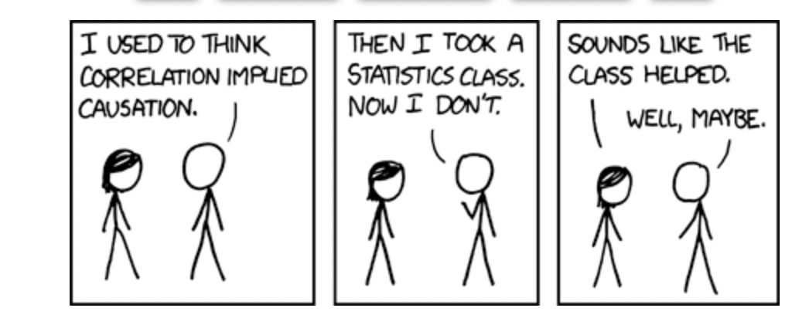
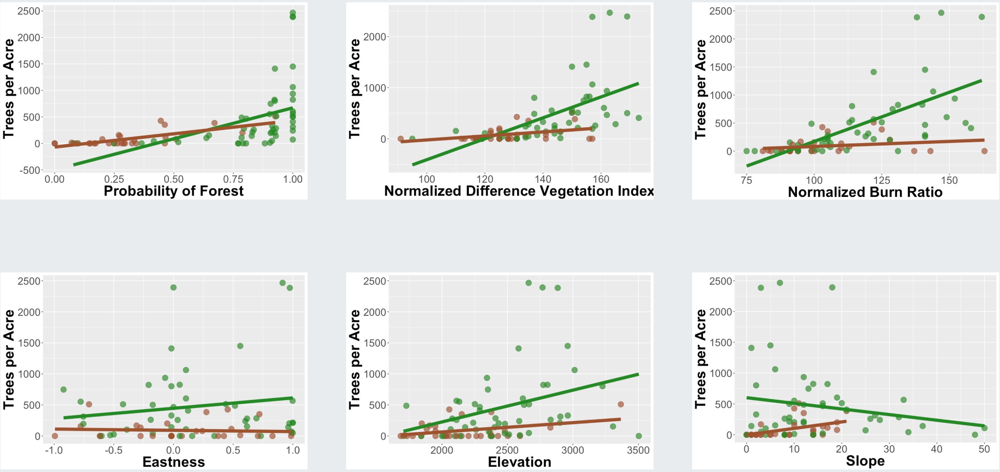
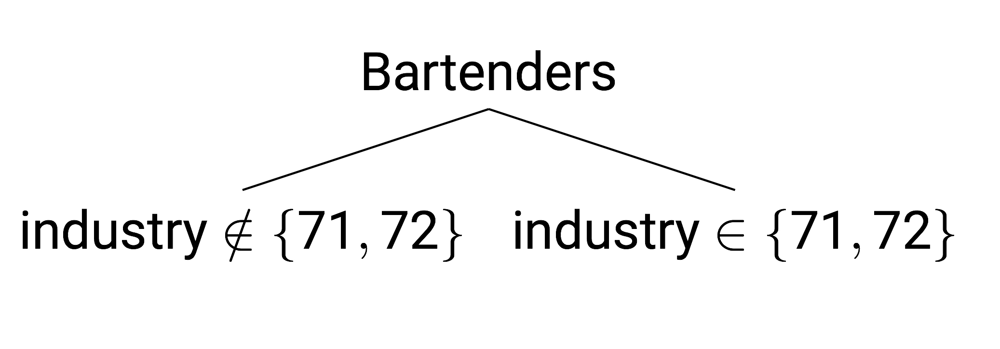
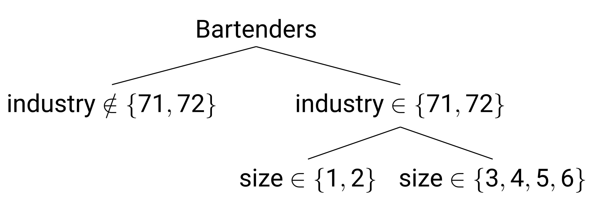
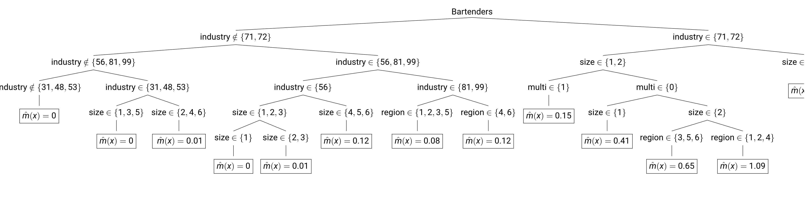
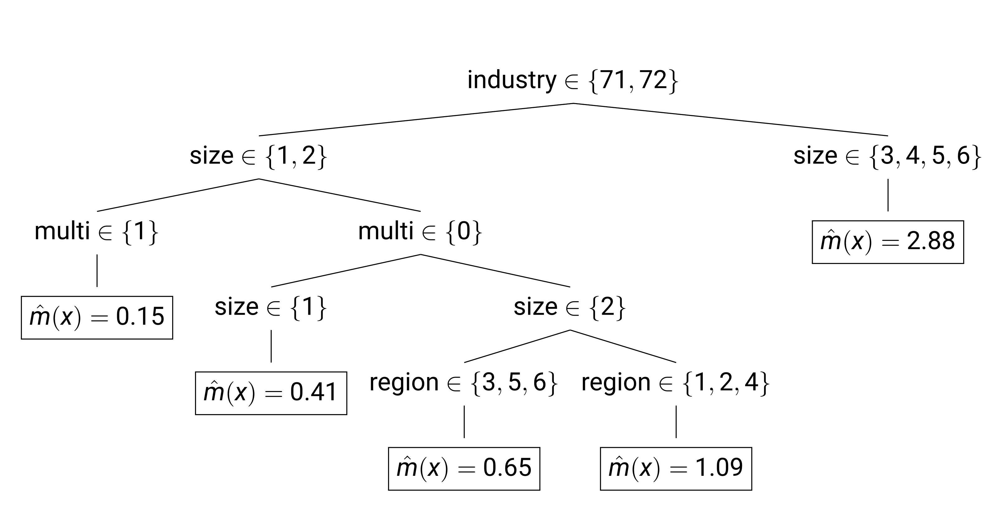

```{r setup, include=FALSE}
knitr::opts_chunk$set(echo = TRUE, warning = FALSE,
                      message = FALSE, 
                      fig.retina = 3, fig.align = 'center',
                      fig.asp = 0.75, fig.width = 8,
                      cache = TRUE)
library(knitr)
library(kableExtra)
library(tidyverse)
theme_update(text = element_text(size = 20),
             plot.title = element_text(hjust = 0.5))

library(Sleuth3)
data(case0901)

# Recode the timing variable
case0901 <- case0901 %>%
  mutate(TimeCat = factor(case_when(
    Time == 1 ~ "Late",
    Time == 2 ~ "Early"
  )))
```

```{r xaringan-scribble, echo=FALSE}
xaringanExtra::use_scribble()
```


background-image: url("img/DAW.png")
background-position: left
background-size: 50%
class: middle, center, inverse


.pull-right[


## .whitish[Where to Go]

## .whitish[From Here]

## .whitish[and Review]


<br>

### .whitish[Kelly McConville]

#### .yellow[ Stat 100 | Week 13 | Spring 2022] 

]

---

background-image: url("img/ggparty.003.jpeg")
background-position: contain
background-size: 90%

---

class: middle, center

# `ggparty` Rain Location: Science Center 316

---

### Announcements

* [The OH schedule](https://docs.google.com/spreadsheets/d/18ckvWMtKWJrpq6YS-FuToAMrbHPP722FF79ZvuZ01Ys/edit?usp=sharing) for the next couple of weeks.
* Final Project Assignment due Friday, May 6th.
* No sections this week!

****************************

--

### Goals for Today

.pull-left[


* Potential future statistical endeavors!


] 


.pull-right[

* Review for our current statistical endeavor!

]


---

background-image: url("img/DAW.png")
background-position: left
background-size: 50%
class: middle

.pull-right[

## Before talking about all the things we didn't have time to cover...

]

--

.pull-right[

## Let's acknowledge that we actually learned a lot!

]

---


background-image: url("img/DAW.png")
background-position: left
background-size: 50%
class: middle


.pull-right[

####  (Some of the) Course Learning Objectives

]


--

.pull-right[

 * Learn how to **analyze** data in `R`.
 
]

--

.pull-right[

* Master **creating** graphs with `ggplot2`.

]

--

.pull-right[

* Apply data wrangling operations with `dplyr`.
]

--

.pull-right[

* Translate a research problem into a set of relevant questions that can be answered with data. 

]


--

.pull-right[

* Reflect on how **sample design structures** impact potential conclusions.


]

--

.pull-right[


* Appropriately apply and draw inferences from a statistical model, including **quantifying and interpreting the uncertainty** in model estimates.

]


--

.pull-right[

* Develop a **reproducible** workflow using `R` Markdown documents.


]


---

class: inverse, middle, center

## What else should we learn?


---

name: acquisition
background-image: url("img/data_acquisition.jpeg")
background-position: left
background-size: 15%


.pull-rightish[

### Data Acquisition

* How to handle data that were collected using a **non-simple random sampling design**


```{r, echo = FALSE, fig.width = 7}
library(NHANES)
library(tidyverse)

ggplot(data = NHANESraw, mapping = aes(x = fct_infreq(Race1),
                                    fill = Race1)) +
  geom_bar() + labs(x = "Race of Respondents", 
                    y = "Count",
                    title = "The Non-SRS NHANES Data") +
  guides(fill = 'none')
```


]

---

name: acquisition
background-image: url("img/data_acquisition.jpeg")
background-position: left
background-size: 15%


.pull-rightish[

### Data Acquisition

* How to handle data that were collected using a **non-simple random sampling design**


```{r, echo = FALSE, fig.width = 7}
library(NHANES)
library(tidyverse)

ggplot(data = NHANESraw, mapping = aes(x = fct_infreq(Race1),
                                    fill = Race1)) +
  geom_bar() + labs(x = "Race of Respondents", 
                    y = "Count",
                    title = "The Non-SRS NHANES Data") +
  guides(fill = 'none')
```

* Consider:
    + Stat 160: Introduction to Survey Sampling and Estimation
    + Gov 1010: Survey Research Methods
    + SOCIOL 157: Qualitative Methods in Sociology


]

---

name: acquisition
background-image: url("img/data_acquisition.jpeg")
background-position: left
background-size: 15%


.pull-rightish[

### Data Acquisition

* How to draw **causation** from observational data (i.e. data collect not using **random assignment**)


```{r, echo = FALSE}

```

]

--

.pull-rightish[

* Consider:
    + Any class that mentions "**causal inference**" in the description.
    + Stat 186: Introduction to Causal Inference
    
]


---

background-image: url("img/exploration_visualization.jpeg")
background-position: left
background-size: 15%


.pull-rightish[

## Data Visualization

* How to fully customize your `ggplots`

```{r, echo = FALSE}
# Load libraries
library(mosaicData)
library(tidyverse)


# Grab data
data(Births2015)
```

```{r, echo=FALSE}
ggplot(data = Births2015, mapping = aes(x = date, y = births, 
                                        color = wday)) + 
  geom_point()
```


]


---

background-image: url("img/exploration_visualization.jpeg")
background-position: left
background-size: 15%


.pull-rightish[

## Data Visualization

* How to fully customize your `ggplots`

```{r, echo=FALSE}
library(ggimage)
library(lubridate)

# Create a story label
label_data <- data.frame(date = ymd("2015-01-01"), 
                         births = max(Births2015$births),
label = "The frequency of births on holidays \nfollows weekend \ntrends.")

# Create holidays dataset
holidays <- 
  data.frame(date = ymd("2015-01-01","2015-05-25", "2015-07-04",
                        "2015-12-25", "2015-11-26", "2015-12-24",
                        "2015-09-07"), 
            occasion = c("New Year", "Memorial Day", 
                         "Independence Day", "Christmas",
                         "Thanksgiving", "Christmas Eve", 
                         "Labor Day"),
            image = c("https://emojipedia-us.s3.dualstack.us-west-1.amazonaws.com/thumbs/240/apple/271/party-popper_1f389.png",
                      "https://emojipedia-us.s3.dualstack.us-west-1.amazonaws.com/thumbs/240/apple/271/military-medal_1f396-fe0f.png",
                      "https://emojipedia-us.s3.dualstack.us-west-1.amazonaws.com/thumbs/240/apple/271/sparkler_1f387.png",
                      "https://emojipedia-us.s3.dualstack.us-west-1.amazonaws.com/thumbs/240/apple/271/christmas-tree_1f384.png",
                      "https://emojipedia-us.s3.dualstack.us-west-1.amazonaws.com/thumbs/240/apple/271/turkey_1f983.png",
                      "https://emojipedia-us.s3.dualstack.us-west-1.amazonaws.com/thumbs/240/apple/271/wrapped-gift_1f381.png",
                      "https://emojipedia-us.s3.dualstack.us-west-1.amazonaws.com/thumbs/320/apple/271/construction-worker_1f477.png"
                      ))

holidays <- left_join(holidays, Births2015)


ggplot(data = Births2015, mapping = aes(x = date, y = births, 
                                        color = wday)) + 
  geom_point(size = 2) +
  scale_color_discrete() + 
   labs(x = "Date", y = "Number of Births in US", 
        title = "Trend of Births in 2015", 
        caption = "Data: National Vital Statistics System", 
        color = "Week Days") + 
  geom_image(data = holidays, mapping = aes(image = image, 
                                            x = date, 
                                            y = births),
             inherit.aes = FALSE, size = .05)  +
  geom_text(mapping = aes(label = label), data = label_data, 
            color = "black", vjust = "top", hjust = "left") +
  theme_light() +
  theme(legend.position = "bottom", text = element_text(size = 20),
             plot.title = element_text(hjust = 0.5))
```


]

---

background-image: url("img/exploration_visualization.jpeg")
background-position: left
background-size: 15%


.pull-rightish[

## Data Visualization

* How to create graphs we haven't seen in Stat 100

.pull-left[

```{r, echo = FALSE}
library(tidyverse)
library(wordcloud)
library(viridis)
library(tidytext)

think <- read_csv("~/stat100s22/stat_thinking - Sheet1.csv") %>%
  mutate(keyword = str_to_lower(keyword, locale = "en")) %>%
  drop_na(keyword)

Beginning <- think %>%
  filter(when == "Beginning") %>%
  count(keyword)

Beginning_tokenized <- think %>%
  filter(when == "Beginning") %>%
  unnest_tokens(word, keyword)  %>%
  anti_join(stop_words) %>%
  count(word) 


Beginning_tokenized2 <- think %>%
  filter(when == "Beginning") %>%
  unnest_tokens(bigram, keyword)  %>%
#  anti_join(stop_words) %>%
  count(bigram) 


#Palette
pal <- viridis_pal(alpha = 1, begin = 0, end = .7, direction = 1,
                   option = "D")(10)


wordcloud(Beginning$keyword,
          Beginning$n, scale = c(5, 2.5),
          rot.per = .3,
          colors = pal, min.freq = 2)
```

]

.pull-right[


```{r, echo = FALSE}
End <- think %>%
  filter(when == "End") %>%
  count(keyword)

End_tokenized <- think %>%
  filter(when == "End") %>%
  unnest_tokens(word, keyword)  %>%
  anti_join(stop_words) %>%
  count(word) 


End_tokenized2 <- think %>%
  filter(when == "End") %>%
  unnest_tokens(bigram, keyword)  %>%
#  anti_join(stop_words) %>%
  count(bigram) 


#Palette
pal <- viridis_pal(alpha = 1, begin = 0, end = .7, direction = 1,
                   option = "D")(10)


wordcloud(End_tokenized$word,
          End_tokenized$n, scale = c(5, 2.5),
          rot.per = .3,
          colors = pal, min.freq = 2)
```


]

]


---

background-image: url("img/exploration_visualization.jpeg")
background-position: left
background-size: 15%


.pull-rightish[

## Data Visualization

* How to graph **spatial** data


```{r, echo = FALSE}

Eruptions <- read_csv("~/shared_data/stat100/data/GVP_Eruption_Results.csv")

eruption_count <- count(Eruptions, VolcanoName, 
                        Latitude, Longitude) %>%
  filter(Longitude > -172.164, Longitude < -157.1507, 
         Latitude > 50.977, Latitude < 59.5617) 

library(leaflet)
volcano  <- makeIcon(
  iconUrl = "https://openclipart.org/image/800px/svg_to_png/168263/volcano-mountain.png",
  iconWidth = 10, iconHeight = 20)

content <- paste("<b>", eruption_count$VolcanoName, 
                 "</b></br>", "Number of eruptions:",
                 eruption_count$n)

leaflet() %>% 
  setView(lng = -160, lat = 55, zoom = 4) %>%
  addTiles() %>%
  addMarkers(lng = ~Longitude, lat = ~Latitude, 
             data = eruption_count, 
             popup = content, icon = volcano)
```

]


---

background-image: url("img/exploration_visualization.jpeg")
background-position: left
background-size: 15%


.pull-rightish[

## Data Visualization

* How to create [fancy dashboards](https://ncasi-shiny-tools.shinyapps.io/Counties/) with the `R` package `shiny`

* Consider:
    + Stat 1XX: "Introduction to Statistical Computing in R" or "Introduction to Computing, Wrangling, Scraping, and Visualizing in R" or ...
    + Data Science 1: Introduction to Data Science
    + A GIS course
    + COMPSCI 171: Visualization


]


---
name: inference
background-image: url("img/modeling_inference.jpeg")
background-position: left
background-size: 15%


.pull-rightish[

## Modeling and Inference

* How to conduct more sophisticated **model selection**


```{r, echo = FALSE, out.width= "25%", out.extra='style="float:left; padding:10px"'}
knitr::include_graphics("img/fs.png")
```

**Mission**: "Make and keep current a comprehensive inventory and analysis of the present and prospective conditions of and requirements for the renewable resources of the forest and rangelands of the US."


**Goal**: Estimate number of trees per acre for a given plot of land.


]


---
name: inference
background-image: url("img/modeling_inference.jpeg")
background-position: left
background-size: 15%


.pull-rightish[

## Modeling and Inference

* How to conduct more sophisticated **model selection**


```{r, echo = FALSE}

```


]


---
name: inference
background-image: url("img/modeling_inference.jpeg")
background-position: left
background-size: 15%


.pull-rightish[

## Modeling and Inference

* How to conduct more sophisticated **model selection**


* **LASSO Method**:  Find $\hat{\beta}$'s based on the following criteria:

\begin{aligned}
\boldsymbol{\hat{\beta}} &= \underset{\boldsymbol{\beta}}{\arg\min}  \left\{ \sum_{i \in s} (y_i - \boldsymbol{x}_i^T \boldsymbol{\beta})^2 + \lambda \sum_{j=1}^p \left|\beta_j\right|\right\}
\end{aligned}

**Selected Predictors**:

* Normalized Difference Vegetation Index
* Slope
* Normalized Burn Ratio
* Elevation
* Slope : Forest/Non-Forest

]

---

background-image: url("img/modeling_inference.jpeg")
background-position: left
background-size: 15%


.pull-rightish[

## Modeling and Inference

* How to build models **beyond** regression


```{r, echo = FALSE, out.width= "25%", out.extra='style="float:left; padding:10px"'}
knitr::include_graphics("img/bls2.png")
```

**Mission**: "Measures labor market activity, working conditions, price changes, and productivity in the U.S. economy to support public and private decision making."

**Goal**: Estimate number of bartenders an establishment has.

]


---

background-image: url("img/modeling_inference.jpeg")
background-position: left
background-size: 15%


.pull-rightish[

## Modeling and Inference

* Why not use regression in this example?

* Predictors come from the Quarterly Census of Employment and Wages:
    * Size class
    * Geographic information
    * Industry type
    * Whether or not its a multi-establishment firm

]


---

background-image: url("img/modeling_inference.jpeg")
background-position: left
background-size: 15%


.pull-rightish[

## Modeling and Inference

**Regression Trees** recursively split sample into two groups based on a predictor.

```{r, echo = FALSE, out.width= "50%", fig.align='center'}

```

]
 


---

background-image: url("img/modeling_inference.jpeg")
background-position: left
background-size: 15%


.pull-rightish[

## Modeling and Inference

Regression Trees **recursively** split sample into two groups based on a predictor.

```{r, echo = FALSE, out.width= "50%", fig.align='center'}

```

]


---

background-image: url("img/modeling_inference.jpeg")
background-position: left
background-size: 15%


.pull-rightish[

## Modeling and Inference

Regression Trees recursively split sample into two groups based on a predictor.

```{r, echo = FALSE, out.width= "120%", fig.align='center'}

```

They **stop** splitting when it is no longer very predictively useful to do so.

]


---

background-image: url("img/modeling_inference.jpeg")
background-position: left
background-size: 15%


.pull-rightish[

## Modeling and Inference

Regression Trees recursively split sample into two groups based on a predictor.

```{r, echo = FALSE, out.width= "70%", fig.align='center'}

```

At each end node, the predicted value is given by the mean of the sample in that node.

]

---

background-image: url("img/modeling_inference.jpeg")
background-position: left
background-size: 15%


.pull-rightish[

## Modeling and Inference

* For a deep dive into regression, consider Stat 139: Linear Models and Stat 149: Generalized Linear Models

* For exposure to predictive models, try
    + Data Science 1: Introduction to Data Science
    + Data Science 2: Advanced Topics in Data Science

* Good keywords to search for:
    + Statistical learning or machine learning
    + Supervised learning
    
]

---

background-image: url("img/modeling_inference.jpeg")
background-position: left
background-size: 15%


.pull-rightish[

## Modeling and Inference

* Why do some test statistics follow a standard normal or a t distribution?

* What other random variables are out there?

* Why is the Central Limit Theorem true?

]


.pull-rightish[

* For a deep dive into the beautiful theory behind our data analysis, consider:
    + Stat 110: Introduction to Probability
    + Stat 111: Introduction to Statistical Inference

]


---

class: inverse, middle, center

## Review Time!

### Let's first go through the Review Sheet for the Final Exam.

---

class: middle, center

##  One of the most challenging inferential ideas:

--

###  Understanding the **many roles of the sample statistic**:

--

.pull-left[

As a number

]

--

.pull-right[

As a random variable

]

--

.pull-left[

As a point estimate

]

--

.pull-right[

As a test statistic

]


---

### Practice Problem

#### Identify the different roles of a statistic in the following example:

Researchers presented young children (aged 5 to 8 years) with a choice between two toy characters who were offering stickers.  One character was described as mean, and the other was described as nice.  The mean character offered two stickers, and the nice character offered one sticker.  Researchers wanted to investigate whether children would tend to select the nice character over the mean character, despite receiving fewer stickers.  


They found that 80% of the 20 children in the study selected the nice character.  If the children had no preference, the probability that 80% or more would select the nice character is approximately equal to 0.0036.  My best guess for the true proportion of children who would select the nice character is 0.8 (with a margin of error of 0.19 for a 95% CI).


.pull-left[

* As a number

]


.pull-right[

* As a random variable

]


.pull-left[

* As a point estimate

]


.pull-right[

* As a test statistic

]


---

### Practice Problem

I generated the following distributions but don't remember if I generated a **sampling**, **bootstrap**, or **null** distribution.


What are each of these?  Justify your answer.

.pull-left[

```{r, echo = FALSE}
dat <- data.frame(selection = c(rep("nice", 16), rep("mean", 4)))

library(infer)
dat %>%
  specify(response = selection, success = "nice") %>%
  hypothesize(null = "point", p = 0.5) %>%
  generate(reps = 1000, type = "draw") %>%
  calculate(stat = "prop") %>%
  ggplot(mapping = aes(x = stat)) +
  geom_histogram()
```

]

.pull-right[

```{r, echo = FALSE}
dat %>%
  specify(response = selection, success = "nice") %>%
  generate(reps = 1000, type = "bootstrap") %>%
  calculate(stat = "prop") %>%
  ggplot(mapping = aes(x = stat)) +
  geom_histogram()
```

]

---

### Practice Problem

Researchers presented young children (aged 5 to 8 years) with a choice between two toy characters who were offering stickers.  One character was described as mean, and the other was described as nice.  The mean character offered two stickers, and the nice character offered one sticker.  Researchers wanted to investigate whether children would tend to select the nice character over the mean character, despite receiving fewer stickers.  


They found that 80% of the 20 children in the study selected the nice character.  If the children had no preference, the probability that 80% or more would select the nice character is approximately equal to 0.0036.  My best guess for the true proportion of children who would select the nice character is 0.8 (with a margin of error of 0.19 for a 95% CI).


#### For this example, would you recommend using theory-based methods to compute the p-value and construct the confidence interval?  Why or why not?

---

### Practice Problem

Researchers presented young children (aged 5 to 8 years) with a choice between two toy characters who were offering stickers.  One character was described as mean, and the other was described as nice.  The mean character offered two stickers, and the nice character offered one sticker.  Researchers wanted to investigate whether children would tend to select the nice character over the mean character, despite receiving fewer stickers.  


They found that 80% of the 20 children in the study selected the nice character.  If the children had no preference, the probability that 80% or more would select the nice character is approximately equal to 0.0036.  My best guess for the true proportion of children who would select the nice character is 0.8 (with a margin of error of 0.19 for a 95% CI).


#### Suppose we increased the sample size to 40 and still got 80%.  How would the p-value change?  How about the confidence interval?

---

### Practice Problem

Researchers presented young children (aged 5 to 8 years) with a choice between two toy characters who were offering stickers.  One character was described as mean, and the other was described as nice.  The mean character offered two stickers, and the nice character offered one sticker.  Researchers wanted to investigate whether children would tend to select the nice character over the mean character, despite receiving fewer stickers.  


They found that 80% of the 20 children in the study selected the nice character.  If the children had no preference, the probability that 80% or more would select the nice character is approximately equal to 0.0036.  My best guess for the true proportion of children who would select the nice character is 0.8 (with a margin of error of 0.19 for a 95% CI).


#### What is the probability that the confidence interval contains the sample statistic?

--

#### What is the better question to ask?

---

background-image: url("img/ggparty.003.jpeg")
background-position: contain
background-size: 90%

---

class: inverse, middle, center

# Thanks for a wonderful semester!  

