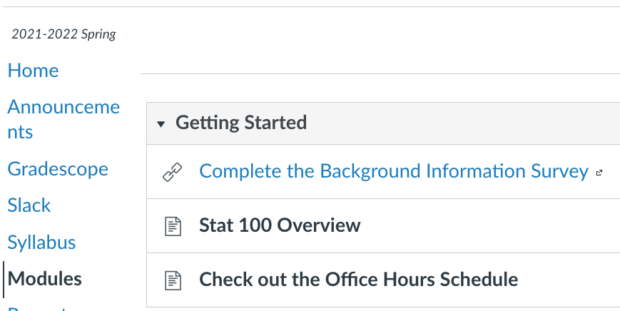
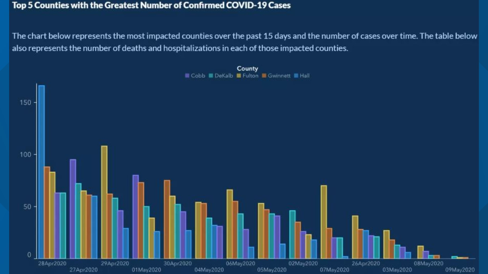
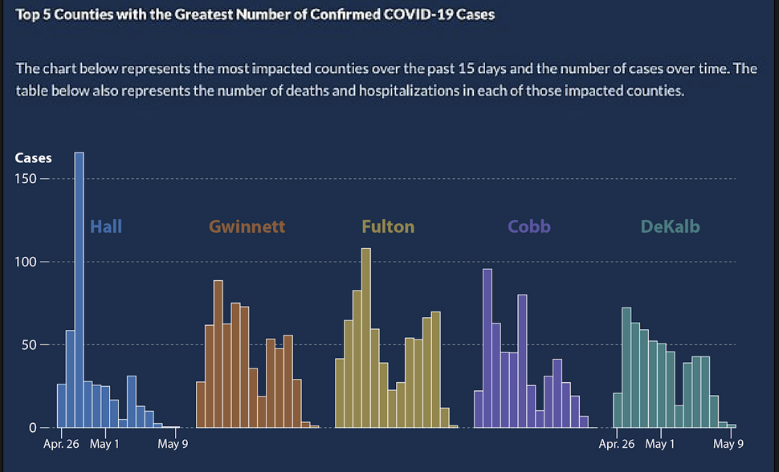
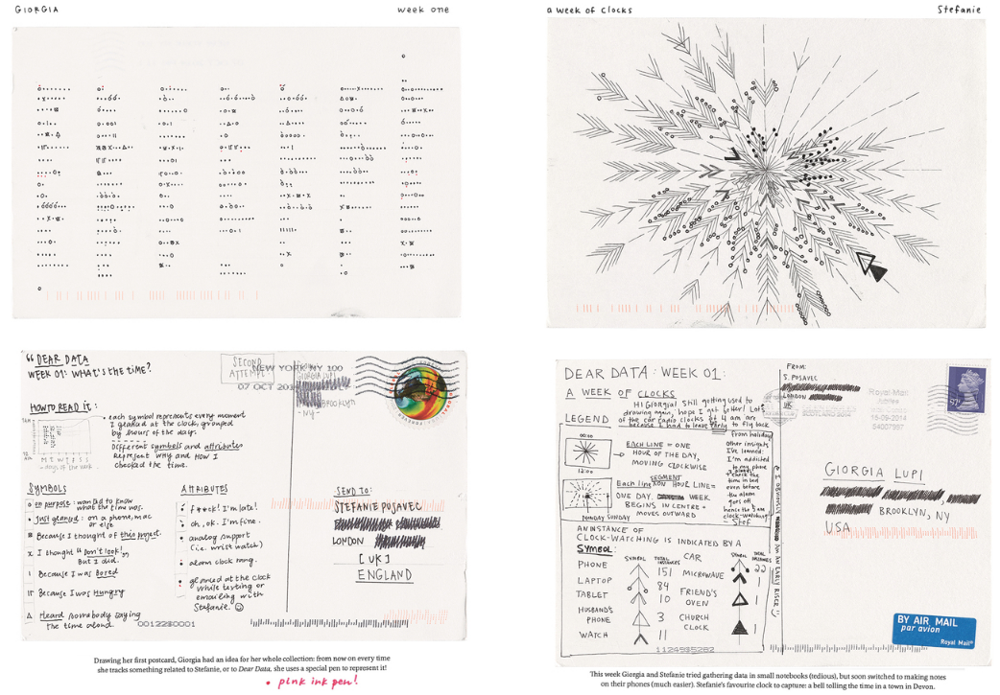
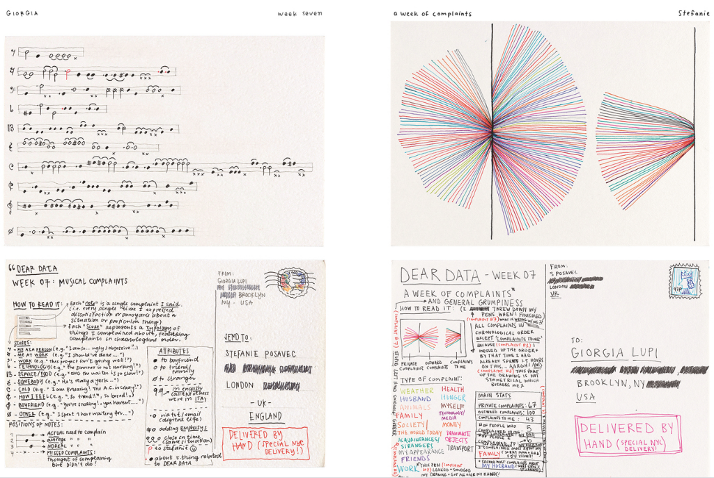
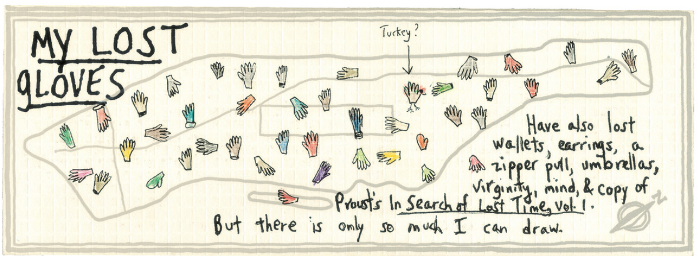
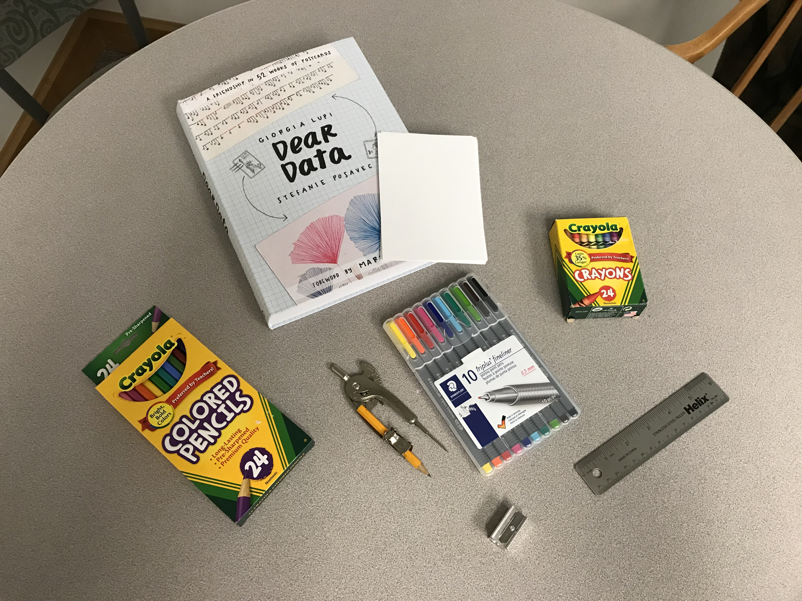
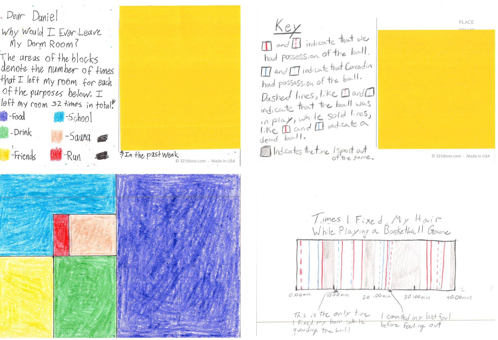
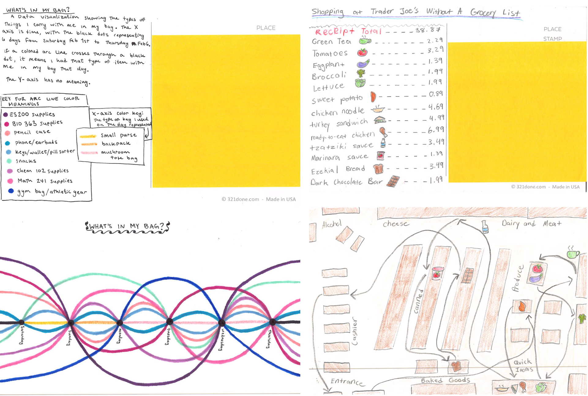

```{r setup, include=FALSE}
knitr::opts_chunk$set(echo = TRUE, warning = FALSE, message = FALSE, 
                      fig.retina = 3, fig.align = 'center')
library(knitr)
library(tidyverse)
```


background-image: url("img/DAW.png")
background-position: left
background-size: 50%
class: middle, center, inverse


.pull-right[


## .whitish[Statistical Thinking]

<br>

<br>

### .whitish[Kelly McConville]

#### .yellow[ Stat 100 | Week 1 | Spring 2022] 

]

---

class: inverse


## Getting Started in Stat 100

.pull-left[

```{r  out.width = "85%", echo = FALSE, fig.align = 'center'}

```

]

.pull-right[

* Complete the [Background Survey](https://forms.gle/FdYRHxULGxcAZy2N6).
    + Due at same time at P-Set 1.
* Watch the overview video.
* Read over the syllabus.
* Check out the [Office Hours Schedule](https://canvas.harvard.edu/courses/102162/pages/check-out-the-office-hours-schedule).
    
]    
    
---


## Announcements

* Lectures are online this week.      
* Lecture slide decks will always be posted and linked to a Canvas Module the day before lecture.
* No sections this week.
* Only I will be running office hours this week (all virtual).
    + I will have extra office hours on Thursday from 10am - noon.

****************************

--

## Week 1 Goals

.pull-left[

**Monday Lecture**

* Statistical thinking
* Introduction to data
* Hand-drawn data visualizations

]

--

.pull-right[

**Wednesday Lecture**

* Stat 100 assessments
* Getting up and running in `RStudio`
* Working with `RMarkdown` documents

]

---

background-image: url("img/structures.001.jpeg")
background-position: contain
background-size: 65%

## Stat 100 Tech & Materials

---

class: inverse

## The Rest of the Teaching Team


```{r  out.width = "95%", echo=FALSE, fig.align='center'}

```


---

class: inverse, middle, center


## Stat 100 is about developing our .mustard[statistical thinking] skills.

--

### What is .mustard[statistical thinking]?

--

### Let's collect some data.  

--

### Practice round: Give keywords or phrases for Harvard.


---

class: inverse, middle, center


## Stat 100 is about developing our .mustard[statistical thinking] skills.


### What is .mustard[statistical thinking]?


--


### It is not the same as mathematical thinking.


--

### Let's discover what .mustard[statistical thinking] is by practicing .mustard[statistical thinking].


---

class: inverse, middle, center


## Start the Statistical Thinking worksheet in small groups.

### We will come back together to discuss.


---

## Problem 1 Discussion


```{r, echo=FALSE}
dat <- data.frame(Minority = c(60, 29, 89), White = c(86, 45, 131))
row.names(dat) <- c("Acquitted",
                     "Convicted", 
                     "Total")
kableExtra::kable(dat) %>%
kableExtra::column_spec(2:3, width = "2cm")
```


* Overall, which group was convicted at a higher rate?

<br>

* When the victim was white, which group was convicted at a higher rate?

<br>

* When the victim was a minority, which group was convicted at a higher rate?

--

.mauve[HOW IS THIS POSSIBLE?]


---

## Simpson's Paradox

.mauve[HOW IS THIS POSSIBLE?]

```{r, echo=FALSE}
dat2 <- data.frame(Minority_Defendant_Convicted = c(19, 10, 29),
                   Minority_Defendant_Acquitted = c(45, 15, 60),
                   White_Defendant_Convicted = c(5, 40, 45),
                   White_Defendant_Acquitted = c(19, 67, 86))
row.names(dat2) <- c("Minority Victim",
                     "White Victim", 
                     "Total")
kableExtra::kable(dat2, col.names = c("Minority Defendant Convicted",
                                 "Minority Defendant Acquitted",
                                 "White Defendant Convicted",
                                 "White Defendant Acquitted")) %>%
kableExtra::column_spec(2:5, width = "2cm")
```


**Key factors:**

--

For what race of the victim, is the conviction rate higher?

--

&rarr; The conviction rate is 37.9% for white victims and 27.2% for minority victims.

--

When the defendant is white, what tends to be the race of the victim?

--

&rarr; White defendants tend to have white victims.  Minority defendants tend to have minority victims.


---

#### Problem 2 Discussion

```{r  out.width = "90%", echo=FALSE, fig.align='center'}
 
```


---

#### Problem 2 Discussion

```{r  out.width = "40%", echo=FALSE, fig.align='center'}
 
```





---

class: middle, inverse, center

## What is "Statistical Thinking?"

---


## Statistical Thinking


.pull-left[

* Importance of the appropriate **measures/metrics**.

]

--

.pull-right[

&#8594; Considering **proportions** instead of the **raw counts**.


]

--


.pull-left[


* Utilizing **multivariate** thinking.


]


--


.pull-right[

&#8594; When we added a **third** variable (race of the victim) into the picture, the story completely changed!


]


--

.pull-left[

* Understanding the importance of **context**.

]

--

.pull-right[

&#8594; Context explained the Monday jumps in the COVID counts.

]

--

.pull-left[

* How we **encode** information in graphs matters.

]

--

.pull-right[

&#8594; **Design choices** impact the conclusions the viewer draws.


]


--

* And so much more!


---

class: middle, inverse, center

## What are data?

---

* The dictionary definition:

> "data: factual information (such as measurements or statistics) used as a basis for reasoning, discussion, or calculation" -- Merriam-Webster

--

* Wikipedia:

> "Data are characteristics or information, usually numerical, that are collected through observation. In a more technical sense, data are a set of values of qualitative or quantitative variables about one or more persons or objects, while a datum (singular of data) is a single value of a single variable."

---

* Our textbook definition:

> "Data comes to us in a variety of formats, from pictures to text to numbers." -- ModernDive

--

* Data Feminism:

> "... by the time that information becomes data, it's already been classified in some way. Data after all, is information made *tractable*." -- D'Ignazio and Klein

---

## Data Frames


```{r, echo = FALSE}
library(pdxTrees)
library(tidyverse)
library(knitr)
library(kableExtra)
pdxTrees_parks <- get_pdxTrees_parks()

pdxTrees_parks[1:6, ] %>%
  select(UserID, Tree_Height, Common_Name, Park,
         DBH,
         Species_Factoid) %>%
  kable() %>%   kable_styling(bootstrap_options = c("responsive", "bordered", "striped", "compact"),
                              font_size = 12)
  

```

Data in spreadsheet-like format where:

--

* Rows = Observations/cases

--


* Columns = Variables

---

## Data Frames


```{r, echo = FALSE}
library(pdxTrees)
library(tidyverse)
library(knitr)
library(kableExtra)
pdxTrees_parks <- get_pdxTrees_parks()

pdxTrees_parks[1:6, ] %>%
  select(UserID, Tree_Height, Common_Name, Park,
         DBH,
         Species_Factoid) %>%
  kable() %>%   kable_styling(bootstrap_options = c("responsive", "bordered", "striped", "compact"),
                              font_size = 12)
  

```

Rows = Observations/cases

**What are the cases?  What does each row represent?** 


---

## Data Frames


```{r, echo = FALSE}
library(pdxTrees)
library(tidyverse)
library(knitr)
library(kableExtra)
pdxTrees_parks <- get_pdxTrees_parks()

pdxTrees_parks[1:6, ] %>%
  select(UserID, Tree_Height, Common_Name, Park,
         DBH,
         Species_Factoid) %>%
  kable() %>%   kable_styling(bootstrap_options = c("responsive", "bordered", "striped", "compact"),
                              font_size = 12)
  

```

Columns = Variables

**Variables**: Describe characteristics of the observations

--

* **Quantitative**: Numerical in nature

--

* **Categorical**: Values are categories

--

* **Identification**: Uniquely identify each case


---

## Data Frames

```{r, echo = FALSE}
library(pdxTrees)
library(tidyverse)
library(knitr)
library(kableExtra)
pdxTrees_parks <- get_pdxTrees_parks()

pdxTrees_parks[1:6, ] %>%
  select(UserID, Tree_Height, Common_Name, Park,
         DBH,
         Species_Factoid) %>%
  kable() %>%   kable_styling(bootstrap_options = c("responsive", "bordered", "striped", "compact"),
                              font_size = 12)
  

```


**Important to understand what each variable represents and the units of measurement.**

--

Example questions:

* For categorical variables, what are the categories? Do those categories adequately represent the data represented by that variable?

--

* For quantitative variables, what values are possible? Were the data rounded or binned?  Are those values actually encoding categories?

---

   
## Hand-Drawn Data Viz

* Two key aspects of data visualization:
    + Determining how you want to display the data.
    + Figuring out how to tell the computer to do that mapping.

--

* Hand-drawn data visualizations allow us to focus on the first part and with full control over the creative process!

---

## Hand-Drawn Data Viz Examples

* [Dear Data](http://www.dear-data.com/theproject)

> "Each week, and for a year, we collected and measured a particular type of data about our lives, used this data to make a drawing on a postcard-sized sheet of paper, and then dropped the postcard in an English “postbox” (Stefanie) or an American “mailbox” (Giorgia)!"

---

### Dear Data Examples

```{r  out.width = "73%", echo=FALSE, fig.cap = "", fig.align='center'}
 
```


---

### Dear Data Examples

```{r  out.width = "73%", echo=FALSE, fig.cap = "", fig.align='center'}
 
```


---

## Mapping Manhattan

* Becky Cooper handed out hand-drawn maps of Manhattan to strangers and asked them to ["map their Manhattan."](https://www.goodreads.com/book/show/15842664-mapping-manhattan?from_search=true)

```{r  out.width = "100%", echo=FALSE, fig.cap = "Map drawn by New Yorker staff writer Patricia Marx", fig.align='center'}
 
```


---

### The Start of Problem Set 1: Create your own Dear Data postcard! 


.pull-left[

**Step 1**  

* This week collect data on some aspect of your life.
    
**Step 2**    
    
* Find a story in your data and determine your postcard recipient.


* Figure out how you want to visualize the story.


**Step 3+** 

* Next week you will get your blank postcard so you can actually create your visualization.

]

.pull-right[

```{r  out.width = "60%", echo=FALSE, fig.cap = "", fig.align='center'}
 
```

]


---

### More Dear Data Examples

```{r  out.width = "73%", echo=FALSE, fig.cap = "", fig.align='center', fig.pos = 'hold'}
 
```

---

### More Dear Data Examples

```{r  out.width = "73%", echo=FALSE, fig.cap = "", fig.align='center', fig.pos = 'hold'}
 
```


---

## Reminders

* Will get the rest of P-Set 1 on Wednesday.  
* Make sure to go through the syllabus and Overview video (which can both be found in the Getting Started Module on Canvas).
    + Will discuss assessments (p-sets, project, exams, engagement) a bit on Wednesday.
    + But will assume you looked over the Getting Started materials.
* No sections this week.
* Only I will be running [office hours this week (all virtual)](https://canvas.harvard.edu/courses/102162/pages/check-out-the-office-hours-schedule).
    + I will have extra office hours on Thursday from 10am - noon.
  
