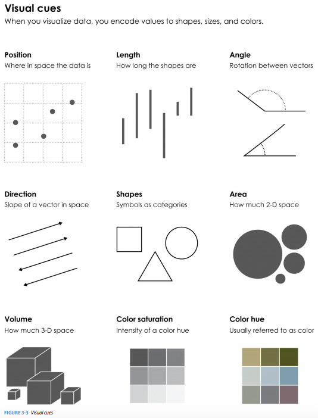
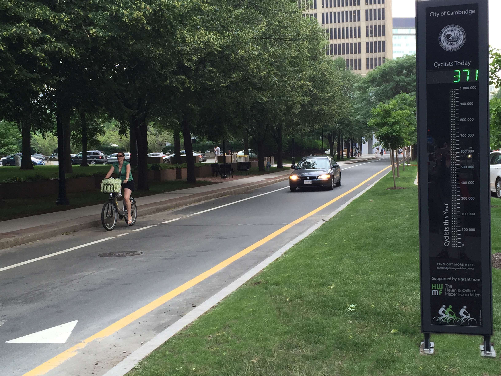

```{r setup, include=FALSE}
knitr::opts_chunk$set(echo = TRUE, warning = FALSE, message = FALSE, 
                      fig.retina = 3, fig.align = 'center',
                      fig.asp = 0.75, fig.width = 8)
library(knitr)
library(tidyverse)
theme_update(text = element_text(size = 20))
```

```{r xaringan-scribble, echo=FALSE}
xaringanExtra::use_scribble()
```


background-image: url("img/DAW.png")
background-position: left
background-size: 50%
class: middle, center, inverse


.pull-right[


## .whitish[Data Visualization]

<br>

<br>

### .whitish[Kelly McConville]

#### .yellow[ Stat 100 | Week 2 | Spring 2022] 

]


---

class:inverse, middle, center

## Teaching and Learning While Masked

```{r  out.width = "55%", echo=FALSE, fig.align='center'}

```

--

#### .mustard[Let me know if you need me to repeat something.]


---


## Announcements

* Now have your section assignments.
* Finalized the office hours schedule.


****************************

--

## Goals for Today

.pull-left[

First Segment:

* Motivate data visualizations.
* Develop **language** to talk about the components of a graphic.
* Practice deconstructing graphics.
* Discuss good graphical practices.

] 

--

.pull-right[

Second Segment:


* Learn the general structure of `ggplot2`.
* Learn a few standard graphs for numerical/quantitative data:
    + **Histogram**: one numerical variable
    + **Side-by-side boxplot**: one numerical variable and one categorical variable
    + **Side-by-side violin plot**: one numerical variable and one categorical variable

]

---

##  But First...

--

* Where do we access p-sets?  

--

* First step should always be saving the shared `Rmd` to your home folder.

--

* `RMarkdown` Workflow:
    * Modify the Rmd file.
    * If the modifications are code, run the code in the console to debug.
    * Knit.
    * Look over the output document.
    * Repeat.


---

class: middle, inverse, center


# Why construct a graph?


--


### To summarize the data.

--

### To look for trends.

--


### To make comparisons and explore relationships.

--

### To tell a compelling story.


---

# Challenger

* On January 27th, 1986, engineers from Morton Thiokol recommended NASA delay launch of space shuttle *Challenger* due to cold weather.
    * Believed cold weather impacted the o-rings that held the rockets together.
    * Used 13 charts in their argument.

--

* After a two hour conference call, the engineer's recommendation was overruled due to lack of persuasive evidence and the launch proceeded.

--

* The Challenger exploded 73 seconds into launch.

---

# Challenger

.left-column[ 

* Here's one of those charts.

]

.right-column[

```{r  out.width = "90%", echo=FALSE, fig.align='center'}
 
```

]

---

.left-column[

# Challenger


* Here's another one of those charts.

]

.right-column[

```{r  out.width = "45%", echo=FALSE, fig.align='center'}
 
```

]


---

# Challenger

.left-column[

* Here's a graphic I created from [Edward Tufte](https://en.wikipedia.org/wiki/Edward_Tufte)'s data.

]

```{r, echo = FALSE, out.width = "60%", fig.align='center', fig.asp= .6}
library(ggplot2)
library(dplyr)
library(readr)
Challenger <- read_delim("data/Challenger2.txt", 
                         "\t", escape_double =
                           FALSE, trim_ws = TRUE)


ggplot(data = Challenger, mapping = aes(x = T, y = I)) + geom_point(alpha = 0.5, color = "orange", size = 5) + labs(y = "Tufte's O-ring damage index", x = "Temperature (degrees F) at launch") #+ geom_smooth(se = FALSE)
```

---

# Challenger

.left-column[

* This adaptation is a recreation of Edward Tufte's graphic.

* For more information on this example and other examples, check out [Tufte's book](https://www.edwardtufte.com/tufte/books_visex).

]


```{r, echo = FALSE, out.width = "60%", fig.align='center', fig.asp= .6}

ggplot() + geom_point(data = Challenger, mapping = aes(x = T, y = I),alpha = 0.5, color = "orange", size = 5) + labs(y = "Tufte's O-ring damage index", x = "Temperature (degrees F) at launch") +
  xlim(22, 85) +
  geom_rect(mapping = aes(xmin = 26, xmax = 29, ymin = 0, ymax = 11), alpha = 0.2) +  annotate(geom = "text", x = 28, y = 6, label = "Forcasted \ntemperature \nfor \nJanuary 27th")#+ geom_smooth(se = FALSE) 
```


---

class: middle, inverse, center


## Now let's learn the .mustard[Grammar of Graphics].

--

#### We will use this grammar to:

--

Decompose and understand existing graphs.

--

Create our own graphs with the `R` package `ggplot2`.

---

# Grammar of Graphics


* **data**: Data frame that contains the raw data
    + Variables

* **geom**: Geometric **shape** that the data are mapped to.
    + Point, line, bar, text, ...
    
* **aesthetic**: Visual properties of the **geom** 
    + X (horizontal) position, y (vertical) position, color, fill, shape

* **scale**: Controls how data are mapped to the visual values of the aesthetic.
    + EX: particular colors

* **guide**: Legend/key to help user convert visual display back to the data

--

**For right now, we won't focus on the names of particular types of graphs (e.g., scatterplot).**

---

.left-column[

### Example 1

* What story is the graph telling?
* What are the variables here?
* What **geom** are the variables map to?
* What are the **aesthetic**s of the **geom**?
* Which variable sets the value of that **aesthetic**?
* What additional context does this graphic provide?

]

.right-column[

```{r  out.width = "80%", echo=FALSE, fig.align='center'}
 
```

]


---


.left-column[

### Example 2

* What story is the graph telling?
* What are the variables here?
* What **geom** are the variables map to?
* What are the **aesthetic**s of the **geom**?
* Which variable sets the value of that **aesthetic**?
* What additional context does this graphic provide?

]

.right-column[

```{r  out.width = "70%", echo=FALSE, fig.align='center'}
 
```

]

---


.left-column[

### Example 3

* What story is the graph telling?
* What are the variables here?
* What **geom** are the variables map to?
* What are the **aesthetic**s of the **geom**?
* Which variable sets the value of that **aesthetic**?
* What additional context does this graphic provide?

]

.right-column[

```{r  out.width = "90%", echo=FALSE, fig.align='center'}
 
```

]


---

# Best Practices: Context

* Think about the story/questions your visualization answers. 

* Determine what context/background information your viewer needs.

* Include
    + Axis labels (with units reported).
    + Legends.
    + Data source.

* Visualizing data involves **editorial choices**.
    + What to highlight.
    + What colors to use.


---

.left-column[

## Context Example

]

.right-column[

```{r  out.width = "90%", echo=FALSE, fig.align='center'}
 
```

]

---

.left-column[

###  Best Practices: Order of perception

]

.right-column[

```{r  out.width = "60%", echo=FALSE, fig.align='center', fig.cap = "Yau (2013)"}
 
```

]

---

### Best Practices: Be careful with color.

.left-column[

* Consider color blindness

]

.right-column[

```{r, echo = FALSE}
library(colorBlindness)
mat <- matrix(1:81, nrow = 9, ncol = 9)

library(ggplot2)
library(reshape2)
mat1 <- melt(t(mat[9:1, ]))
len <- length(Blue2DarkRed12Steps)-1
mat1$v2 <- cut(mat1$value,
              breaks = seq(0,ceiling(81/len)*len, 
                           length.out = len+1))
ht <- ggplot(mat1) + 
  geom_tile(aes(x=Var1, y=Var2, fill=v2)) + 
  scale_fill_manual(values=Blue2DarkRed12Steps) + 
  theme_bw()
# check the plot by CVD simulator
cvdPlot(ht)
```
]


---

## Best Practices: Color Palettes -- Sequential

.left-column[

* [Dude map](https://qz.com/316906/the-dude-map-how-american-men-refer-to-their-bros/)

* Note: Maps are also a great way to provide context!

]

.right-column[

```{r  out.width = "80%", echo=FALSE, fig.align='center'}
 
```

]


---

## Best Practices: Color Palettes -- Diverging

.left-column[

* [Adam Pearce's 2015 NBA Games](https://roadtolarissa.com/nba-minutes/) 

]

.right-column[

```{r  out.width = "95%", echo=FALSE, fig.align='center'}
 
```

]

---

## Best Practices: Color Palettes -- Qualitative

.left-column[

* [information is beautiful's Best in Show](https://www.informationisbeautiful.net/visualizations/best-in-show-whats-the-top-data-dog/)

]

.right-column[

```{r  out.width = "85%", echo=FALSE, fig.align='center'}
 
```

]

---

#   Best Practices: Aspect Ratio

* Aspect ratio affects our perception of the rate of change

```{r  out.width = "80%", echo=FALSE, fig.align='center', fig.cap = "http://socviz.co/lookatdata.html"}
include_graphics("img/aspect_ratio.png") 
```


---

## Many Ways To Visually Tell A Story

Washington Post's Approach:

```{r  out.width = "50%", echo=FALSE, fig.align='center'}
 
```

[Periscopic's Approach](https://guns.periscopic.com/?year=2013)

---


## Bad Graphics    

.left-column[

* It is much easier to make a bad graph than a good graph.  

]

.right-column[

```{r  out.width = "50%", echo=FALSE, fig.align='center', fig.cap = "YouGov"}
 
```

]

---

## Misleading Graphics

.left-column[

* Ethical data viz: Be careful that your editorial choices don't make your viewer make incorrect conclusions about the data

]

.right-column[

```{r  out.width = "70%", echo=FALSE, fig.align='center', fig.cap="Modern Data Science with R"}
include_graphics("img/FLguns.jpg") 
```


]

---


## Summary Thoughts on Best Practices


* Good graphics are one's where the findings and insights are obvious to the viewer.
    + You have power over the patterns your viewer sees and the conclusions they draw.  Use that power ethically.

* Facilitate comparisons.

* Add information and key context.

* Data visualizations are not neutral.

* It is easier to see the differences and similarities between different types of graphics if we learn the grammar of graphics.  

* Practicing **decomposing** graphics should make it easier for us to **compose** our own graphics.

---

class: inverse, center, middle

## Two Minute Stretch


---

```{r, echo = FALSE, out.width= "15%", out.extra='style="float:left; padding:10px"'}
knitr::include_graphics("img/ggplot2.png")
```

## Load Necessary Packages

`ggplot2` is part of this collection of data science packages.

```{r, message=TRUE}
# Load necessary packages
library(tidyverse)
```


---


## Data Setting: [Eco-Totem Broadway Bicycle Count](https://data.cambridgema.gov/Transportation-Planning/Eco-Totem-Broadway-Bicycle-Count/q8v9-mcfg)


.pull-left[

```{r  out.width = "90%", echo=FALSE, fig.align='center'}
 
```

]

.pull-right[

```{r  out.width = "90%", echo=FALSE, fig.align='center'}
include_graphics("img/bike_counter_map.png") 
```


]


---

## Import the [Data](https://data.cambridgema.gov/Transportation-Planning/Eco-Totem-Broadway-Bicycle-Count/q8v9-mcfg)

```{r, cache = TRUE, message = FALSE, warning = FALSE}
bike_counter <- read_csv("https://data.cambridgema.gov/api/views/q8v9-mcfg/rows.csv")

# Inspect the data
glimpse(bike_counter)
```

---

## Inspect the Data

```{r}
# Look at first few rows
head(bike_counter)
```

---

## Inspect the Data

```{r}
# Determine type
# To access one variable: dataset$variable
class(bike_counter$Day)
class(bike_counter$Total)
class(bike_counter)

```


---

## Data Wrangling

**We haven't learned this topic yet.**

**I only included this code for completeness/transparency.**

```{r}
# Fix Date column to be stored with the date class
library(lubridate)
bike_counter <- mutate(bike_counter, Date = mdy(Date))

# Filter to only include two days in July 2019
july_2019 <- filter(bike_counter,
                    Date %in% c(mdy("07/04/2019"),
                                mdy("07/11/2019")))
# Add an Occasion column
july_2019 <- mutate(july_2019,
                    Occasion = if_else(Date == mdy("07/04/2019"),
                                                    "Fourth of July",
                                                    "Normal Thursday"))

```

```{r, eval = FALSE, echo = FALSE}
bike_counter_recent <- filter(bike_counter, Date >= mdy("07/01/2020"))
bike_counter_recent2 <- bike_counter %>%
  mutate(Month = month(Date, label = TRUE)) %>%
  group_by(Month, Day) %>%
  summarize(n = sum(Total))

bike_counter_july <- filter(bike_counter, (Date >= mdy("07/01/2020") &
                                        Date <= mdy("07/31/2020")) |
                                     (Date >= mdy("07/01/2019") &
                                        Date <= mdy("07/31/2019")))


```
---

# Grammar of Graphics


* **data**: Data frame that contains the raw data
    + Variables

* **geom**: Geometric **shape** that the data are mapped to.
    + Point, line, bar, text, ...
    
* **aesthetic**: Visual properties of the **geom** 
    + X (horizontal) position, y (vertical) position, color, fill, shape

* **scale**: Controls how data are mapped to the visual values of the aesthetic.
    + EX: particular colors

* **guide**: Legend/key to help user convert visual display back to the data

---

# `ggplot2` example code

**Guiding Principle**: We will map variables from the **data** to the **aes**thetic attributes (e.g. location, size, shape, color) of **geom**etric objects (e.g. points, lines, bars).

```{r, eval = FALSE, tidy = FALSE}
ggplot(data = ---, mapping = aes(---)) +
  geom_---(---) 
```

* There are other layers, such as `scales_---_---()` and `labs()`, but we will wait on those.


---

# Histograms

.left-column[

* Binned counts of data.

* Great for assessing shape.
]

.right-column[
```{r, echo = FALSE}
# Create histogram
ggplot(data = july_2019, mapping = aes(x = Total)) +
  geom_histogram()

```

]

---

# Data Shapes

```{r, echo=FALSE, fig.width = 12, fig.asp = .4}
dat <- data_frame(x1 = rf(200,12,8), x2 = rnorm(200), x3 = (-1)*rf(200, 12, 8)+20)
p1 <- ggplot(dat, aes(x = x1)) +
  geom_histogram(bins = 20) +
  labs(title = "Right Skewed Shape")
p2 <- ggplot(dat, aes(x = x2)) +
  geom_histogram(bins = 15) +
  labs(title = "Bell Shaped \nand Symmetric")
p3 <- ggplot(dat, aes(x = x3)) +
  geom_histogram(bins = 15) + 
  labs(title = "Left Skewed Shape")
library(cowplot)
plot_grid(p1, p2, p3, ncol = 3)
```

---

# Histograms

.pull-left[

```{r hist, fig.show = 'hide'}
# Create histogram
ggplot(data = july_2019, 
       mapping = aes(x = Total)) +
  geom_histogram()
```

]

.pull-right[

```{r, echo = FALSE}
knitr::include_graphics(knitr::fig_chunk("hist", "png"))
```

]
---

# Histograms

.pull-left[

```{r hist2, fig.show = 'hide'}
# Create histogram
ggplot(data = july_2019, 
       mapping = aes(x = Total)) +
  geom_histogram(color = "white",
                 fill = "violetred1",
                 bins = 50)
```

#### For aesthetics:

* **mapping** to a variable goes in `aes()`
* **setting** to a specific value goes in the `geom_---()`


]

.pull-right[

```{r, echo = FALSE}
knitr::include_graphics(knitr::fig_chunk("hist2", "png"))
```

]


---

# Boxplots

.pull-left[

```{r box, fig.show = 'hide', echo = FALSE}
ggplot(data = july_2019, 
       mapping = aes(x = Occasion, 
                     y = Total)) +
  geom_boxplot()
```

* **Five number summary**: 
    + Minimum
    + First quartile (Q1)
    + Median
    + Third quartile (Q3)
    + Maximum
* Interquartile range (IQR) $=$ Q3 $-$ Q1
* Outliers: **unusual** points 
    + Boxplot defines unusual as being beyond $1.5*IQR$ from $Q1$ or $Q3$.
* Whiskers: reach out to the furthest point that is NOT an outlier

]

.pull-right[

```{r, echo = FALSE}
knitr::include_graphics(knitr::fig_chunk("box", "png"))
```

]


---

# Boxplots

.pull-left[

```{r not, eval = FALSE, echo = TRUE}
ggplot(data = july_2019, 
       mapping = aes(x = Occasion, 
                     y = Total)) +
  geom_boxplot()
```


]

.pull-right[

```{r, echo = FALSE}
knitr::include_graphics(knitr::fig_chunk("box", "png"))
```

]

---

# Boxplots

.pull-left[

```{r box2, fig.show = 'hide'}
ggplot(data = july_2019, 
       mapping = aes(x = Occasion, 
                     y = Total)) +
  geom_boxplot(fill = "springgreen1")
```


]

.pull-right[

```{r, echo = FALSE}
knitr::include_graphics(knitr::fig_chunk("box2", "png"))
```

]


---

# Boxplots

.pull-left[

```{r box3, fig.show = 'hide'}
ggplot(data = july_2019, 
       mapping = aes(x = Occasion, 
                     y = Total,
                     fill = Occasion)) +
  geom_boxplot()
```


]

.pull-right[

```{r, echo = FALSE}
knitr::include_graphics(knitr::fig_chunk("box3", "png"))
```

]


---

# Boxplots


.pull-left[

```{r box4, fig.show = 'hide'}
ggplot(data = july_2019, 
       mapping = aes(x = Occasion, 
                     y = Total,
                     fill = Occasion)) +
  geom_boxplot() +
  guides(fill = "none")
```


]

.pull-right[

```{r, echo = FALSE}
knitr::include_graphics(knitr::fig_chunk("box4", "png"))
```

]


---

# Violin Plots


.pull-left[

```{r vio, fig.show = 'hide'}
ggplot(data = july_2019, 
       mapping = aes(x = Occasion, 
                     y = Total,
                     fill = Occasion)) +
  geom_violin() +
  guides(fill = "none")
```


]

.pull-right[

```{r, echo = FALSE}
knitr::include_graphics(knitr::fig_chunk("vio", "png"))
```

]


---

# Boxplot Versus Violin Plots


.pull-left[

```{r, echo = FALSE}
knitr::include_graphics(knitr::fig_chunk("box4", "png"))
```

]


.pull-right[

```{r, echo = FALSE}
knitr::include_graphics(knitr::fig_chunk("vio", "png"))
```

]


---

# Recap: `ggplot2`

```{r, eval = FALSE, tidy = FALSE}
library(tidyverse)
ggplot(data = ---, mapping = aes(---)) +
  geom_---(---) 
```

```{r, eval = FALSE, echo = FALSE}
ggplot(data = july_2019, mapping = aes(x = Total)) +
  geom_histogram()

ggplot(data = july_2019, mapping = aes(x = Time, y = Total)) +
  geom_point(alpha = 0.5)
ggplot(data = july_2019, mapping = aes(x = Time, y = Total,
                                                    color = Occasion)) +
  geom_point()
ggplot(data = july_2019, mapping = aes(x = Time, y = Total,
                                                    color = Occasion)) +
  geom_line()
ggplot(data = july_2019, mapping = aes(x = Occasion, y = Total)) +
  geom_boxplot()

ggplot(data = july_2019, mapping = aes(x = Occasion, y = Total,
                                                    fill = Occasion)) +
  geom_boxplot()
```


