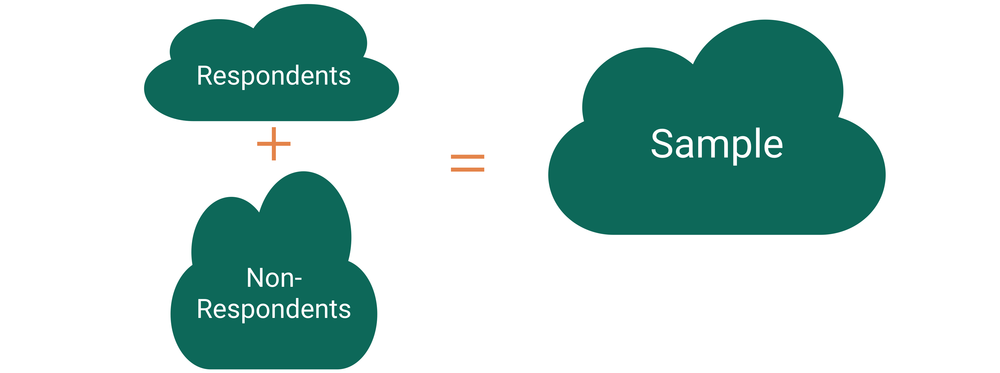

```{r setup, include=FALSE}
knitr::opts_chunk$set(echo = TRUE, warning = FALSE,
                      message = FALSE, 
                      fig.retina = 3, fig.align = 'center',
                      fig.asp = 0.75, fig.width = 8)
library(knitr)
library(tidyverse)
theme_update(text = element_text(size = 20))
```

```{r xaringan-scribble, echo=FALSE}
xaringanExtra::use_scribble()
```


background-image: url("img/DAW.png")
background-position: left
background-size: 50%
class: middle, center, inverse


.pull-right[


## .whitish[More Linear Regression]

<br>

<br>

### .whitish[Kelly McConville]

#### .yellow[ Stat 100 | Week 6 | Spring 2022] 

]


---

### Announcements


* Mid-Term Exam: Wednesday, March 9th - Friday, March 11th
    + Can now sign up for your oral exam slot [here](https://docs.google.com/document/d/1fL0ge4JW_-KYqLzxD_oQeMXt3sLQvTdPW9N67OVbjAY/edit?usp=sharing).
* For Project Assignment 1, please fill out [this feedback survey](https://forms.gle/ytMfBBi2iBJKby8w6) (also on Canvas and in the announcements channel) by Friday, March 4th.

****************************

--

### Goals for Today

.pull-left[

* Discuss upcoming exam.

* Receive Project Assignment 2.

* Explore ethics in modeling: algorithmic bias.

* Considering approaches to handle missingness.


] 


.pull-right[

* Practice interpreting model coefficients.

* Continue discussing multiple linear regression models.
    * Explore polynomial terms.
    * Consider categorical explanatory variables with more than 2 categories.

* Discuss guiding principles for model building.

]

---

class: middle, center, inverse

# Midterm Exam

## Let's go through "exam1Review.Rmd" in the "stat100/handouts"!


---

class: middle, center, inverse

# Project Assignment 2

## Let's go through "pa2.Rmd" in the "stat100/project"!

---

class: middle, center, inverse

# Data Ethics: Algorithmic Bias

---

class: middle, center, inverse

# Data Ethics

## Return to the Americian Statistical Association's ["Ethical Guidelines for Statistical Practice"](https://www.amstat.org/ASA/Your-Career/Ethical-Guidelines-for-Statistical-Practice.aspx)

---

class: inverse, center, middle

##  Integrity of Data and Methods


> "The ethical statistical practitioner seeks to understand and mitigate known or suspected limitations,  defects, or biases in the data or methods and communicates potential impacts on the interpretation, conclusions, recommendations, decisions, or other results of statistical practices."

---

class: inverse, center, middle

##  Integrity of Data and Methods


> "For models and algorithms designed to inform or implement decisions repeatedly, develops and/or implements plans to validate assumptions and assess performance over time, as needed. Considers criteria and mitigation plans for model or algorithm failure and retirement."

---

## Algorithmic Bias

**Algorithmic bias**: when the model systematically creates unfair outcomes, such as privileging one group over another.

**Example**: [The Coded Gaze](https://www.youtube.com/watch?v=162VzSzzoPs)


```{r, echo = FALSE, out.width='35%', fig.cap = "Joy Buolamwini"}

```

--

* Facial recognition software struggles to see faces of color.

--

* Algorithms built on a non-diverse, biased dataset.


---

**Example**: [COMPAS model](https://www.propublica.org/article/machine-bias-risk-assessments-in-criminal-sentencing) used throughout the country to predict recidivism 

--

* Differences in predictions across race and gender

```{r, echo = FALSE, out.width='55%', fig.cap = "ProPublica Analysis"}

```

--

> "For models and algorithms designed to inform or implement decisions repeatedly, develops and/or implements plans to validate assumptions and assess performance over time, as needed. Considers criteria and mitigation plans for model or algorithm failure and retirement."  -- ASA Guidelines

---

class: inverse, center, middle

## What to do about missing values?


---

### Missingness

**Unit non-response**: Complete absence of responses for a subset of the sampled units

```{r, echo = FALSE, out.width='80%'}

```

---

### Missingness

**Item non-response**: When you have no response for a subset of the measured variables for a sampled unit.

```{r}
library(NHANES)
library(tidyverse)
select(NHANES, Height, Depressed, SleepHrsNight) %>%
  glimpse()
```

What should we do about the item non-response?


---

### Missingness

What should we do about the item non-response?

```{r}
newdat <- na.omit(NHANES)
glimpse(newdat)
```

---

### Missingness

What should we do about the item non-response?

```{r}
newdat <- drop_na(NHANES, Height, Depressed, SleepHrsNight)
glimpse(newdat)
```

---

### Missingness


.pull-left[

```{r, echo = FALSE}
ggplot(data = NHANES, mapping = aes(x = Height)) +
  geom_histogram() +
  labs(title = "Full NHANES Dataset")
```


]


--

.pull-right[

```{r, echo = FALSE}
ggplot(data = newdat, mapping = aes(x = Height)) +
  geom_histogram() +
  labs(title = "Subsetted NHANES Dataset")
```

]

**WHAT HAPPENED?!**

---

### Missingness

What should we do about the item non-response?

```{r}
NHANES %>%
  group_by(Depressed) %>%
  summarize(MeanSleep = mean(SleepHrsNight))
```

---

### Missingness

What should we do about the item non-response?

```{r}
NHANES %>%
  group_by(Depressed) %>%
  summarize(MeanSleep = mean(SleepHrsNight, na.rm = TRUE))
```

---

### Missingness

What should we do about the item non-response?

```{r}
NHANES %>%
  drop_na(Depressed) %>%
  group_by(Depressed) %>%
  summarize(MeanSleep = mean(SleepHrsNight, na.rm = TRUE))
```

---

### Missingness

What should we do about the item non-response?

Beyond Stat 100 Answers:

--

* Build an **imputation model** and fill in the missing values.

--

* Give different **weights** to the respondents when constructing statistics.

--

Take **Stat 160: Sample Surveys** to learn about these approaches!

--

**Bottom line**: Be transparent about how you handle the missingness and if that impacts the group you are generalizing to!

---

class: inverse, center, middle

## Let's return to Multiple Linear Regression


---

## Multiple Linear Regression

Linear regression is a flexible class of models that allow for:

* Both quantitative and categorical explanatory variables.


* Multiple explanatory variables.


* Curved relationships between the response variable and the explanatory variable.


* BUT the response variable is quantitative.


**Form of the Model:**


$$ 
\begin{align}
y &= \beta_o + \beta_1 x_1 + \beta_2 x_2 + \cdots + \beta_p \epsilon_p + \epsilon
\end{align}
$$


---

### New Example: Movies

Let's model a movie's critic rating using the audience rating and the movie's genre.

```{r}
library(tidyverse)
movies <- read_csv("https://www.lock5stat.com/datasets2e/HollywoodMovies.csv")

# Restrict our attention to dramas, horrors, and actions
movies2 <- movies %>%
  filter(Genre %in% c("Drama", "Horror", "Action")) %>%
  drop_na(Genre, AudienceScore, RottenTomatoes)
glimpse(movies2)
```

* **Response variable:**

* **Explanatory variables:**

---

#### How should we encode a categorical variable with more than 2 categories?


<br>
<br>

**Equal Slopes Model:**

<br>
<br>

<br>
<br>

<br>
<br>

**Different Slopes Mdoel:**


---

### Exploring the Data

.pull-left[

```{r mscat, fig.show = 'hide'}
ggplot(data = movies2,
       mapping = aes(x = AudienceScore,
                     y = RottenTomatoes,
                     color = Genre)) +
  geom_point(alpha = 0.5) +
  stat_smooth(method = lm, se = FALSE) +
  geom_abline(slope = 1, intercept = 0)
```

* Trends?

* Should we include interaction terms in the model?

]

.pull-right[

```{r, echo = FALSE}
knitr::include_graphics(knitr::fig_chunk("mscat", "png"))
```


]


---

### Side-bar: Identify Outliers on a Graph


```{r}
outliers <- movies2 %>%
  mutate(DiffScore = AudienceScore - RottenTomatoes) %>%
  filter(DiffScore > 50 | DiffScore < -30) %>%
  select(Movie, DiffScore, AudienceScore, RottenTomatoes, Genre)
outliers
```

---

### Side-bar: Identify Outliers on a Graph

.pull-left[

```{r outliers, fig.show='hide'}
library(ggrepel)
ggplot(data = movies2,
       mapping = aes(x = AudienceScore,
                     y = RottenTomatoes,
                     color = Genre)) +
  geom_point(alpha = 0.5) +
  stat_smooth(method = lm, se = FALSE) +
  geom_abline(slope = 1, intercept = 0) +
  geom_text_repel(data = outliers,
                  mapping = aes(label =
                                  Movie),
                  force = 10,
                  show.legend = FALSE,
                  size = 6)
```


]

.pull-right[

```{r, echo = FALSE}
knitr::include_graphics(knitr::fig_chunk("outliers", "png"))
```


]


---


### Building the Model:

Full model form: 

```{r}
mod <- lm(RottenTomatoes ~ AudienceScore*Genre, data = movies2)

library(moderndive)
get_regression_table(mod) 
```

---

### Exploring the Data


.pull-left[

```{r mscat2, fig.show='hide'}
library(ggrepel)
ggplot(data = movies2,
       mapping = aes(x = AudienceScore,
                     y = RottenTomatoes,
                     color = Genre)) +
  geom_point(alpha = 0.5)
```

Evidence of **curvature**?

]

.pull-right[

```{r, echo = FALSE}
knitr::include_graphics(knitr::fig_chunk("mscat2", "png"))
```


]


---


### Exploring the Data


.pull-left[

```{r curve, fig.show='hide'}
library(ggrepel)
ggplot(data = movies2,
       mapping = aes(x = AudienceScore,
                     y = RottenTomatoes,
                     color = Genre)) +
  geom_point(alpha = 0.5) +
  stat_smooth(method = lm, se = FALSE, 
        formula = y ~ poly(x, degree = 2))
```

Evidence of **curvature**?

]

.pull-right[

```{r, echo = FALSE}
knitr::include_graphics(knitr::fig_chunk("curve", "png"))
```


]


---

### Fitting the New Model

```{r}
mod2 <- lm(RottenTomatoes ~ poly(AudienceScore, degree = 2, raw = TRUE)*Genre, 
           data = movies2)
get_regression_table(mod2, print = TRUE) 
```


---

### Considering Other Explanatory Variables

```{r}
movies2 %>%
  select(RottenTomatoes, AudienceScore, OpeningWeekend, 
         DomesticGross, Budget) %>%
  na.omit() %>%
  cor()
```

Also look at scatterplots!

---

class: center, middle, inverse


### Let's Practice!

---

### Let's Practice with the `palmerpenguins`!

.pull-left[

```{r penguins, fig.show='hide'}
library(palmerpenguins)
ggplot(data = penguins,
       mapping = aes(x = flipper_length_mm,
                     y = bill_length_mm,
                     color = species)) +
  geom_point(alpha = 0.7) +
  stat_smooth(method = "lm", se = FALSE)
```

]

.pull-right[

```{r, echo = FALSE}
knitr::include_graphics(knitr::fig_chunk("penguins", "png"))
```


]

---

center: middle

### Practice

.pull-left[

.tiny[

```{r}
mod1 <- lm(bill_length_mm ~ flipper_length_mm + species, 
           data = penguins)
get_regression_table(mod1, print = TRUE)
```
]

.tiny[
```{r}
mod2 <- lm(bill_length_mm ~ flipper_length_mm * species, 
           data = penguins)
get_regression_table(mod2, print = TRUE)
```

]

]

.pull-right[

1. Determine and interpret the slope for a **Chinstrap** penguin using Model 1.
1. Determine and interpret the slope for a **Chinstrap** penguin using Model 2.
1. Determine and interpret the slope for a **Adelie** penguin using Model 1.
1. Determine and interpret the slope for a **Adelie** penguin using Model 2.

]

---

###  Model Building Guidance

We often have several potential explanatory variables.  How do we determine which to include in the model and in what form?

--

.pull-left[

**Guiding Principle**: Capture the general trend, not the noise.

$$
\begin{align}
y &= f(x) + \epsilon \\
y &= \mbox{TREND} + \mbox{NOISE}
\end{align}
$$

]

--

.pull-right[

Returning the 2008 Election Example:

```{r, echo = FALSE}
Pollster08 <- 
  read_csv("~/shared_data/stat100/data/Pollster08.csv")

ggplot(Pollster08, aes(x = Days, y = Margin)) +
  geom_point() +
  geom_smooth(method = "lm", se = FALSE)
```

]


---

###  Model Building Guidance

We often have several potential explanatory variables.  How do we determine which to include in the model and in what form?


.pull-left[

**Guiding Principle**: Capture the general trend, not the noise.

$$
\begin{align}
y &= f(x) + \epsilon \\
y &= \mbox{TREND} + \mbox{NOISE}
\end{align}
$$

]


.pull-right[

Returning the 2008 Election Example:

```{r, echo = FALSE}
Pollster08 <- 
  read_csv("~/shared_data/stat100/data/Pollster08.csv")

ggplot(Pollster08, aes(x = Days, y = Margin)) +
  geom_point() +
  geom_smooth(method = "lm", se = FALSE) +
  geom_smooth(method = "lm", se = FALSE, formula = y ~ poly(x, degree = 2), 
              color = "purple")
```

]


---

###  Model Building Guidance

We often have several potential explanatory variables.  How do we determine which to include in the model and in what form?


.pull-left[

**Guiding Principle**: Capture the general trend, not the noise.

$$
\begin{align}
y &= f(x) + \epsilon \\
y &= \mbox{TREND} + \mbox{NOISE}
\end{align}
$$

]


.pull-right[

Returning the 2008 Election Example:

```{r, echo = FALSE}
Pollster08 <- 
  read_csv("~/shared_data/stat100/data/Pollster08.csv")

ggplot(Pollster08, aes(x = Days, y = Margin)) +
  geom_point() +
  geom_smooth(method = "lm", se = FALSE) +
  geom_smooth(method = "lm", se = FALSE, formula = y ~ poly(x, degree = 2), 
              color = "purple") +
  geom_smooth(method = "lm", se = FALSE, formula = y ~ poly(x, degree = 5), 
              color = "orange")
```

]


---

###  Model Building Guidance

We often have several potential explanatory variables.  How do we determine which to include in the model and in what form?


.pull-left[

**Guiding Principle**: Capture the general trend, not the noise.

$$
\begin{align}
y &= f(x) + \epsilon \\
y &= \mbox{TREND} + \mbox{NOISE}
\end{align}
$$

]


.pull-right[

Returning the 2008 Election Example:

```{r, echo = FALSE}
Pollster08 <- 
  read_csv("~/shared_data/stat100/data/Pollster08.csv")

ggplot(Pollster08, aes(x = Days, y = Margin)) +
  geom_point() +
  geom_smooth(method = "lm", se = FALSE) +
  geom_smooth(method = "lm", se = FALSE, formula = y ~ poly(x, degree = 2), 
              color = "purple") +
  geom_smooth(method = "lm", se = FALSE, formula = y ~ poly(x, degree = 5), 
              color = "orange") +
  geom_smooth(method = "lm", se = FALSE, formula = y ~ poly(x, degree = 18), 
              color = "darkgreen")
```

]

---

###  Model Building Guidance

We often have several potential explanatory variables.  How do we determine which to include in the model and in what form?

--

.pull-left[

**Guiding Principle**: Occam's Razor for Modeling

> "All other things being equal, simpler models are to be preferred over complex ones." -- ModernDive


```{r mf, echo = FALSE, fig.show = 'hide'}
library(Sleuth3)
data(case0901)

# Recode the timing variable
case0901 <- case0901 %>%
  mutate(TimeCat = factor(case_when(
    Time == 1 ~ "Late",
    Time == 2 ~ "Early"
  )))

ggplot(case0901, aes(x = Intensity, y = Flowers,
                     color = TimeCat)) + 
  geom_point() + 
  geom_smooth(method = "lm", se = FALSE)
```

]

.pull-right[

```{r, echo = FALSE}
knitr::include_graphics(knitr::fig_chunk("mf", "png"))
```

]

---

###  Model Building Guidance

We often have several potential explanatory variables.  How do we determine which to include in the model and in what form?

--

**Guiding Principle**: Include explanatory variables that attempt to explain **different** aspects of the variation in the response variable.


```{r}
library(mosaicData)
SaratogaHouses %>%
  select(price, livingArea, age,
         rooms, bathrooms) %>%
  na.omit() %>%
  cor()
```

---

###  Model Building Guidance

We often have several potential explanatory variables.  How do we determine which to include in the model and in what form?

--

**Guiding Principle**:  Use your modeling motivation to determine how much you weight **interpretability** versus **prediction accuracy** when choosing the model.


```{r, fig.width=13, echo=FALSE, fig.asp = 0.4}

Pollster08 <- 
  read_csv("~/shared_data/stat100/data/Pollster08.csv")

p1 <- ggplot(Pollster08, aes(x = Days, y = Margin, 
                       color = factor(Charlie))) +
  geom_point() +
  stat_smooth(method = "lm", se = FALSE) + theme(legend.position = "bottom")

p2 <- ggplot(Pollster08, aes(x = Days, y = Margin, 
                       color = factor(Meltdown))) +
  geom_point() +
  stat_smooth(method = "lm", se = FALSE) + theme(legend.position = "bottom")
p3 <- ggplot(Pollster08, aes(x = Days, y = Margin)) +
  geom_point() +
  stat_smooth(method = "lm", se = FALSE, formula = y ~ poly(x, degree = 2))
library(cowplot)
plot_grid(p1, p2, p3, ncol = 3)

```

---

### Model Building

* We will come back to methods for model selection.

* Key ideas:
    + Determining the **response** variable and the potential **explanatory** variable(s)
    + Writing out the **model form** and understanding the terms
    + **Building** and **visualizing** linear regression models in `R`
    + **Comparing** different potential models


---

## Reminders:

* Mid-Term Exam: Wednesday, March 9th - Friday, March 11th
    + Can now sign up for your oral exam slot [here](https://docs.google.com/document/d/1fL0ge4JW_-KYqLzxD_oQeMXt3sLQvTdPW9N67OVbjAY/edit?usp=sharing).
* For Project Assignment 1, please fill out [this feedback survey](https://forms.gle/ytMfBBi2iBJKby8w6) (also on Canvas and in the announcements channel) by Friday, March 4th.

