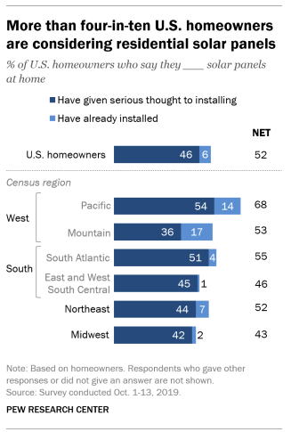
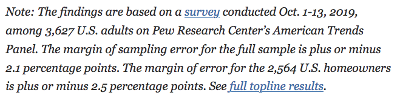
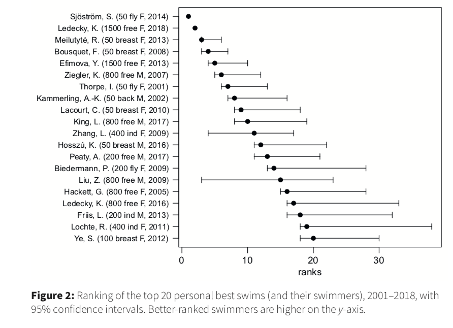

```{r setup, include=FALSE}
knitr::opts_chunk$set(echo = TRUE, warning = FALSE,
                      message = FALSE, 
                      fig.retina = 3, fig.align = 'center',
                      fig.asp = 0.75, fig.width = 8)
library(knitr)
library(tidyverse)
theme_update(text = element_text(size = 20))
```

```{r xaringan-scribble, echo=FALSE}
xaringanExtra::use_scribble()
```


background-image: url("img/DAW.png")
background-position: left
background-size: 50%
class: middle, center, inverse


.pull-right[


## .whitish[Sampling Distributions]

<br>

<br>

### .whitish[Kelly McConville]

#### .yellow[ Stat 100 | Week 7 | Spring 2022] 

]


---

### Announcements

* Final Exam: May 17 - May 20th
* Mid-Term Exam: Wednesday, March 9th - Friday, March 11th
    + Sign up for your oral exam slot [here](https://docs.google.com/document/d/1fL0ge4JW_-KYqLzxD_oQeMXt3sLQvTdPW9N67OVbjAY/edit?usp=sharing) ASAP.  Only Thursday slots left.
    + Split: 
        + 20% Oral
        + 80% Takehome
* Review sheet key posted to shared folder.

****************************

--

### Goals for Today

.pull-left[

* Knitting Strategies?

* Discuss the `r emo::ji("heart")` of statistical inference

] 


.pull-right[


* **Sampling Distribution**
    + Creation
    + Properties
    + Construction in `R`


]

---

class: middle, center

## When your Rmd doesn't knit, what do you try?


---

class: center, middle

### Which Type Are You?

.pull-left[

### Data Visualizer


<iframe src="https://giphy.com/embed/d31vTpVi1LAcDvdm" width="480" height="362" frameBorder="0" class="giphy-embed" allowFullScreen></iframe><p><a href="https://giphy.com/gifs/netflix-d31vTpVi1LAcDvdm">via GIPHY</a></p>

]


.pull-right[

### Data Wrangler

<iframe src="https://giphy.com/embed/DbaUtl1DcLyrdwhzGJ" width="480" height="362" frameBorder="0" class="giphy-embed" allowFullScreen></iframe><p><a href="https://giphy.com/gifs/Amalgia-DbaUtl1DcLyrdwhzGJ">via GIPHY</a></p>

]


---

class: center, middle

### Which Type Are You?

.pull-left[

### Model Builder


<iframe src="https://giphy.com/embed/xZsLh7B3KMMyUptD9D" width="480" height="270" frameBorder="0" class="giphy-embed" allowFullScreen></iframe><p><a href="https://giphy.com/gifs/tlceurope-xZsLh7B3KMMyUptD9D">via GIPHY</a></p>

]

--


.pull-right[

### A Mix!

<iframe src="https://giphy.com/embed/cmzp1t3EJ87XNOaHRJ" width="260" height="350" frameBorder="0" class="giphy-embed" allowFullScreen></iframe><p><a href="https://giphy.com/gifs/giphcrawler2018-cmzp1t3EJ87XNOaHRJ">via GIPHY</a></p>

]


---


class: middle, center


---

### The `r emo::ji("heart")` of statistical inference is quantifying uncertainty

```{r, echo = FALSE, out.width='70%'}
knitr::include_graphics("img/week4.005.jpeg")
```

--

```{r}
library(tidyverse)
ce <- read_csv("~/shared_data/stat100/data/ce.csv")
summarize(ce, meanFINCBTAX = mean(FINCBTAX))
```

---

### The `r emo::ji("heart")` of statistical inference is quantifying uncertainty

```{r}
library(tidyverse)
ce <- read_csv("~/shared_data/stat100/data/ce.csv")
summarize(ce, meanFINCBTAX = mean(FINCBTAX))
```

#### Distinguishing between the population and the sample

--

.pull-left[

* **Parameters**: 
    + Based on the **population**
    + Unknown then if don't have data on the whole population
    + EX: $\beta_o$ and $\beta_1$
    + EX: $\mu$ = population mean

]

.pull-right[

* **Statistics**: 
    + Based on the **sample** data
    + Known
    + Usually estimate a population parameter
    + EX: $\hat{\beta}_o$ and $\hat{\beta}_1$ 
    + EX: $\bar{x}$ = sample mean


]


---

### Quantifying Our Uncertainty 

`R` has been giving us uncertainty estimates:

.pull-left[

```{r polls, fig.show = 'hide'}
Pollster08 <- 
  read_csv("~/shared_data/stat100/data/Pollster08.csv")

ggplot(Pollster08, aes(x = Days,
                       y = Margin, 
                       color = factor(Charlie))) +
  geom_point() +
  stat_smooth(method = "lm", se = TRUE) +
  theme(legend.position = "bottom")

```


]

.pull-right[


```{r, echo = FALSE}
knitr::include_graphics(knitr::fig_chunk("polls", "png"))
```

]

---

### Quantifying Our Uncertainty 

`R` has been giving us uncertainty estimates:

```{r}
modPoll <- lm(Margin ~ Days*factor(Charlie), data = Pollster08)
library(moderndive)
get_regression_table(modPoll)
```


---

### Quantifying Our Uncertainty 

The [news and journal articles](https://www.pewresearch.org/fact-tank/2019/12/17/more-u-s-homeowners-say-they-are-considering-home-solar-panels/) are also giving us uncertainty estimates:


.pull-left[

```{r  out.width = "65%", echo=FALSE, fig.align='center'}
 
```


]

--


.pull-right[


```{r  out.width = "85%", echo=FALSE, fig.align='center'}
 
```

]

---

### Quantifying Our Uncertainty 

The [news and journal articles](https://rss.onlinelibrary.wiley.com/doi/abs/10.1111/1740-9713.01501) are also giving us uncertainty estimates:


```{r  out.width = "65%", echo=FALSE, fig.align='center'}
 
```


---

### Statistical Inference

**Goal**: Draw conclusions about the population based on the sample.

--

**Main Flavors**

&rarr; Estimating numerical quantities (parameters).

--

&rarr; Testing conjectures.

---

### Estimation

**Goal**: Estimate a (population) parameter.  

--

Best guess?  

&rarr; The corresponding (sample) statistic 

--

**Example**: Are GIFs just another way for people to share videos of their pets?

<iframe src="https://giphy.com/embed/MCfhrrNN1goH6" width="280" height="240" frameBorder="0" class="giphy-embed" allowFullScreen></iframe><p><a href="https://giphy.com/gifs/easy-ear-MCfhrrNN1goH6">via GIPHY</a></p>

--

Want to estimate the proportion of GIFs that feature animals.

---

### Estimation

**Key Question**: How accurate is the statistic as an estimate of the parameter?

--

**Helpful Sub-Question**: If we take many samples, how much would the statistic vary from sample to sample?

--

Need two new concepts:

--

* The **sampling variability** of a statistic

--

* The **sampling distribution** of a statistic


---

class: inverse, center, middle

## Let's learn about these ideas through an activity!

## Go to [bit.ly/stat100-samp](https://bit.ly/stat100-samp).

---

## Sampling Distribution of a Statistic

Steps to Construct an (Approximate) Sampling Distribution:

1. Decide on a sample size, $n$.

--

2. Randomly select a sample of size $n$ from the population.

--

3. Compute the sample statistic.

--

4.  Put the sample back in.

--

5. Repeat Steps 2 - 4 many (1000+) times.


---

## Sampling Distribution of a Statistic


```{r  out.width = "55%", echo=FALSE, fig.align='center'}
include_graphics("img/samp_dist.png") 
```

.pull-left[

* Center? Shape?

* Spread?
    + Standard error = standard deviation of the statistic


]


--

.pull-right[

**What happens to the center/spread/shape as we increase the sample size?**


**What happens to the center/spread/shape if the true parameter changes?**

]


---

## Let's practice with the samplingDistributions.Rmd handout.

#### Important Notes

* To construct a **sampling distribution** for a statistic, we need access to the entire population so that we can take repeated samples from the population. 

--

* But if we have access to the entire population, then we don't need a sampling distribution!

--

* Often we only have access to a **single sample**.  In these cases, we will need to **approximate** the sampling distribution. 

--

* In this hand-out, we have the **entire population** and are constructing sampling distributions anyway to study their properties so that we can figure out how to approximate them well!

---

## Reminders:

* Virtual option for in-person OHs this week.
    + No OHs starting Wednesday at noon.
* Mid-Term Exam: Wednesday, March 9th - Friday, March 11th
    + Sign up for your oral exam slot [here](https://docs.google.com/document/d/1fL0ge4JW_-KYqLzxD_oQeMXt3sLQvTdPW9N67OVbjAY/edit?usp=sharing) ASAP.  Only Thursday slots left.
    + Split: 
        + 20% Oral
        + 80% Takehome
* Review sheet key posted to shared folder.

