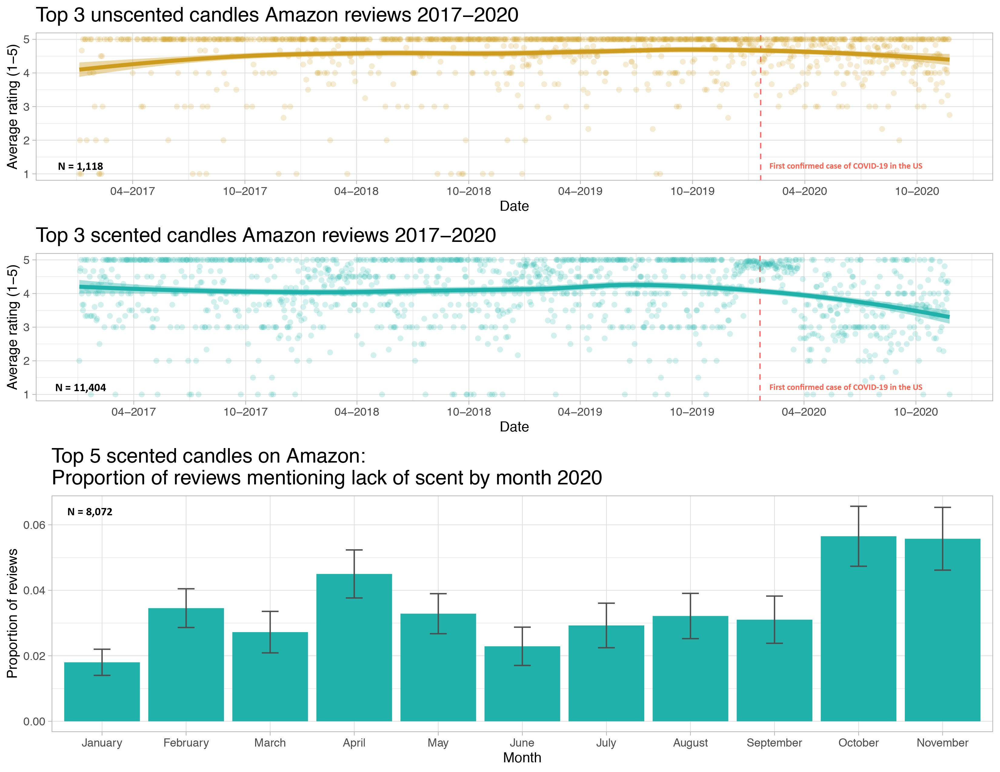

```{r setup, include=FALSE}
knitr::opts_chunk$set(echo = TRUE, warning = FALSE,
                      message = FALSE, 
                      fig.retina = 3, fig.align = 'center',
                      fig.asp = 0.75, fig.width = 8,
                      cache = TRUE)
library(knitr)
library(kableExtra)
library(tidyverse)
theme_update(text = element_text(size = 20),
             plot.title = element_text(hjust = 0.5))

library(Sleuth3)
data(case0901)

# Recode the timing variable
case0901 <- case0901 %>%
  mutate(TimeCat = factor(case_when(
    Time == 1 ~ "Late",
    Time == 2 ~ "Early"
  )))
```

```{r xaringan-scribble, echo=FALSE}
xaringanExtra::use_scribble()
```


background-image: url("img/DAW.png")
background-position: left
background-size: 50%
class: middle, center, inverse


.pull-right[


## .whitish[Inference for]

## .whitish[Linear Regression]


<br>

### .whitish[Kelly McConville]

#### .yellow[ Stat 100 | Week 12 | Spring 2022] 

]


---

### Announcements

* Project Assignment 3 is due Friday, April 22nd at 5pm
* Final Project Assignment
    + Create 5-10 minute video summary of your analyses
    + Due Friday, May 6th

****************************

--

### Goals for Today

.pull-left[

* Recap linear regression

* Checking **assumptions** for linear regression


] 


.pull-right[

* Hypothesis testing for linear regression

* Estimation and prediction inference for linear regression

]


---

class: inverse, middle, center

## Please make sure to fill out the Stat 100 Course Evaluations.

### We appreciate constructive feedback.

### For all of your course evaluations be mindful of [unconscious and unintentional biases](https://benschmidt.org/profGender).


---

## Multiple Linear Regression

Linear regression is a flexible class of models that allow for:

* Both quantitative and categorical explanatory variables.


* Multiple explanatory variables.


* Curved relationships between the response variable and the explanatory variable.

--

* BUT the response variable is quantitative.


---


### Multiple Linear Regression

**Form of the Model:**


$$ 
\begin{align}
y &= \beta_o + \beta_1 x_1 + \beta_2 x_2 + \cdots + \beta_p x_p + \epsilon
\end{align}
$$

--

**Fitted Model:** Using the Method of Least Squares,


$$ 
\begin{align}
\hat{y} &= \hat{\beta}_o + \hat{\beta}_1 x_1 + \hat{\beta}_2 x_2 + \cdots + \hat{\beta}_p x_p 
\end{align}
$$

--

#### Typical Inferential Questions:

(1) Should $x_2$ be in the model that already contains $x_1$ and $x_3$?

$$ 
\begin{align}
y &= \beta_o + \beta_1 x_1 + \beta_2 x_2 + \beta_3 x_3 + \epsilon
\end{align}
$$

In other words, should $\beta_2 = 0$?

---


### Multiple Linear Regression

**Form of the Model:**


$$ 
\begin{align}
y &= \beta_o + \beta_1 x_1 + \beta_2 x_2 + \cdots + \beta_p x_p + \epsilon
\end{align}
$$


**Fitted Model:** Using the Method of Least Squares,


$$ 
\begin{align}
\hat{y} &= \hat{\beta}_o + \hat{\beta}_1 x_1 + \hat{\beta}_2 x_2 + \cdots + \hat{\beta}_p x_p 
\end{align}
$$


#### Typical Inferential Questions:

(2) Can we estimate $\beta_3$ with a confidence interval?

$$ 
\begin{align}
y &= \beta_o + \beta_1 x_1 + \beta_2 x_2 + \beta_3 x_3 + \epsilon
\end{align}
$$

---


### Multiple Linear Regression

**Form of the Model:**


$$ 
\begin{align}
y &= \beta_o + \beta_1 x_1 + \beta_2 x_2 + \cdots + \beta_p x_p + \epsilon
\end{align}
$$


**Fitted Model:** Using the Method of Least Squares,


$$ 
\begin{align}
\hat{y} &= \hat{\beta}_o + \hat{\beta}_1 x_1 + \hat{\beta}_2 x_2 + \cdots + \hat{\beta}_p x_p 
\end{align}
$$


#### Typical Inferential Questions:

(3) While $\hat{y}$ is a point estimate for $y$, can we also get an interval estimate for $y$?

$$ 
\begin{align}
y &= \beta_o + \beta_1 x_1 + \beta_2 x_2 + \beta_3 x_3 + \epsilon
\end{align}
$$


--

To answer these questions, we need to add some **assumptions** to our linear regression model.

---


### Multiple Linear Regression

**Form of the Model:**


$$ 
\begin{align}
y &= \beta_o + \beta_1 x_1 + \beta_2 x_2 + \cdots + \beta_p x_p + \epsilon
\end{align}
$$

**Additional Assumptions:**

$$
\epsilon \overset{\mbox{ind}}{\sim} N (\mu = 0, \sigma = \sigma_{\epsilon})
$$

$\sigma_{\epsilon}$ = typical deviations from the model

--

Let's unpack these assumptions!


---

### Assumptions

For ease of visualization, let's assume a simple linear model:


\begin{align*}
y = \beta_o + \beta_1 x_1 + \epsilon \quad \mbox{   where   } \quad \epsilon \overset{\color{orange}{\mbox{ind}}}{\sim}N\left(0, \sigma_{\epsilon} \right)
\end{align*}

--

**Assumption**: The cases are independent of each other.


--

**Question**: How do we check this assumption? 

--

Look at how the data were collected.  Generally relies on random sampling or random assignment being utilized.

---

### Assumptions

For ease of visualization, let's assume a simple linear model:


\begin{align*}
y = \beta_o + \beta_1 x_1 + \epsilon \quad \mbox{   where   } \quad \epsilon \overset{\mbox{ind}}{\sim}\color{orange}{N}\left(0, \sigma_{\epsilon} \right)
\end{align*}

--

**Assumption**: The errors are normally distributed.


--

.pull-left[

**Question**: How do we check this assumption? 

]

--

.pull-right[

Recall the residual: $e = y - \hat{y}$

]

--

**QQ-plot:** Plot the residuals against the quantiles of a normal distribution!

.pull-left[

```{r, echo = FALSE, fig.asp = .6, fig.width = 6}
set.seed(11131)
dat <- data.frame(res1 = rnorm(50),
                  res2 = rf(50, df1 = 5, df2 = 7))
ggplot(data = dat , mapping = aes(sample = res1)) + 
  stat_qq() + 
  stat_qq_line()
```


]

.pull-right[

```{r, echo = FALSE, fig.asp = .6, fig.width = 6}
ggplot(data = dat , mapping = aes(sample = res2)) + 
  stat_qq() + 
  stat_qq_line()
```


]


---

### Assumptions

For ease of visualization, let's assume a simple linear model:


\begin{align*}
y = \beta_o + \beta_1 x_1 + \epsilon \quad \mbox{   where   } \quad \epsilon \overset{\mbox{ind}}{\sim}N\left(\color{orange}{0}, \sigma_{\epsilon} \right)
\end{align*}

--

**Assumption**: The points will, on average, fall on the line.


--

**Question**: How do we check this assumption? 

--

If you use the Method of Least Squares, then you don't have to check.

It will be true by construction:


$$
\sum e = 0
$$

---

### Assumptions

For ease of visualization, let's assume a simple linear model:


\begin{align*}
y = \beta_o + \beta_1 x_1 + \epsilon \quad \mbox{   where   } \quad \epsilon \overset{\mbox{ind}}{\sim}N\left(0, \color{orange}{\sigma_{\epsilon}} \right)
\end{align*}

--

**Assumption**: The variability in the errors is constant.


--

**Question**: How do we check this assumption? 

--

**One option**: Scatterplot

.pull-left[

```{r, echo = FALSE, fig.asp = .6, fig.width = 6}
set.seed(21)
dat <- data.frame(x = rnorm(50, mean = 4)) 
set.seed(443)
dat <- dat %>%
  mutate(y1 = 1 + 2*x + rnorm(50, sd = 2))

set.seed(4154)
dat <- dat %>%
  mutate(y2 = 1 + 2*x + rnorm(50, sd = 1)*x)

ggplot(data = dat , mapping = aes(x = x,
                                  y = y1)) + 
  geom_point() +
  geom_smooth(method = lm, se = FALSE)
```


]

.pull-right[

```{r, echo = FALSE, fig.asp = .6, fig.width = 6}
ggplot(data = dat , mapping = aes(x = x,
                                  y = y2)) + 
  geom_point() +
  geom_smooth(method = lm, se = FALSE)
```


]

---

### Assumptions

For ease of visualization, let's assume a simple linear model:


\begin{align*}
y = \beta_o + \beta_1 x_1 + \epsilon \quad \mbox{   where   } \quad \epsilon \overset{\mbox{ind}}{\sim}N\left(0, \color{orange}{\sigma_{\epsilon}} \right)
\end{align*}


**Assumption**: The variability in the errors is constant.


**Question**: How do we check this assumption? 


**Better option** (especially when have more than 1 explanatory variable): **Residual Plot** 

.pull-left[

```{r, echo = FALSE, fig.asp = .6, fig.width = 6}
set.seed(21)
dat <- data.frame(x = rnorm(50, mean = 4)) 
set.seed(443)
dat <- dat %>%
  mutate(y1 = 1 + 2*x + rnorm(50, sd = 2))

set.seed(4154)
dat <- dat %>%
  mutate(y2 = 1 + 2*x + rnorm(50, sd = 1)*x) 

mod1 <- lm(y1 ~ x, data = dat)
mod2 <- lm(y2 ~ x, data = dat)


library(gglm)
ggplot(data = mod1) +
  stat_fitted_resid()
```


]

.pull-right[

```{r, echo = FALSE, fig.asp = .6, fig.width = 6}
ggplot(data = mod2) +
  stat_fitted_resid()
```


]


---

### Assumptions

For ease of visualization, let's assume a simple linear model:


\begin{align*}
y = \color{orange}{\beta_o + \beta_1 x_1} + \epsilon \quad \mbox{   where   } \quad \epsilon \overset{\mbox{ind}}{\sim}N\left(0, \sigma_{\epsilon} \right)
\end{align*}

--

&rarr; The model form is appropriate.


--

**Question**: How do we check this assumption? 

--

**One option**: Scatterplot(s)

.pull-left[

```{r, echo = FALSE, fig.asp = .6, fig.width = 6}
set.seed(21)
dat <- data.frame(x = rnorm(50, mean = 4)) 
set.seed(443)
dat <- dat %>%
  mutate(y1 = 1 + 2*x + rnorm(50, sd = 2))

set.seed(4154)
dat <- dat %>%
  mutate(y2 = 1 + 3*(x-3)^2 + rnorm(50, sd = 3))

ggplot(data = dat , mapping = aes(x = x,
                                  y = y1)) + 
  geom_point() +
  geom_smooth(method = lm, se = FALSE)
```


]

.pull-right[

```{r, echo = FALSE, fig.asp = .6, fig.width = 6}
ggplot(data = dat , mapping = aes(x = x,
                                  y = y2)) + 
  geom_point() +
  geom_smooth(method = lm, se = FALSE)
```


]

---

### Assumptions

For ease of visualization, let's assume a simple linear model:

\begin{align*}
y = \color{orange}{\beta_o + \beta_1 x_1} + \epsilon \quad \mbox{   where   } \quad \epsilon \overset{\mbox{ind}}{\sim}N\left(0, \sigma_{\epsilon} \right)
\end{align*}


**Assumption**: The model form is appropriate.


**Question**: How do we check this assumption? 


**Better option** (especially when have more than 1 explanatory variable): **Residual Plot**

.pull-left[

```{r, echo = FALSE, fig.asp = .6, fig.width = 6}


mod1 <- lm(y1 ~ x, data = dat)
mod2 <- lm(y2 ~ x, data = dat)


ggplot(data = mod1) +
  stat_fitted_resid()
```


]

.pull-right[

```{r, echo = FALSE, fig.asp = .6, fig.width = 6}
ggplot(data = mod2) +
  stat_fitted_resid()
```


]


---

### Assumptions

**Question**: What if the assumptions aren't all satisfied?

--

&rarr; Try transforming the data and building the model again.

--

&rarr; Use a modeling technique beyond linear regression.

--

**Question**: What if the assumptions are all (roughly) satisfied?

--

&rarr; Can now start answering your inference questions!

---

### Example: COVID and Candle Ratings

[Kate Petrova created a dataset](https://twitter.com/kate_ptrv/status/1332398768659050496) that has been making the rounds on Twitter:





---

### COVID and Candle Ratings

She posted all her data and code to GitHub and I did some light wrangling so that we could answer the question:

&rarr; Do we have evidence that we should allow the slopes to vary?

--

```{r, echo = FALSE}
library(tidyverse)
library(moderndive)
library(readxl)
Scented_All <- read_excel("~/shared_data/stat100/data/Scented_all.xlsx")
Unscented_All <- read_excel("~/shared_data/stat100/data/Unscented_all.xlsx")


s <- Scented_All %>%
  filter(Date >= "2017-01-01") %>%
  filter(CandleID <= 3) %>%
  group_by(Date) %>%
  summarise(Rating=mean(Rating)) %>%
  mutate(Type = "scented")


#### UNSCENTED CANDLES ####

us <- Unscented_All %>%
  filter(Date >= "2017-01-01") %>%
  group_by(Date) %>%
  summarise(Rating = mean(Rating)) %>%
  mutate(Type = "unscented")

all <- bind_rows(s, us) %>%
  filter(Date >= "2020-01-20") %>%
  mutate(Date = as.Date(Date))
```

.pull-left[

```{r candles, fig.show = 'hide'}
ggplot(data = all,
       mapping = aes(x = Date,
                     y = Rating,
                     color = Type)) +
  geom_point(alpha = 0.4) +
  geom_smooth(method = lm) +
  theme(legend.position = "bottom")
```

]

.pull-right[

```{r, echo = FALSE}
knitr::include_graphics(knitr::fig_chunk("candles", "png"))
```

]


---

class: inverse, center, middle


### But before we try to answer that question formally, let's practice checking linear regression assumptions with the "inferenceModeling.Rmd" handout!


---

### Hypothesis Testing 

**Question**: What tests is `get_regression_table()` conducting?

```{r}
mod <- lm(Rating ~ Date + Type, data = all)
get_regression_table(mod)
```

--

**In General**:

$$
H_o: \beta_j = 0 \quad \mbox{assuming all other predictors are in the model}
$$
$$
H_a: \beta_j \neq 0 \quad \mbox{assuming all other predictors are in the model}
$$


---

### Hypothesis Testing 

**Question**: What tests is `get_regression_table()` conducting?

```{r}
mod <- lm(Rating ~ Date + Type, data = all)
get_regression_table(mod)
```


**For our Example**:

**Row 2**:

$$
H_o: \beta_1 = 0 \quad \mbox{given Type is already in the model}
$$
$$
H_a: \beta_1 \neq 0 \quad \mbox{given Type is already in the model}
$$


---

### Hypothesis Testing 

**Question**: What tests is `get_regression_table()` conducting?

```{r}
mod <- lm(Rating ~ Date + Type, data = all)
get_regression_table(mod)
```


**For our Example**:

**Row 3**:

$$
H_o: \beta_2 = 0 \quad \mbox{given Date is already in the model}
$$
$$
H_a: \beta_2 \neq 0 \quad \mbox{given Date is already in the model}
$$

---

### Hypothesis Testing 

**Question**: What tests is `get_regression_table()` conducting?


**In General**:

$$
H_o: \beta_j = 0 \quad \mbox{assuming all other predictors are in the model}
$$
$$
H_a: \beta_j \neq 0 \quad \mbox{assuming all other predictors are in the model}
$$

Test Statistic:

--

$$
t = \frac{\hat{\beta}_j - 0}{SE(\hat{\beta}_j)} \sim t(df = n - \mbox{# of predictors})
$$

when $H_o$ is true and the model assumptions are met.


---

### Hypothesis Testing 

**Question**: What tests is `get_regression_table()` conducting?

--

**For our Example**:

**Row 3**:

$$
H_o: \beta_2 = 0 \quad \mbox{given Date is already in the model}
$$
$$
H_a: \beta_2 \neq 0 \quad \mbox{given Date is already in the model}
$$

Test Statistic:

--

$$
t = \frac{\hat{\beta}_2 - 0}{SE(\hat{\beta}_2)} = \frac{0.831 - 0}{0.063} = 13.2
$$

with p-value $= P(t \leq -13.2) + P(t \geq 13.2) \approx 0.$

--

There is evidence that including whether or not the candle is scented adds useful information to the linear regression model for Amazon ratings that already controls for date.

---

### Example

Do we have evidence that we should allow the slopes to vary?


```{r, echo = FALSE}
ggplot(data = all, mapping = aes(x = as.Date(Date), y = Rating,
                                 color = Type)) +
  geom_point(alpha = 0.4) +
  geom_smooth(method = lm)
```


---

### Example

Do we have evidence that we should allow the slopes to vary?


```{r}
mod <- lm(Rating ~ Date*Type, data = all)
get_regression_table(mod)
```


---

class: inverse, middle, center


## Now let's shift our focus to estimation and prediction!


---

### Estimation

#### Typical Inferential Questions:

(2) Can we estimate $\beta_j$ with a confidence interval?

--

Confidence Interval Formula:

--

\begin{align*}
\mbox{statistic} & \pm ME \\
\hat{\beta}_j & \pm t^* SE(\hat{\beta}_j)
\end{align*}

--


```{r}
get_regression_table(mod)
```

---

### Prediction

#### Typical Inferential Questions:

(3) While $\hat{y}$ is a point estimate for $y$, can we also get an interval estimate for $y$?

#### Two Types:

--

.pull-left[

**Confidence Interval for the Mean Response**

&rarr; Defined at given values of the explanatory variables

&rarr; Estimates the <span style="color: orange;">average</span> response

&rarr; Centered at $\hat{y}$

&rarr; <span style="color: orange;">Smaller</span> SE

]


.pull-right[

**Prediction Interval for an Individual Response**

&rarr; Defined at given values of the explanatory variables

&rarr; Predicts the response of a <span style="color: orange;">single, </span> new observation

&rarr; Centered at $\hat{y}$

&rarr; <span style="color: orange;">Larger</span> SE


]

---

### CI for mean response at a given level of X:

We want to construct a 95% CI for the average rating of unscented candles on Oct 31st, 2020.

--

```{r}
new <- data.frame(Type = "unscented", Date = as.Date("2020-10-31"))
predict(mod, new, interval = "confidence", level = 0.95)

```

--

**Interpretation**:  We are 95% confident that the average rating of an unscented candle on Amazon on Halloween 2020 was between 4.27 and 4.60.


---

### PI for a new Y at a given level of X:


Say we want to construct a 95 % PI for the rating of an **individual** unscented candle on Oct 31st, 2020.

* Predicting for a new observation not the mean!


```{r}
predict(mod, new, interval = "prediction", level = 0.95)
```

**Interpretation**: For unscented candles on Amazon, we expect 95% of the Halloween 2020 ratings to be between 2.91 and 5.97.


---

### Comparing Models

Suppose I built 4 different model. **Which is best?**

--

* Big question!  Take [Stat 139: Linear Models](https://canvas.harvard.edu/courses/89311) to learn systematic model selection techniques.

--

* We will explore one approach.  (But there are many possible approaches!)


---

### Comparing Models

Suppose I built 4 different model. **Which is best?**

--

&rarr; Pick the best model based on some measure of quality.

--

**Measure of quality**: $R^2$ (Coefficient of Determination)

\begin{align*}
R^2 &= \mbox{% of total variation in y explained by the model}\\
&= 1- \frac{\sum (y - \hat{y})^2}{\sum (y - \bar{y})^2}
\end{align*}


--

**Strategy**: Compute the $R^2$ value for each model and pick the one with the highest $R^2$.

---

### Comparing Models with $R^2$

**Strategy**: Compute the $R^2$ value for each model and pick the one with the highest $R^2$.

```{r}
library(broom)
mod1 <- lm(Rating ~ Date, data = all)
mod2 <- lm(Rating ~ Type, data = all)
mod3 <- lm(Rating ~ Date + Type, data = all)
mod4 <- lm(Rating ~ Date * Type, data = all)
```

---

**Strategy**: Compute the $R^2$ value for each model and pick the one with the highest $R^2$.

```{r}
glance(mod1)
glance(mod2)
glance(mod3)
glance(mod4)
```

---

```{r}
glance(mod2)
glance(mod3)
glance(mod4)
```


**Problem:** As we add predictors, the $R^2$ value will only increase.  


---

### Comparing Models with $R^2$


**Problem:** As we add predictors, the $R^2$ value will only increase.  


And in [Week 6, we said](https://mcconvil.github.io/stat100s22/stat100_wk06mon.html#55):

**Guiding Principle**: Occam's Razor for Modeling

> "All other things being equal, simpler models are to be preferred over complex ones." -- ModernDive


---

### Comparing Models with the Adjusted $R^2$


**New Measure of quality**: Adjusted $R^2$ (Coefficient of Determination)

\begin{align*}
\mbox{adj} R^2 &= 1- \frac{\sum (y - \hat{y})^2}{\sum (y - \bar{y})^2} \left(\frac{n - 1}{n - p - 1} \right)
\end{align*}

where $p$ is the number of explanatory variables in the model.

--

Now we will penalize larger models.

--

**Strategy**: Compute the adjusted $R^2$ value for each model and pick the one with the highest adjusted $R^2$.

---

**Strategy**: Compute the adjusted $R^2$ value for each model and pick the one with the highest adjusted $R^2$.

```{r}
glance(mod2)
glance(mod3)
glance(mod4)
```
